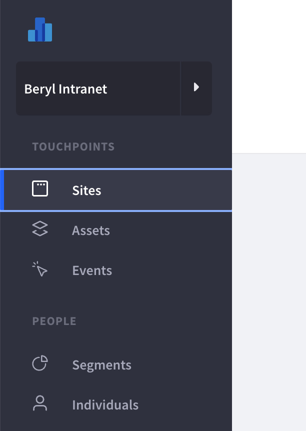
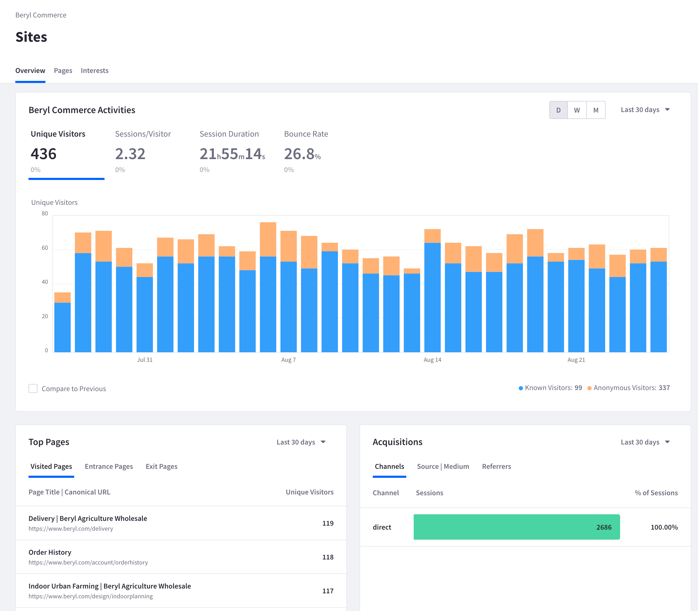
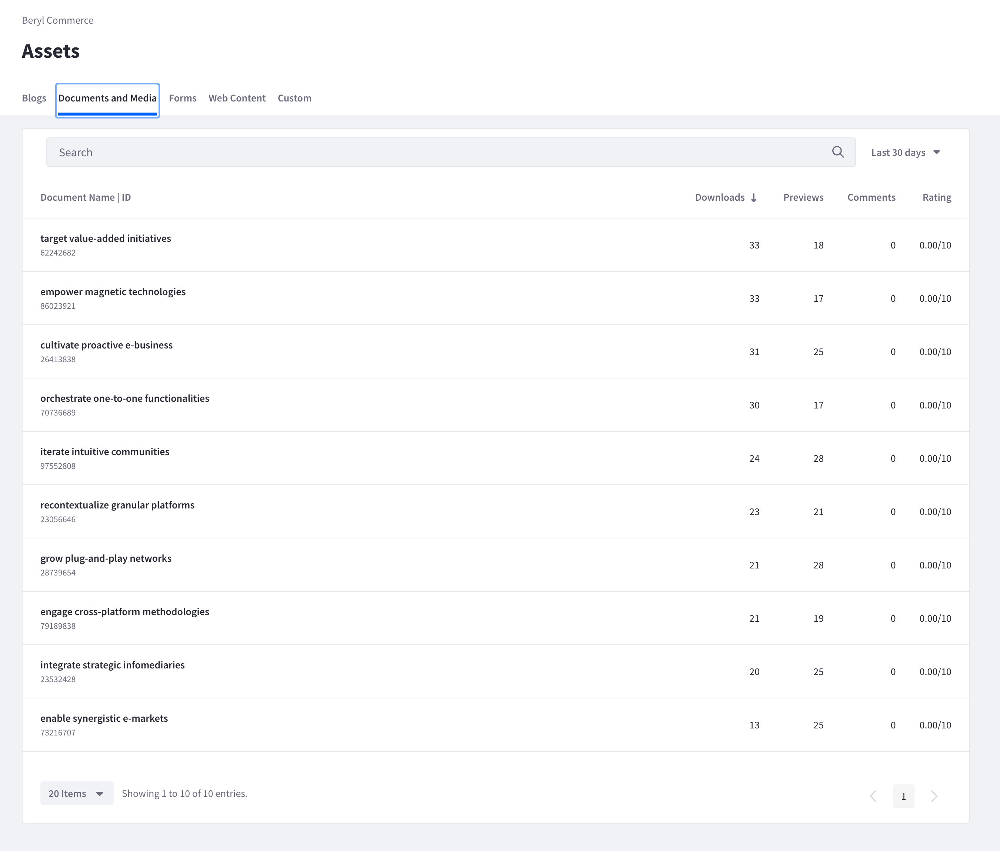

---
toc:
   - ./getting-started/connecting-liferay-dxp-to-analytics-cloud.md
   - ./getting-started/syncing-sites-and-contacts.md
   - ./getting-started/understanding-your-sites-data.md
   - ./getting-started/paths-and-pages.md
   - ./getting-started/assets-and-events.md
   - ./getting-started/understanding-your-audience.md
   - ./getting-started/individuals.md
   - ./getting-started/segments.md
---
# Getting Started

```{toctree}
:maxdepth: 3

getting-started/connecting-liferay-dxp-to-analytics-cloud.md
getting-started/syncing-sites-and-contacts.md
getting-started/understanding-your-sites-data.md
getting-started/paths-and-pages.md
getting-started/assets-and-events.md
getting-started/understanding-your-audience.md
getting-started/individuals.md
getting-started/segments.md
```

Welcome to Liferay Analytics Cloud. Collecting analytics data is a crucial part of any business. There are many different tools out there but not all provide high value. It's not enough just to gather large amounts of data, because it doesn't necessarily translate to valuable data and useful insights. Furthermore, low value data can lead to an incomplete picture of who your customers are or wasted marketing spend in the wrong areas.

Use Liferay Analytics Cloud to know exactly who is visiting your site and how they're interacting with your site's content. The high value comes from the tight integration shared between Liferay Analytics Cloud and Liferay DXP.

Why is this integration so awesome? Because straight out-of-the-box, Analytics Cloud is built to access the wide range of data on a Liferay DXP installation. This means that as you build out your site, all the content you create (i.e. pages, blogs, forms, documents, etc.) is ready to be tracked without any additional configuration. As individuals interact on your site, the data associated with these users can help you create individual profiles and profile segments. Analytics Cloud helps you learn what's important to your users and helps you deliver improved content and optimized site experiences.

Here are some example use cases for using Analytics Cloud with Liferay DXP:

| Liferay DXP Use Case | Analytics Cloud Example Application |
| :--- | :--- |
| Building a customer portal | Learn what articles and documents customers are looking for to know what type of customer support or knowledge base content to put in front of them |
| Building a commerce site | See the products customers are looking at for future promotions or cross-selling |
| Building a company intranet for your employees | Transform your intranet to be centered on self-service by identifying and providing content important to individual employees and departments  |

Whether you want a bird's-eye view or a ground-level view of your data, Analytics Cloud's got you covered.

## Analytics About Your Site

At a high level, Analytics Cloud gives reports aggregate data from your entire site in one comprehensive dashboard. As you [Build Sites](https://learn.liferay.com/dxp/latest/en/site-building/introduction-to-site-building.html) and [Create Pages](https://learn.liferay.com/dxp/latest/en/site-building/creating-pages.html) in Liferay DXP, you'll get a sense of the traffic flow to your site. You can see your most popular pages ranked. 



Analytics Cloud shows you these site-wide things: 

* The number of individuals visiting your site across time
* A list of the most viewed pages
* A summary of where your traffic is coming from
* Popular search terms and popular interest topics
* Visitor location and device/browser type
* Cohort analysis (a table showing what percent of a previous day's visitors return)

For a ground-level view, Analytics Cloud provides detailed statistics for the various parts of your site. Sure, you can see how many individuals visit your page and how long they spend viewing your page, but Analytics Cloud goes way beyond that. You can see traffic source information. Discover how people find your page through web searches, advertisements, e-mail links, and more. This is especially useful if you are paying for ad traffic and want to know if your marketing efforts are working. You can monitor your search traffic and see if traffic is coming from email clicks.



Analytics Cloud shows you these details: 

* The number of individuals visiting the page over time
* The percentage of the visitors that are known (i.e. contact info synced) and if any belong to a segment
* Visitor location and device/browser type

The ground-level view also includes detailed analytics for other site content such as blog entries, documents, or forms.


Analytics Cloud shows you these things about your assets: 

* For blogs, number of views, reading time, comments, ratings
* For documents and media, number of downloads, previews, comments, ratings
* For forms, number of submissions, views, abandonment percentage, completion times
* For other web content, number of views

## Analytics About the People Interacting With Your Site

Analytics Cloud shows you global data about your visitors. For example, see the total number of active individuals interacting with your site or the topics different groupings of individuals (called _segments_) are looking for.



Analytics Cloud shows you these things about individuals: 

* Total number of individuals (both known and anonymous) in the last 30 days
* The change across time of the number of individuals interacting with your site
* Most popular interest topics
* Distribution info based on selected attributes (e.g. date of birth)

People analytics also includes analytics about segments. Segments are groupings of individuals you define based on shared attributes (e.g. a segment of managers created by filtering any individuals on your site with a job title that contains the word "manager"). Use segments to isolate and analyze groups of individuals based on geography, industry, shared interest topics, and more.


Analytics Cloud shows you these things about segments: 

* Total number of individuals in the segment across time
* Percentage of individuals in the segment who have interacted with the site recently
* An explanation of the criteria used to create the segment
* Most popular interest topics of the segment
* Distribution info based on selected attributes (e.g. individual's home country)

Finally, for a ground-level view, Analytics Cloud can give detailed analytics for known individuals (i.e. visitors who are logged in to your site and have had their contact info synced). As known individuals navigate your site, learn what they are searching for and what they want to see. Use this data to create a clear picture of who your customers are and what their greatest needs are.


Analytics Cloud shows you these things about known individuals: 

* Recent interaction history, including a detailed site activity stream
* Most popular interest topics of the individual
* Any segment the individual is associated with

## Setting Up Your Analytics Cloud

Now that you've seen some of the capabilities of Analytics Cloud, it's time to get your workspace set up. The first step is to connect your Liferay DXP instance to Analytics Cloud. This is, in essence, giving Analytics Cloud permission to view what's happening on your Liferay instance.

See [Connecting Liferay DXP to Analytics Cloud](./getting-started/connecting-liferay-dxp-to-analytics-cloud.md) to follow the steps.
