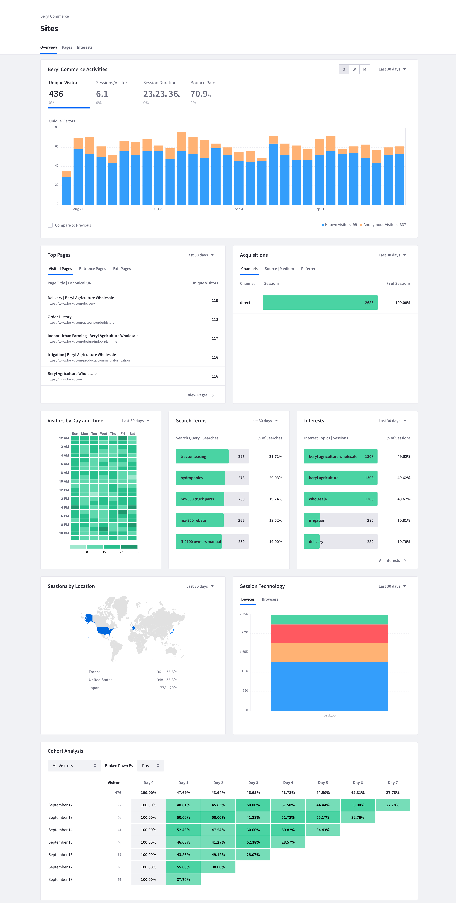
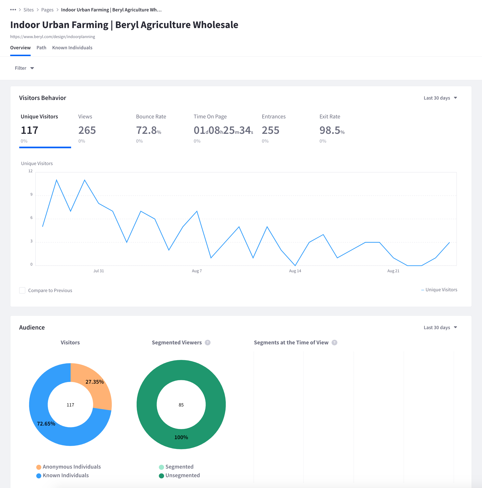

---
toc:
  - ./getting-started/connecting-liferay-dxp-to-analytics-cloud.md
  - ./getting-started/viewing-the-analytics-dashboard.md
uuid: 04d50515-b7e9-43d4-83d7-fff078917d16
---
# Getting Started

```{toctree}
:maxdepth: 3

getting-started/connecting-liferay-dxp-to-analytics-cloud.md
getting-started/viewing-the-analytics-dashboard.md
```

Welcome to Liferay Analytics Cloud! Collecting analytics data is a crucial part of any business. There are many different tools out there but not all provide high value. It's not enough just to gather large amounts of data; you must also be able to analyze it to discover useful insights. Furthermore, low value data can lead to an incomplete picture of who your customers are or wasted marketing spend in the wrong areas.

You can use Liferay Analytics Cloud to know who visits your site and how they interact with your site's content. The high value comes from the tight integration between Liferay Analytics Cloud and Liferay DXP.

Straight out-of-the-box, Analytics Cloud is built to access the wide range of data on a Liferay DXP installation. This means that as you build out your site, all the content you create (i.e., pages, blogs, forms, documents, etc.) is ready to be tracked without any additional configuration. As individuals interact on your site, the data associated with these users can help you create individual profiles and profile segments. Analytics Cloud helps you learn what's important to your users so you can deliver improved content and optimized site experiences.

Here are some example use cases for using Analytics Cloud with Liferay DXP:

| Liferay DXP Use Case                           | Analytics Cloud Example Application                                                                                                            |
| :--------------------------------------------- | :--------------------------------------------------------------------------------------------------------------------------------------------- |
| Building a customer portal                     | Learn the most searched articles and documents to know what type of customer support or knowledge base content to put in front of them |
| Building a commerce site                       | See the most popular products for future promotions or cross-selling                                                                  |
| Building a company intranet for your employees | Identify and provide the most important employee and departmental content to transform your intranet to a self-service portal        |

Whether you want a bird's-eye view or a ground-level view of your data, Analytics Cloud's got you covered.

## Analytics About Your Site

At a high level, Analytics Cloud reports aggregate data from your entire site in one comprehensive dashboard. As you [Build Sites](https://learn.liferay.com/dxp/latest/en/site-building/introduction-to-site-building.html) and [Create Pages](https://learn.liferay.com/dxp/latest/en/site-building/creating-pages.html) in Liferay DXP, you'll get a sense of the traffic flow to your site. You can see your most popular pages ranked.



Analytics Cloud shows you these site-wide statistics:

* The number of individuals visiting your site across time
* A list of the most viewed pages
* A summary of where your traffic is coming from
* Popular search terms and popular interest topics
* Visitor location and device/browser type
* Cohort analysis (a table showing what percent of a previous day's visitors return)

From a ground-level view, Analytics Cloud provides detailed statistics for the various parts of your site. Sure, you can see how many individuals visit your page and how long they spend there, but Analytics Cloud goes way beyond that. Discover how people find your page through web searches, advertisements, email links, and more. This is especially useful if you purchased advertising and want to know if your marketing efforts are working.


Analytics Cloud shows you these details:

* The number of individuals visiting the page over time
* The percentage of the visitors that are known (i.e. contact info synced) and if any belong to a segment
* Visitor location and device/browser type

The ground-level view also includes detailed analytics for content such as blog entries, documents, or forms.



Analytics Cloud shows you these things about your assets:

* For blogs, number of views, reading time, comments, ratings
* For documents and media, number of downloads, previews, comments, ratings
* For forms, number of submissions, views, completion times
* For other web content, number of views

## Analytics About the People Interacting With Your Site

Analytics Cloud shows you global data about your visitors. For example, see the total number of active individuals on your site or the topics different groupings of individuals (called _segments_) are seeking.


Analytics Cloud shows you these things about individuals:

* Total number of individuals (both known and anonymous) in the last 30 days
* The change across time of the number of individuals interacting with your site
* Most popular interest topics
* Distribution info based on selected attributes (e.g. date of birth)

People analytics also includes segment analytics. Segments are groupings of individuals you define based on shared attributes. For example you could create a segment of managers by filtering users who have a job title containing the word "manager"). Use segments to isolate and analyze groups of individuals based on geography, industry, shared interest topics, and more.


Analytics Cloud shows you these things about segments:

* Total number of individuals in the segment across time
* Percentage of individuals in the segment who have interacted with the site recently
* An explanation of the criteria used to create the segment
* Most popular interest topics of the segment
* Distribution info based on selected attributes (e.g. individual's home country)

Finally, for a ground-level view, Analytics Cloud can give detailed reports for known individuals (i.e., visitors logged into your site and with their contact info synced). As known individuals navigate your site, learn what they are searching for and what they want to see. Use this data to create a clear picture of who your customers are and how to solve their greatest needs.


Analytics Cloud shows you these things about known individuals:

* Recent interaction history, including a detailed site activity stream
* Most popular interest topics of the individual
* Any segment the individual belongs to

## Setting Up Your Analytics Cloud

Now that you've seen some of the capabilities of Analytics Cloud, it's time to get your workspace set up. The first step is to connect your Liferay DXP instance to Analytics Cloud. This is, in essence, giving Analytics Cloud permission to view what's happening on your Liferay instance.

See [Connecting Liferay DXP to Analytics Cloud](./getting-started/connecting-liferay-dxp-to-analytics-cloud.md) to follow the steps.
