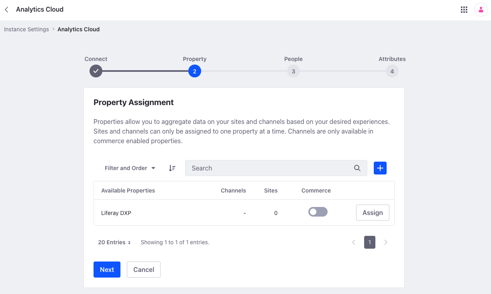
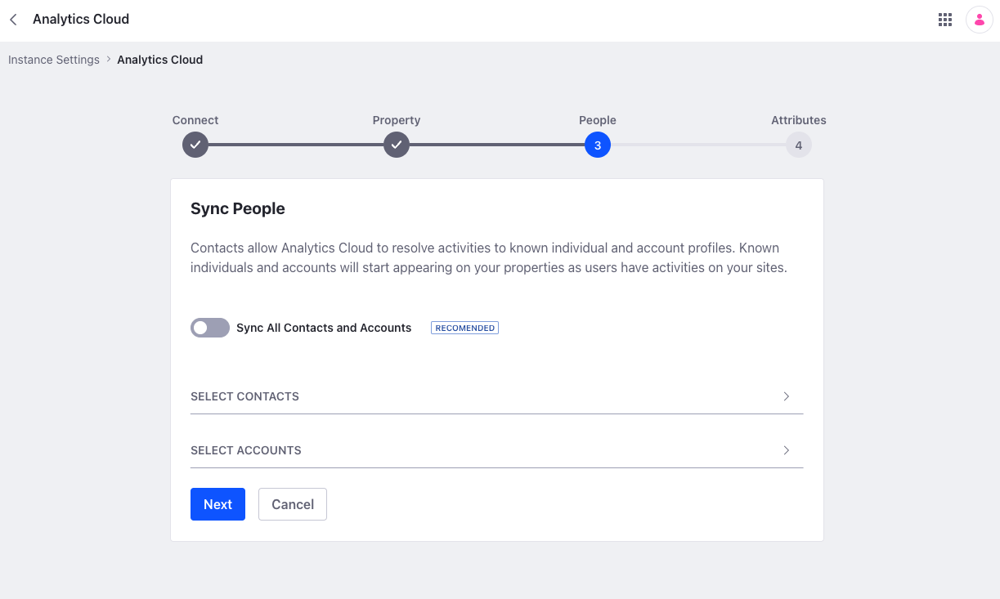
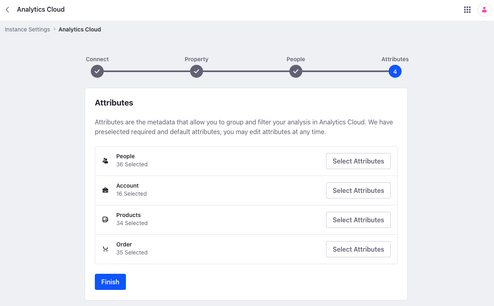

# Connecting Liferay DXP to Analytics Cloud

To begin the setup process, there are a few requirements:

1. You need a [liferay.com](https://www.liferay.com) account. If you don't have a Liferay account, you can [Create an account](https://login.liferay.com/signin/register).

1. When you visit [analytics.liferay.com](https://analytics.liferay.com/) for the first time, you must set up multi-factor authentication for the account. If you need help, see [Multi-Factor Authentication](../workspace-settings/multi-factor-authentication.md).

1. Your Liferay DXP installation must meet one of the following minimum versions:

    * 7.4 (Any version)
    * 7.3 Fix Pack 1
    * 7.2 Fix Pack 11
    * 7.1 Fix Pack 22
    * 7.0 Fix Pack 98

1. You must have access to at least one Analytics Cloud workspace. Note, as a paid Analytics Cloud user, you should see your workspace upon login. If you don't, contact support through [help.liferay.com](https://help.liferay.com/) or email us at <analytics-cloud@liferay.com>.

## Connection Token

Next, get your Analytics Cloud token and use it to connect your Liferay instance. Liferay Analytics Cloud and Liferay DXP connect via a secure, encrypted token. It's generated by Analytics Cloud and must be copied and pasted into your Liferay DXP configuration. If you're using Liferay DXP 7.4 U66 or earlier, see [Connecting Older Versions of Liferay DXP](../workspace-settings/connecting-older-versions-of-liferay-dxp.md) for more information.

1. Log into Analytics Cloud. Select your workspace. If it's your first time logging in, you see an onboarding guide. Click _Next_ and you're shown the Analytics Cloud token in the next screen. Click the _Copy_ () icon to copy the token to your clipboard.

   

   If you canceled out of the onboarding guide, navigate to _Settings_ &rarr; _Data Sources_. Click _Add Data Source_. Select _Liferay DXP_ and the Analytics Cloud token appears. Click the Copy icon () to copy the token to your clipboard.

1. Log into your Liferay DXP instance. Open the Global Menu () and navigate to _Configuration_ &rarr; _Instance Settings_.

1. Under _Platform_, click _Analytics Cloud_. You see a 4-step onboarding guide the first time you do this. The first step is to paste the Analytics Cloud token you copied earlier and click _Connect_.

   

1. You can choose the property already created or create a new one by clicking on the _Add_ () button. A property is a label associated with a single Liferay site or multiple Liferay sites. Once selected, click _Assign_.

   

1. In the new modal window, you can select the sites you want to sync with Analytics Cloud. If you enable the _Commerce_ toggle, you can select Commerce [Channels](https://learn.liferay.com/commerce/latest/en/store-management/channels/introduction-to-channels.html) to sync with Analytics Cloud.

   

   ```{note}
   You cannot assign the same channel or site to different properties. But, you can assign different channels or sites to the same property. To learn more about defining a property with multiple sites see [Scoping Sites and Individuals Using Properties](../workspace-settings/scoping-sites-and-individuals-using-properties.md). You can also create a new property by going to Analytics Cloud and navigating to _Settings_ &rarr; _Properties_. Click _New Property_ and input a label. (e.g. Minium Site). This becomes available 
   ```

1. Click _Next_.

1. Here, you can sync people data that includes accounts and contacts. You can use the toggle to sync all contacts and accounts, or select a subset based on their user groups, organizations or account groups.

   

   ```{important}
   Analytics Cloud gives you tools to sync and manage individual contact data. However, the tools discussed here and anywhere else in the documentation, including those directly aimed at addressing privacy regulations (e.g. GDPR), do not guarantee compliance with these privacy regulations. Each company or individual whose website processes personal data and is under the jurisdiction of specific privacy laws must carefully determine the steps necessary to ensure full compliance with these regulations.
   ```

1. Click _Next_.

1. Select the attributes you want for each of the entities. If you enabled the _Commerce_ toggle in the previous step, you can select the attributes for the Commerce entities also. Analytics Cloud requires some fields to be synced, so those are grayed out.

   

1. Click _Finish_.

Upon successful connection, the following message appears at the bottom left of your screen:

   `Success: DXP has successfully connected to Analytics Cloud. You will begin to see data as activities occur on your sites.`

Congratulations, your Liferay instance is now connected to Analytics Cloud!

```{note}
You can access these options (_Properties_, _People_, _Attributes_) from the left side menu after completing the onboarding guide also.
```
