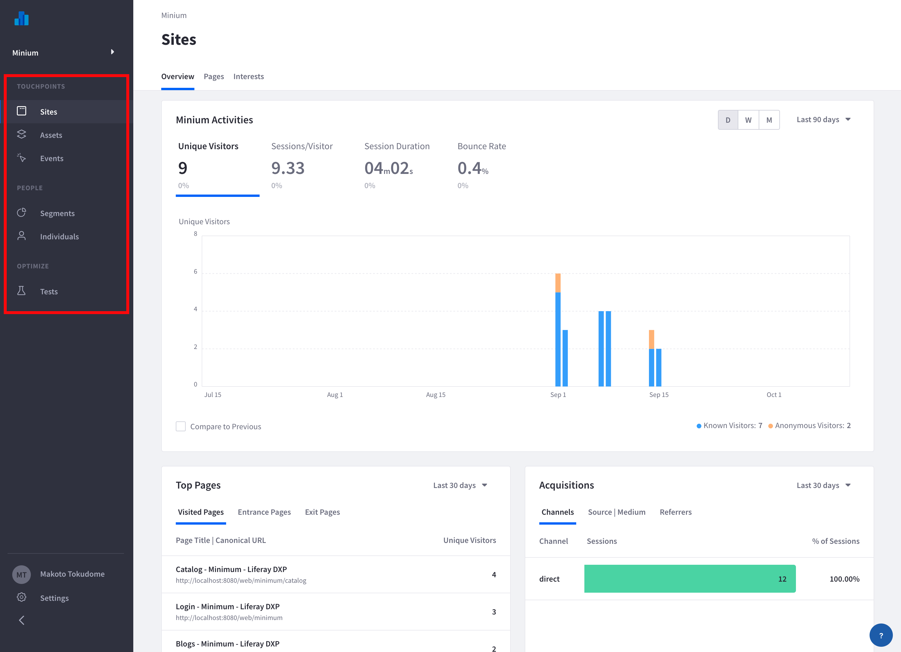

# Viewing the Analytics Dashboard

After [syncing data](./connecting-liferay-dxp-to-analytics-cloud.md), Analytics Cloud automatically begins tracking site visitors and how they interact with your content. The following tools are available for reviewing analytic data.



For understanding your site's data:

* [Sites Dashboard](../touchpoints/sites-dashboard.md)
* [Individual Pages](../touchpoints/pages/pages.md) and [Paths](../touchpoints/pages/paths.md)
* [Assets](../touchpoints/assets.md)
* [Events Analysis](../touchpoints/events/events-analysis.md)

For understanding your audience:

* [Individuals Dashboard](../people/individuals/individuals-dashboard.md)
* [Individual Profiles](../people/individuals/individual-profiles.md)
* [Segments](../people/segments/segments.md)

```{note}
To explore analytics data based on segments, you must first [Create Segments](../people/segments/creating-segments.md). These are groups of individuals that are aggregated together based on attributes you select.
```
<!-- Hiding until further notice
For understanding your Commerce data:

* [Commerce Dashboard](../commerce/commerce-dashboard.md)

```{note}
To explore Commerce analytics data, you must sync Commerce channels with Analytics Cloud. See [Connecting Liferay DXP to Analytics Cloud](./connecting-liferay-dxp-to-analytics-cloud.md) for more information.
``` 
-->

For optimizing site content:

* [A/B Testing](../optimization/a-b-testing.md)

## Inviting Others to Your Workspace

As a workspace owner or admin, you can invite your colleagues to the workspace. Invited users can be configured to help set up and configure data sources, create segments, or view analytics reports.

See [Managing Users](../workspace-settings/managing-users.md) to learn more about adding users to your workspace.

## Configure Settings for Your Workspace

Most of the important settings were configured when you created the workspace. However there are other settings worth reviewing. 

* Data Definitions
* Data Control and Privacy
* APIs
* Workspace Usage Monitoring
* Workspace Settings

Analytics data appears once your workspace is connected. For example, you can view site-specific analytics on the [Sites dashboard](../touchpoints/sites-dashboard.md). To see more about your workspace settings, see [Managing Workspaces](../workspace-settings/managing-workspaces.md). 

## Language Menu Option

The UI for Analytics Cloud currently supports English, Japanese, Portuguese, and Spanish. To change your language settings,

1. Click on your user name at the bottom of the dashboard. Then click *Language*.

   

1. Select the language. Refresh the page. The dashboard and menu is now in the selected language.

Well done! To browse all the available features, options, and configurations for Analytics Cloud, click the *Analytics Cloud* breadcrumb above.
