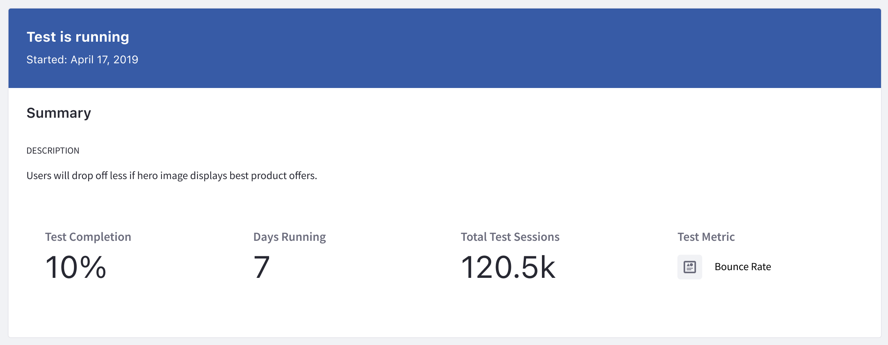
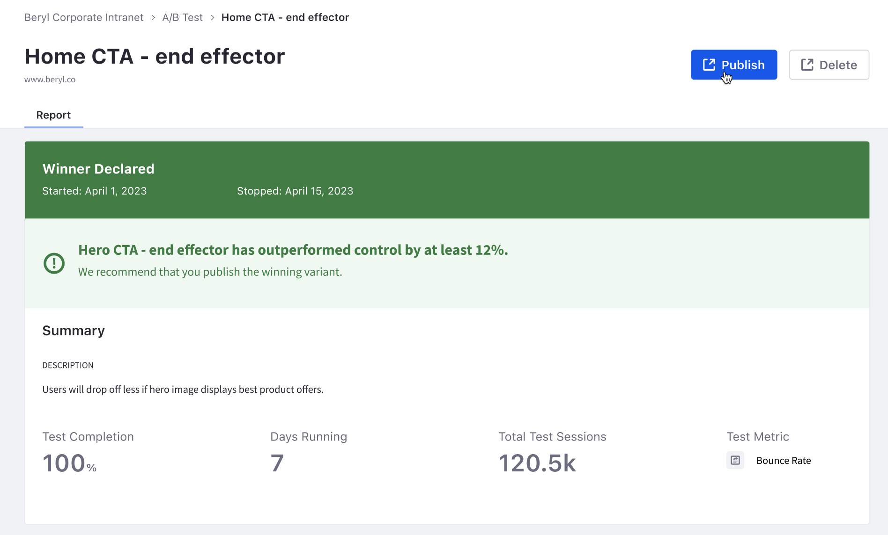
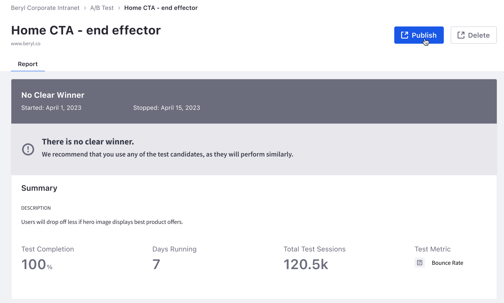

# A/B Testing

A/B Testing evaluates the effectiveness of content pages by testing multiple versions of the page at once. This process involves creating page variants, testing them with a metric (e.g., clicks), and publishing the most effective variant. These tests can help you choose the best experience for your site's users.

You can learn more about creating an A/B test and configuring it for a content page in Liferay DXP's [A/B Testing documentation](https://learn.liferay.com/dxp/latest/en/site-building/optimizing-sites/ab-testing/ab-testing.html).

Analytics Cloud tracks all results from A/B tests running in Liferay DXP. When created, tests are synced automatically with Analytics Cloud, where you can manage them. To view drafted, running, terminated, and completed A/B tests, go to the *Tests* menu in the left column.


For drafted A/B tests, you can configure these details:

* Target: the experience and user segment.
* Metric: the goal to track (e.g., bounce rate or click).
* Variants: the page variants for users to interact with.
* Traffic Split: the percentage of visitors randomly split between the variants.
* Confidence Level: the accuracy of the test results.


Once your A/B test is running, Analytics Cloud offers these reports to keep you up-to-date on its progress:

* [Summary](#summary)
* [Variant Report](#variant-report)
* [Test Sessions](#test-sessions)

## Summary

The Summary panel provides an overview of test details, including completion percentage, running time (in days), and total visitor sessions.

It also provides a quick summary of metric details and the current best performing variant.



## Variant Report

The Variant Report panel provides a detailed breakdown of each variant and how well they're performing.


Below are the metrics reported for each variant:

**Median:** The middle number in the set of sample values. This estimates a typical user's behavior.

**Confidence Interval:** The range of values expected to contain the true mean of the population. For example, a 95% confidence interval is a range of values that the system is 95% sure contains the true mean. This gives the range of possible values that seem plausible for the measured goal.

**Improvement:** The relative improvement from the control group. This metric may also be known as lift. For example, assume the control page has a 15% retention rate and the variant page has a 16% retention rate. The improvement calculation would be `((16 - 15) / 15) = ~6.67%` improvement. This shows the impact of a change. If there is only a small improvement, it may not be worth implementing that change.

**Probability to Win:** Predicts the likelihood that a variant will beat all other participating variants. This shows how multiple metrics compare to each other. For example, consider a horse racing event: each horse has a generated chance to win that is posted before a race (i.e., odds of winning), calculated by simulating the race thousands of times. This same method is used for your variants to calculate their probability of winning the A/B test.

**Unique Visitors:** The number of visitors contributing to the variant. A visitor randomly assigned a variant always sees the same variant until the end of the test. Besides knowing how much traffic is hitting a page, this metric also helps in determining configuration issues with the A/B test. For example, there could be too much traffic going to one variant (typically caused by a segment misconfiguration).

## Test Sessions

The Test Sessions panel provides statistics of how many sessions view your test impressions per day over time. This helps you validate that your audiences are being directed to your A/B test impressions. It also portrays how your test affects the traffic to your page compared to before.


Next, you'll learn about an A/B test's statuses.

## Test Status

An A/B test is always characterized with a status after it starts. These include

* [Test is Running](#test-is-running)
* [Winner Declared](#winner-declared)
* [No Clear Winner](#no-clear-winner)

### Test is Running

This means that your test is running and needs a larger sample size before reaching the desired confidence level and declaring a winner. You can view the current best variant.


When a test is running, you can terminate it by selecting *Terminate Test* from the Summary bar.


```{important}
Large amounts of traffic (i.e. several thousand hits a day) is expected for an A/B test to run successfully. Therefore, public facing sites may be more suitable for testing. It may take significantly longer for a test to finish for an internal website or portal.
```

### Winner Declared

Once your A/B test finishes successfully, a variant is declared a winner. For this state, you can perform these actions:

* Publish the winning variant as your default experience.
* Complete the test without publishing any variants.



### No Clear Winner

Sometimes, Analytics Cloud cannot determine a winner because no variant has outperformed significantly over the control page. In this case, you can complete the test without publishing and the control remains the default experience.


