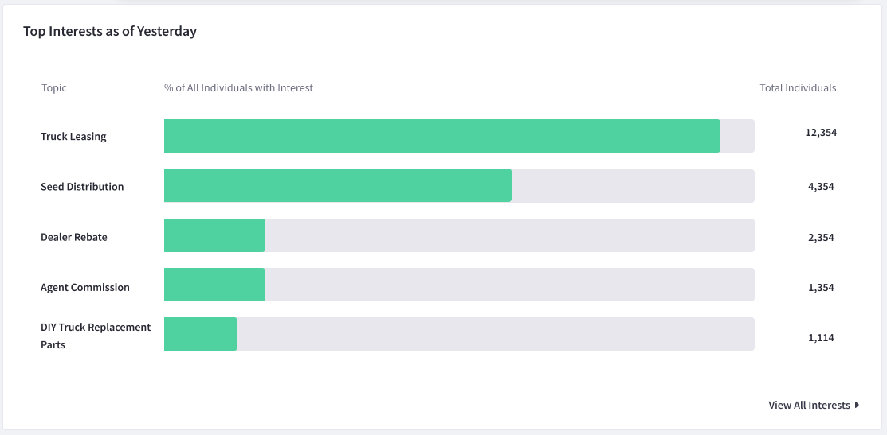

# Individuals Dashboard

The Individuals dashboard provides a broad range of analytics data about your visitors and how they interact with your Site.

To view the dashboard,

1. Click _Individuals_ in the People section of the menu.

1. Click the _Overview_ tab (this tab is selected by default when you click Individuals).

The Individuals dashboard contains the following panels:

* [Current Totals](#current-totals)
* [Enriched Profiles](#enriched-profiles)
* [Active Individuals](#active-individuals)
* [Interests](#interests)
* [Breakdown](#breakdown)

To download this dashboard view as a PDF file, click _Download Report_. See [downloading reports](../../reference/downloading-reports.md) to learn more.

## Current Totals

The Current Totals panel presents the total number of individuals, known and anonymous, that have been tracked by Analytics Cloud. 


```{note}
Individuals are considered known when their email addresses are matched at login with user data synced with Analytics Cloud. When new users register on your site, it may take up to two hours for their data to sync with Analytics Cloud and appear as known individuals.
```

The panel also displays a percentage change in total numbers compared to the previous 30 days.

## Enriched Profiles

The Enriched Profiles panel presents the total number of individuals that have been enriched within the last 30 days.


An individual is considered enriched any time an attribute is associated with that individual; for example, when you [sync contact data from DXP](../../getting-started/connecting-liferay-dxp-to-analytics-cloud.md).

## Active Individuals

The Active Individuals panel presents information on both known and anonymous individuals who interacted with your Site in the selected period.


Choose to visualize the data based on day, week or month. The data can be filtered by ranges of time: Last 24 hours, Last 7 days, Last 30 days, Last 90 days. Click *More Preset Periods* to reveal additional time ranges. Click *Custom Range* to filter by a start date and end date of your choice.

## Interests

The Interests panel presents the top 5 most popular topics. 



The percentage of total individuals for interests shows what percent of individuals are interested in a specific topic. Theses topics are derived from the title, description, and keyword tags of your pages' HTML.

To view the full list of interest topics, click *View All Interests* in the panel. Alternatively, click the Interests tab at the top of the page. 

To learn more about interests see [Understanding Interests](./understanding-interests.md).

## Breakdown

The Breakdown panel presents distribution information based on selected attributes of individuals. These attributes are available:

* `additionalName`: middle name
* `birthDate`: birth date
* `Email`: email address
* `familyName`: family name
* `givenName`: given name
* `jobTitle`: job title
* `languageId`: preferred language
* `modifiedDate`: last modified date
* `screenName`: screen name


To add a new breakdown,

1. Click the plus sign at the top right of the panel. 

1. Use the drop-down menu to select an attribute.

1. Input a name for the breakdown and click _Save_.

To view the breakdown of additional attributes, click *Explore Breakdown*. Alternatively, click the _Distribution_ tab at the top of the page.
