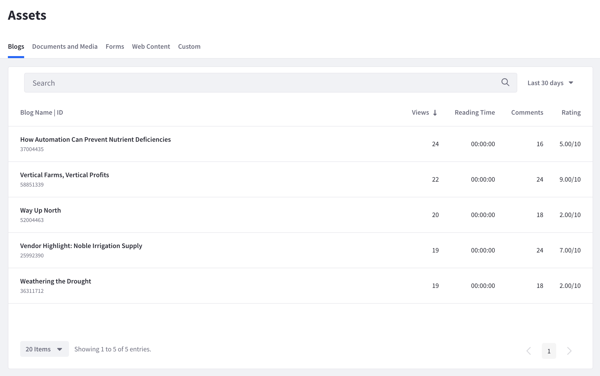

---
toc:
  - ./assets.md
  - ./assets/web-content.md
  - ./assets/blogs.md
  - ./assets/forms.md
  - ./assets/documents-and-media.md
  - ./assets/tracking-custom-assets.md
taxonomy-category-names:
- Content Management System
- Asset Analytics
- Liferay Self-Hosted
- Liferay SaaS
- Liferay PaaS
uuid: 5ec4ccb1-4c4e-415d-855e-5c458597f1c3
---
# Assets

Assets are individual pieces of content that exist on site pages in your Liferay Analytics Cloud data sources. In summary, assets are

- Content residing on a page.
- Registered, tracked, and reported on by Analytics Cloud the first time an interaction is detected by the Analytics Cloud client.
- Queried and reported on at regular intervals.
- Reported on in Analytics Cloud with the data reports shown in this tutorial.

Analytics Cloud supports these types of assets:

- [Blogs](./blogs.md)
- [Documents and Media](./documents-and-media.md)
- [Forms](./forms.md)
- [Web Content](./tracking-custom-assets.md)

A CSV report is available for each asset type. See [downloading reports](../../reference/downloading-reports.md) to learn more.

Clicking an individual asset leads to an overview page showing analytics data for the asset. Clicking on the Known Individuals tab shows a list of known visitors who have interacted with the asset.

!!! note
    By default, Analytics data for assets is only collected through each asset's respective widget. For information on how to use other types of fragments and widgets to collect data on assets, see [Tracking Custom Assets](./tracking-custom-assets.md)

## Related Topics

- [Blogs](https://learn.liferay.com/web/guest/w/dxp/content-authoring-and-management/blogs)
- [Documents and Media](https://learn.liferay.com/web/guest/w/dxp/content-authoring-and-management/documents-and-media)
- [Forms](https://learn.liferay.com/web/guest/w/dxp/process-automation/forms)
- [Web Content](https://learn.liferay.com/web/guest/w/dxp/content-authoring-and-management/web-content)
- [Using Widgets](https://learn.liferay.com/web/guest/w/dxp/site-building/creating-pages/page-fragments-and-widgets/using-widgets)