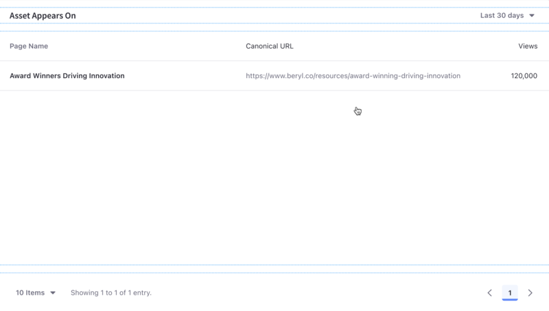

---
taxonomy-category-names:
- Content Management System
- Asset Analytics
- Blogs
- Liferay Self-Hosted
- Liferay SaaS
- Liferay PaaS
uuid: 5001f516-6581-4865-a1f8-b4ac590d3771
---
# Blogs

[Blogs entries](https://learn.liferay.com/w/dxp/content-authoring-and-management/blogs/getting-started-with-blogs) are important content on websites. They attract readers who return to view new blog posts and interact in discussion.

Analytics Cloud gives you important insights into how engaged readers are with your blog posts.

A list of your site's blog posts is presented along with different metrics. To download this data as a CSV file, click *Download Reports*. See [Downloading Reports](../../reference/downloading-reports.md) to learn more.

!!! note
    Analytics data for blogs is collected through the Blogs widget. For information on how to use other types of fragments and widgets to collect data on blogs, see [Tracking Custom Assets](./tracking-custom-assets.md)

## Visitor Behavior

Click the name of any blog post to see more detailed analytics. The overview tab of an asset's detail presents several data presentations. To download this dashboard view as a PDF file, click *Download Reports*. See [Downloading Reports](../../reference/downloading-reports.md) to learn more.

The first chart, called visitor behavior, contains five important metrics:

- Total Views
- Average Reading time
- Total Shares
- Total Comments
- Average Rating

### Views

The views plot shows the trend-line for the number of times a blogs entry was viewed each day (or hour, if yesterday or last 24 hours are selected). You can find more detailed information about this in [Asset Appears On](#asset-appears-on), at the bottom of the page.

### Reading Time

Reading time is the average reading time per view of a blog entry. The daily (or hourly, if yesterday or last 24 hours are selected) average reading time per view is plotted for the time period.

### Shares

The count of total shares per day is plotted to establish the shares trend-line.

### Comments

The comments trend-line plots the total number of comments on a blog entry per day (or hour, if yesterday or last 24 hours are selected) over the selected time period.

### Rating

Readers can rate blogs. Whether the rating is a simple thumbs up/thumbs down or a stars rating (0-5 stars), you can use the rating in Analytics Cloud to compare blog posts. A blog post announcing free swag may have a higher rating than a blog post announcing that prices are increasing. The rating is reported as a number out of 10.

## Audience

The audience report uses charts to present information about the audience interaction with the asset. It answers these questions:

- How many users are interacting with my content?
- Of these users, how many are known or anonymous?
- Of the known users who interacted with my content, how many belong to Analytics Cloud segments?
- Of the users in segments, what are the top 15 segments?

Here are the charts in the Audience report:

**View:** A donut chart that presents the percentage of total unique visitors who are known or anonymous. The center shows the total number of unique visitors. Tooltips show the number of users for that section (e.g, the number of known or anonymous users).

!!! note
    Individuals are considered known when their email addresses are matched at login with user data synced with Analytics Cloud. When new users register on your site, it may take up to two hours for their data to sync with Analytics Cloud and appear as known individuals.

**Segmented Views:** A donut chart that presents the percentage of individuals who belong or do not belong to one or more Analytics Cloud segments. The center shows the total number of known individuals. Tooltips show the number of known individuals for that section (e.g. the number of known individuals belonging to one or more segments).

**Viewer Segments:** A bar chart that shows the percentage of known individuals that comprise each segment. The chart shows a bar for each of the top five segments, and then aggregates the remaining segments into the last bar. A tooltip on the last bar shows the values for each of the remaining segments.

Note that the segmentation data presented about your audience is based on an individual belonging to a segment at the time of their visit.

## Views by Location

The map in the Views by Location panel shows the number of views by country in the selected time period.

## Views by Technology

View a stacked bar graph of the page's views by operating system (grouped by device type) in the default *Devices* tab.

Click *Browsers* to see a donut chart displaying up to the top eight web browsers over the selected time period. If applicable, remaining web browsers are aggregated in the ninth donut segment.

## Asset Appears On

You can view comprehensive statistics for each asset across various sites and channels where it's published on the Asset Appears On table. It includes the page name, the URL, and the number of views on the page. Like any page data in Analytics Cloud, only pages site visitors interacted with in some way are tracked and reported. It's important to note that the link doesn't take you to the actual page with the asset on it. Instead, it leads to the page's analytics view. From there you can click the URL to the actual page.

## Related Topics

- [Blogs](https://learn.liferay.com/web/guest/w/dxp/content-authoring-and-management/blogs)
- [Tracking Custom Assets](./tracking-custom-assets.md)