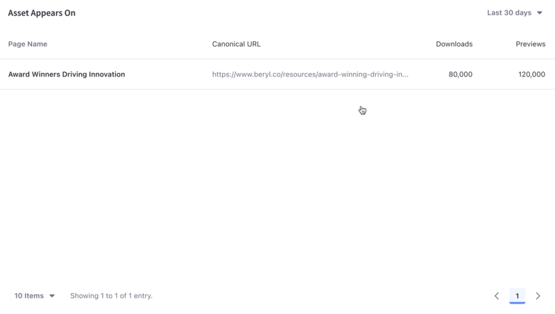

# Documents and Media

Documents and media files are assets you want site users to look at or download. Analytics Cloud provides insights on user engagement with your documents and media assets.

A list of your site's documents and media appear along with different metrics. To download this data as a CSV file, click _Download Report_. See [downloading reports](../../reference/downloading-reports.md) to learn more.

## Visitor Behavior

The Overview tab of an asset's detail presents several data presentations. To download this dashboard view as a PDF file, click _Download Report_. See [downloading reports](../../reference/downloading-reports.md) to learn more.

The first chart, called visitor behavior, contains four important metrics:

1. Total Downloads
1. Total Previews
1. Total Comments
1. Average Rating

### Downloads

The Downloads trend-line shows the total number of downloads per day (or hour, if Yesterday or Last 24 Hours are selected) over the selected time period.

### Previews

Documents and Media files can be previewed. Even if not ultimately downloaded, previewing shows interaction with the file and is therefore an important metric. The previews trend line shows the total number of previews per day (or hour, if yesterday or last 24 hours are selected) for the selected time period.

### Comments

Comments can be enabled on documents and media files. If enabled, the comments trend line shows the total number of comments on a file per day (or hour, if yesterday or last 24 hours are selected) over the selected time period.

### Rating

Ratings can be enabled on documents and media. Whether the rating is a simple thumbs up/thumbs down or a stars rating (0-5 Stars), you can use the rating to compare how users evaluate the site's documents and media files.

## Audience

The audience report uses charts to present information about the audience interaction with the asset. It answers these questions:

* How many users are interacting with my content?
* Of these users, how many are known or anonymous?
* Of the known users who interacted with my content, how many belong to Analytics Cloud segments?
* Of the users in segments, what are the top 15 segments?

Here are the charts in the audience report:

**Downloads:** A donut chart that presents the percentage of total unique visitors who are known or anonymous. The center shows the total number of unique visitors. Tooltips show the number of users for that section (e.g, the number of known or anonymous users).

!!! note
    Individuals are considered known when their email addresses are matched at login with user data synced with Analytics Cloud. When new users register on your site, it may take up to two hours for their data to sync with Analytics Cloud and appear as known individuals.

**Segmented Downloads:** A donut chart that presents the percentage of known individuals who belong or do not belong to one or more Analytics Cloud segments. The center shows the total number of known individuals. Tooltips show the number of known individuals for that section (e.g, the number of known individuals belonging to one or more segments).

**Viewer Segments:** A bar chart that shows the percentage of known individuals that comprise each segment. The chart shows a bar for each of the top five segments and then aggregates the remaining segments into the last bar. A tooltip on the last bar shows the values for each of the remaining segments.

Note that the segmentation data presented about your audience is based on an individual belonging to a segment at the time of their visit.

## Downloads by Location

The map in this panel shows the number of downloads by country in the selected time period.

## Views by Technology

View a stacked bar graph of the page's views by operating system (grouped by device type) in the default _Devices_ tab.

Click _Browsers_ to see a donut chart displaying up to the top eight web browsers over the selected time period. If applicable, remaining web browsers are aggregated in the ninth donut segment.

## Asset Appears On

The asset appears on table includes a page name and URL. Like any page data in Analytics Cloud, only pages that were interacted with in some way by site visitors are tracked and reported. It's important to note that the link doesn't take you to the actual page with the asset on it. Instead, it leads to the page analytics view of the page. From there you can click the URL to the actual page.

