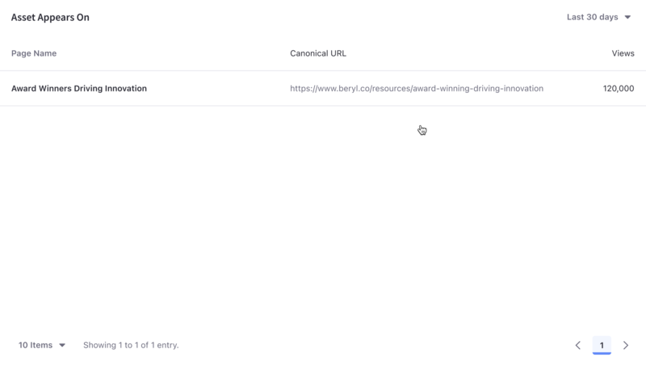

---
taxonomy-category-names:
- Content Management System
- Asset Analytics
- Web Content and Structures
- Liferay Self-Hosted
- Liferay SaaS
- Liferay PaaS
uuid: 81304039-f329-43a0-bfe0-8666f6ae66d3
---
# Web Content

[Web content articles](https://learn.liferay.com/w/dxp/content-authoring-and-management/web-content/web-content-articles/adding-a-basic-web-content-article) are important assets for presenting site visitors with information. Analytics Cloud gives you important insights into how site users are engaging with your content.

A list of your site's web content articles are presented along with different metrics. To download this data as a CSV file, click _Download Report_. See [downloading reports](../../reference/downloading-reports.md) to learn more.

!!! note
    Analytics data for web content is collected through the Web Content Display widget. For information on how to use other types of fragments and widgets to collect data on web content, see [Tracking Custom Assets](./tracking-custom-assets.md)

## Visitor Behavior

The overview tab of an asset's detail presents several data presentations. To download this dashboard view as a PDF file, click _Download Report_. See [downloading reports](../../reference/downloading-reports.md) to learn more.

The first chart, called visitor behavior, contains one important metric: total views.

The number of views per day (or hour, if yesterday or last 24 hours are selected) is plotted over the selected time period to establish a view trend line. Use this to evaluate how well the content engages visitors over time.

## Audience

The Audience report uses charts to present information about the audience interaction with the asset. It answers these questions:

- How many users are interacting with my content?
- Of these users, how many are known or anonymous?
- Of the known users who interacted with my content, how many belong to Analytics Cloud segments?
- Of the users in segments, what are the top 15 segments?

Here are the charts in the audience report:

**Views:** A donut chart that presents the percentage of total unique visitors who are known or anonymous. The center shows the total number of unique visitors. Tooltips show the number of users for that section (e.g, the number of known or anonymous users).

!!! note
    Individuals are considered known when their email addresses are matched at login with user data synced with Analytics Cloud. When new users register on your site, it may take up to two hours for their data to sync with Analytics Cloud and appear as known individuals.

**Segmented Views:** A donut chart that presents the percentage of known individuals who belong or do not belong to one or more Analytics Cloud segments. The center shows the total number of known individuals. Note that only the known individuals are used to calculate this chart.

**Viewer Segments:** A bar chart that shows the percentage of known individuals that comprise each segment. The chart shows a bar for each of the top five segments, and then aggregates the remaining segments into the last bar. A tooltip on the last bar shows the values for each of the remaining segments.

Note that the segmentation data presented about your audience is based on an individual belonging to a segment at the time of their visit.

## Views by Location

The map in the Views by Location panel shows the number of views by country in the selected time period.

## Views by Technology

View a stacked bar graph of the page's views by operating system (grouped by device type) in the default Devices tab.

Click _Browsers_ to see a donut chart displaying up to the top eight web browsers over the selected time period. If applicable, remaining web browsers are aggregated in the ninth donut segment.

## Asset Appears On

The Asset Appears On table includes the page name, the URL, and the number of views on the page. Like any page data in Analytics Cloud, only pages site visitors interacted with in some way are tracked and reported. It's important to note that the link doesn't take you to the actual page with the asset on it. Instead, it leads to the page analytics view of the page. From there you can click the URL to the actual page.

## Related Topics

- [Web Content](https://learn.liferay.com/web/guest/w/dxp/content-authoring-and-management/web-content)
- [Tracking Custom Assets](./tracking-custom-assets.md)