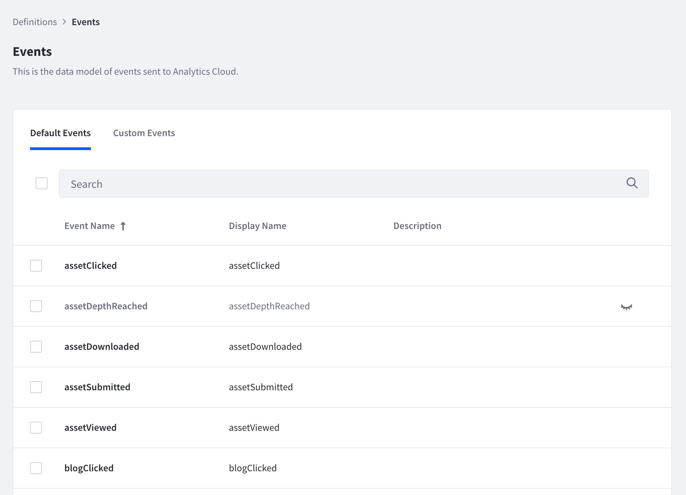
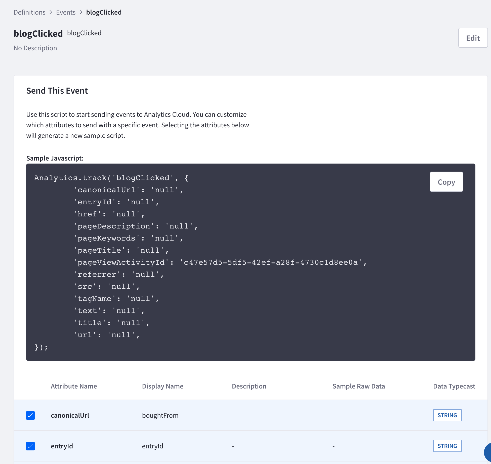
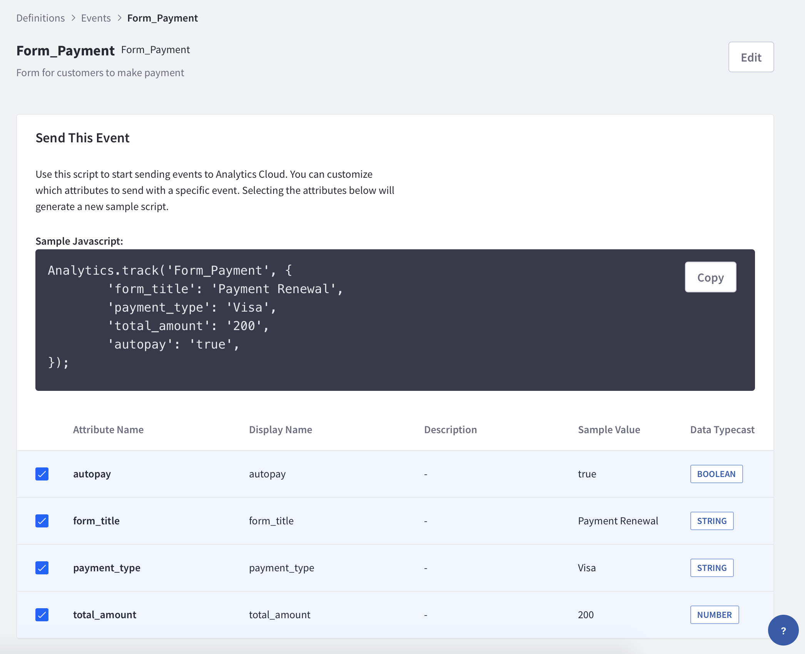
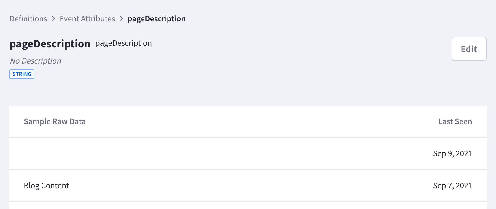
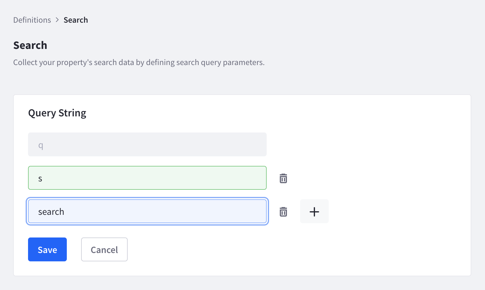

# Definitions

In Analytics Cloud, you can manage how data is modeled and defined. You can view and manage the data models of [individuals](./definitions/definitions-for-individuals.md), [events](./definitions/definitions-for-events.md), [event attributes](./definitions/definitions-for-event-attributes.md), and [search queries](./definitions/setting-a-search-query.md).

## Individuals

The data model for individuals is defined by the various attributes that get mapped when contact data is [synced from DXP](../../getting-started/connecting-liferay-dxp-to-analytics-cloud.md).

To view a list of these attributes, navigate to *Settings* &rarr; *Workspace Data* &rarr; *Definitions* &rarr; *Individuals*.

All the different attributes for individuals are listed. Some attributes may be defined by more than one data source. 

You can choose specific attributes for [creating segments](../../people/segments/creating-segments.md) or [creating a specific breakdown for individuals](../../people/individuals.md#breakdown).

## Events

Analytics Cloud tracks default and custom events that occur on your DXP instance. To view and manage how these events are defined, navigate to *Settings* &rarr; *Workspace Data* &rarr; *Definitions* &rarr; *Events*.

### Default Events

There are several default events that can be analyzed as soon as you have [connected your DXP instance to Analytics Cloud](../../getting-started/connecting-liferay-dxp-to-analytics-cloud.md). Click on the *Default Events* tab to see all the events that are available out of the box.

Click on a default event to see the specific attributes that are associated with that event.

The attributes are presented in a list with the following properties:

- Attribute Name
- Display Name
- Description
- Sample Raw Data
- Data Typecast

A sample JavaScript snippet is also provided to serve as a template for defining custom events. Check or uncheck the attributes you need and click the *Copy* button to copy the code snippet.

#### Hiding Events

You can choose to hide or show specific events. Hiding an event removes the option from the Events Analysis tool and hides the visibility of the data. Different events are used to calculate different metrics. Choose to hide or show events based on your business needs. 

To hide an event, locate the specific event and click the *Hide* icon () on the right of the event name. Click *Hide* in the pop-up window to confirm your decision.

To unhide an event, locate the specific event and click the *Show* icon () on the right of the event name.

Note, only administrators can hide or show events.

### Custom Events

Custom events are a useful way to define and track events that are specific to your business needs. For example, you might track a form on your site that customers use to make payments. Once the specific event is defined and configured on your site, Analytics Cloud collects data for the event. See [Tracking Events](../../touchpoints/events/tracking-events.md) to learn more.

Click on the *Custom Events* tab to see all the events that have been defined and are being tracked. Note that there is a limit of 100 custom events that can be tracked at any given time. 

#### Custom Event Definition

Click on a custom event to see the specific attributes that are associated with that event.

The attributes are presented in a list with the following properties:

- Attribute Name
- Display Name
- Description
- Sample Raw Data
- Data Typecast

The image above shows an example of how a custom event might track attributes such as payment type, total amount, and whether autopay was selected.

Click the *Edit* button to edit the Display Name or Description of the custom event. 

#### Block List

Analytics Cloud currently supports up to 100 custom events. Additional custom events beyond 100 are automatically added to the Block List. Any custom event that is in this block list is an event that is not tracked or processed by Analytics Cloud. To see the list of blocked events, click *Block List* under the Custom Events tab.

To unblock a custom event from the Block List, check the box next to the event and click *Unblock Events*. Or click the unblock icon () to the right of the event name.

To block a custom event, from the Custom Events tab check the box next to the event and click *Block Events*. Or click the block icon () to the right of the event name.

## Event Attributes

Event attributes are the metadata that provide context for events. Different attributes are associated with default and custom events. Global attributes are attributes that are associated with all types of events. Other attributes may only be associated with certain types of events. To view and manage event attributes, navigate to *Settings* &rarr; *Workspace Data* &rarr; *Definitions* &rarr; *Event Attributes*.

1. Choose a specific attribute under the Global Attributes tab or the Attributes tab. Use the search bar to find a particular attribute.

   

1. Click an attribute to see more details. The Sample Raw Data column shows recent data of that particular attribute. The Last Seen column shows when the attribute was last seen.

   

1. Click the *Edit* button to edit the Display Name, Description, or Default Data Typecast of the attribute.

   

   The following data typecasts are available: Boolean, Date, Duration, Number, and String. Analytics Cloud automatically tries to detect and cast the datatype based on the first data collected for that attribute. Make changes to the typecast if necessary.

## Search Queries

The search query parameter can vary from site to site. For example, a URL might look like `www.example.com/?s=test` where `s` is the parameter, or `www.example.com/?search=test` where `search` is the parameter. You can define up to five search query parameters in settings.

Navigate to *Settings* &rarr; *Workspace Data* &rarr; *Definitions* &rarr; *Search*. Enter the parameter into the text field. Click *+* to add additional parameters. Click the trash icon () to delete a parameter.