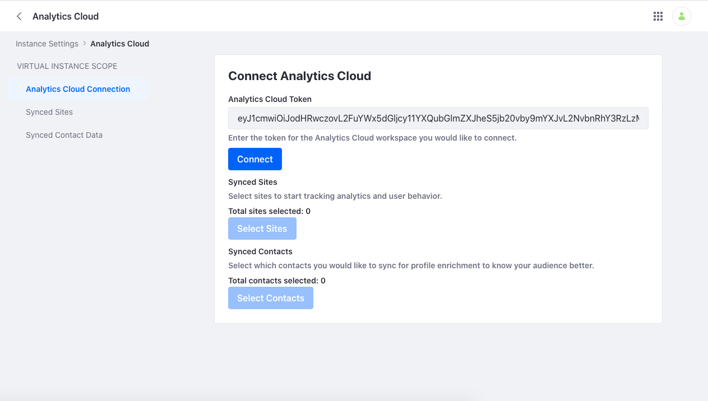

# Connecting Older Versions of Liferay DXP

{bdg-secondary}`Available Liferay DXP 7.4 U66 and below`

To begin the setup process, there are a few requirements:

1. You need a [liferay.com](https://www.liferay.com) account. If you don't have one, you can [create an account](https://login.liferay.com/signin/register).

1. When you visit [analytics.liferay.com](https://analytics.liferay.com/) for the first time, you must set up multi-factor authentication for the account. See [Multi-Factor Authentication](../workspace-settings/multi-factor-authentication.md) for details.

1. Your Liferay DXP installation must meet one of the following minimum versions:

   * 7.4 (Any version)
   * 7.3 Fix Pack 1
   * 7.2 Fix Pack 11
   * 7.1 Fix Pack 22
   * 7.0 Fix Pack 98

1. You must have access to at least one Analytics Cloud workspace. As a paid Analytics Cloud user, you should see your workspace upon login. If you don't, contact support through [help.liferay.com](https://help.liferay.com/) or email <analytics-cloud@liferay.com>.

## Connection Token

Liferay DXP and Analytics Cloud connect via a secure, encrypted token. This token is generated by Analytics Cloud and must be added to your Liferay DXP configuration. Once connected, you can determine which data to sync. The process is different depending on the version of Liferay DXP you are using.

1. Log in to Analytics Cloud and select your workspace.

   If this is your first time logging in, the onboarding guide appears. Click _Next_ and copy the Analytics Cloud token.

   

   Alternatively, you can find the token under _Settings_ &rarr; _Data Sources_. Click _Add Data Source_, select _Liferay DXP_, and copy the Analytics Cloud token.

1. Log in to your Liferay DXP instance.

1. Open the _Global Menu_ (), go to the _Control Panel_ tab, and click _Instance Settings_.

1. Under Platform, click _Analytics Cloud_.

1. Paste the Analytics Cloud token and click _Connect_.

   

   ```{note}
   On Liferay DXP 7.0, Analytics Cloud Admin is under *Configuration* &rarr; *Analytics Cloud*.
   ```

1. Verify this message appears:

   `Success: Your request completed successfully`

Congratulations, your Liferay instance is now connected to Analytics Cloud! The next step is syncing your Liferay site and your contacts.

## Syncing Sites and Contacts

```{tip}
If you are new to Liferay DXP, there isn't much content on your Liferay instance for Analytics Cloud to start tracking. If you want to learn Analytics Cloud by jump-starting a demo site, consider using Liferay Commerce's [Minium Accelerator Site](https://learn.liferay.com/commerce/latest/en/starting-a-store/using-the-minium-accelerator-to-jump-start-your-b2b-store.html) to generate some sample content. 
```

### Syncing Sites

To sync sites, you must create properties and associate them with one or more sites. Analytics Cloud aggregates your data according to how you define your properties. This example shows a simple setup where a single site is associated with a property. To learn more about defining a property with multiple sites see [Scoping Sites and Individuals Using Properties](./scoping-sites-and-individuals-using-properties.md).

1. In Analytics Cloud, navigate to _Settings_ &rarr; _Properties_.

1. Click _New Property_ and input a label (e.g. Minium Site).

1. In your DXP instance, open the _Global Menu_ (), go to the _Control Panel_ tab, and click _Instance Settings_.

1. Under Platform, click _Analytics Cloud_.

1. Click _Select Sites_.

1. Select the new property under Available Properties.

1. Select the site you want to sync and click _Done_.

   

   Verify this message appears:

   `Success: Your request completed successfully`

### Syncing Contacts

1. In your DXP instance, open the _Global Menu_ (), go to the _Control Panel_ tab, and click _Instance Settings_.

1. Under Platform, click _Analytics Cloud_.

1. Click _Select Contacts_.

1. Under Contact Sync Options, click _Sync Contacts_. Toggle _Sync All_ to sync all contacts. Alternatively, click _Sync by User Groups_ or _Sync by Organizations_ if you want to sync a subset of your contacts.

   ```{important}
   Analytics Cloud provides tools to sync and manage individual contact data. However, these tools do not guarantee compliance with privacy regulations (e.g. GDPR). You must carefully determine the practices and configurations necessary for complying with the privacy laws where your sites store and process personal data.
   ```

1. Click _Save and Next_.

1. Switch between the _Contact_ tab and _User_ tab to select which fields to sync. Liferay DXP stores contact data in two separate tables (Contact and User). Analytics Cloud requires some fields to be synced; these fields are grayed out.

   

1. Click _Save_.

   Verify this message appears:

   `Success: Your request completed successfully`

Great, now you're all set up! As users visit and interact with your site, Analytics Cloud begins tracking what's happening. Once that happens, you can take a dive into [Viewing the Analytics Dashboard](../getting-started/viewing-the-analytics-dashboard.md) to see the different interactions that get tracked.
