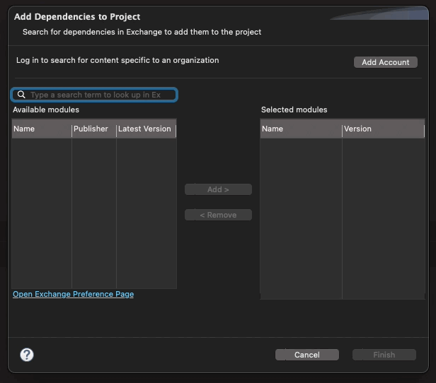
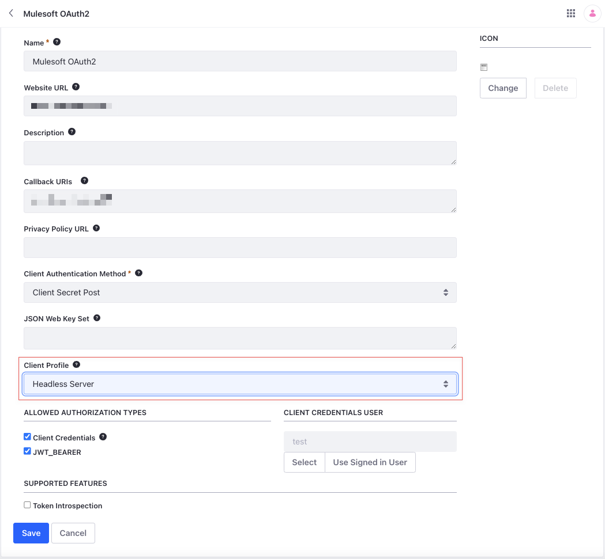

# Configuring the MuleSoft Connector

Liferay's connector to MuleSoft uses OpenAPI 3.0 documents that describe Liferay's APIs. Each OpenAPI document is deployed dynamically in your Liferay instance under the following schema:

```bash
http://[host]:[port]/o/[headless-api-app-name]/[version]/openapi.json
```

These documents are based on your deployed RESTful web services, so they are the most accurate descriptions of your APIs. You can learn more about Liferay APIs [here](https://learn.liferay.com/dxp/latest/en/headless-delivery/consuming-apis.html).

Once you specify an OpenAPI document endpoint, the connector automatically configures the paths, path/query parameters, and entity metadata defined in the OpenAPI document. The connector works with any OpenAPI 3.0 document that follows Liferay standards and supports all Liferay APIs.

## Adding the Connector to Mule Projects

Before configuring the connector, you must add it to your Mule project:

1. Click *Search in Exchange* in the Mule Palette.

1. Search for *Liferay*.

1. Select the connector and click *Add*.

1. Click *Finish*.

The connector now appears in your Mule project.



## Connector Configuration

1. Select an authentication method and enter the required parameters.

1. Specify an OpenAPI document endpoint.

### Authentication

Choose between *Basic* and *OAuth2* authentication methods.

**Basic Authentication**: Enter a user name and password.

**OAuth2**: Enter a client key and client secret.

For production, you should authorize users via [OAuth2](https://learn.liferay.com/dxp/latest/en/headless-delivery/using-oauth2.html). Basic authentication is provided only for basic testing and demonstration.

When setting up OAuth2 in Liferay, select *Headless Server* for Client Profile. Liferay generates a client ID (consumer key) and client secret (consumer secret) for use in the connector.



To use endpoints with OAuth2 authorization, you must also define [scopes](https://learn.liferay.com/dxp/latest/en/headless-delivery/using-oauth2/oauth2-scopes.html) with the authorization options you need (e.g., `everything`, `everything.write`, or `everything.read`).

See [Creating OAuth2 Applications](https://learn.liferay.com/dxp/latest/en/headless-delivery/using-oauth2/creating-oauth2-applications.html) for detailed setup instructions, or [Using OAuth2 to Authorize Users](https://learn.liferay.com/dxp/latest/en/headless-delivery/using-oauth2/using-oauth2-to-authorize-users.html) for a sample React application with OAuth2.

### Specify OpenAPI Document Endpoint

Once authorized, set an OpenAPI document endpoint to specify the Liferay API you want to use. For example, this document is for the Commerce Admin Catalog API:

```bash
http://[host]:[port]/o/headless-commerce-admin-catalog/v1.0/openapi.json
```

To set this value, edit the `Liferay_Config` global element and enter the document endpoint into the *OpenAPI Spec URL* field.


You can also do this using XML configuration. Right click the `Liferay_Config` global element and select *Go to XML*. Then enter your credentials using the appropriate format for your authentication method.

* Basic Authentication Example:

   ```xml
    <liferay:config name="Liferay_Config_Catalog">
    <liferay:basic-connection username=${username} password=${password} openApiSpecPath="http://localhost:8080/o/headless-commerce-admin-catalog/v1.0/openapi.json" />
    </liferay:config>
   ```

* OAuth 2.0 Example:

   ```xml
    <liferay:config name="Liferay_Config_Catalog">
    <liferay:oauth2-connection consumerKey="${consumerKey}" consumerSecret=${consumerSecret} openApiSpecPath="http://localhost:8080/o/headless-commerce-admin-catalog/v1.0/openapi.json" />
    </liferay:config>
   ```

Click *Test Connection*. If successful, you can start building flows using the connector. Otherwise, review your configuration.

## Additional Information

* [Designing Mule Flows](./designing-mule-flows.md)
* [Consuming APIs](https://learn.liferay.com/dxp/latest/en/headless-delivery/consuming-apis.html)
* [Using OAuth2](https://learn.liferay.com/dxp/latest/en/headless-delivery/using-oauth2.html)
