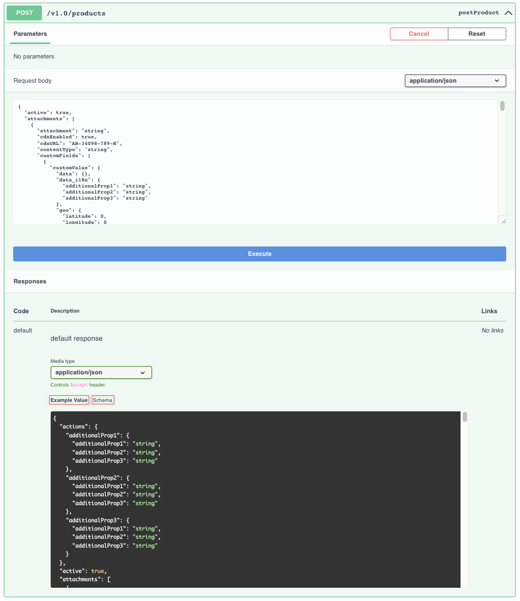
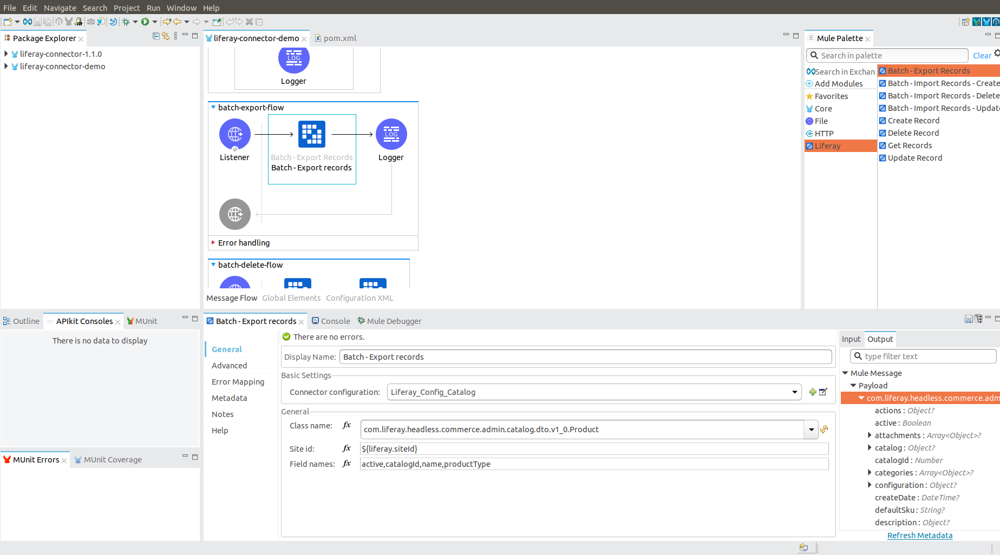

# Designing Mule Flows

Now that you've created your Mule project and configured the MuleSoft Connector, you can start building Mule flows. Four operations are available after defining the OpenAPI endpoint.

* Create Records
* Delete Records
* Get Records
* Update Records

Each operation implements and exposes different parts of the specified OpenAPI document.

If you're working with large data sets, you probably don't want to handle records one at a time. To process these quickly, you can use Liferay's batch operations. They enable you to submit large amounts of data in batches that results in faster execution.

## Create Records Operation

This operation exposes all endpoints handled by the HTTP POST method for the chosen OpenAPI 3.0 document. The SwaggerHub UI shows all available path parameters, request body structures, and possible responses.



After selecting the desired endpoint from the *Endpoint* selector, the connector automatically generates related metadata.

Next, you must specify the input parameters. Input parameters support all Liferay RESTful web services and needn't be used with every endpoint:

| Parameter name | Type   | Description                                                         | Required                      |
| :------------- | :----- | :------------------------------------------------------------------ | :---------------------------- |
| Endpoint       | String | Drop-down list of available endpoints that support create operation | Yes                           |
| Records        | Object | Object to be created                                                | Yes                           |
| Path Params    | Object | Map with path parameter values                                      | Yes (if required by endpoint) |
| Query Params   | Object | Map with query parameter values                                     | No                            |

Use [Liferay's SwaggerHub](https://app.swaggerhub.com/organizations/liferayinc) as a reference for the different operations supported by the Liferay MuleSoft connector. You can also use the OpenAPI document from the endpoint you defined in the connector configuration, but you lose the intuitive UI offered by SwaggerHub.


You can follow the same steps as above to configure and use the other operations in your flow.

## Batch Export Operation

The Batch Export operation allows you to get all records of a specified entity with a single request. This is useful when the number of records are very high. In case the number of records are low, you can use the *Get Records* operation.



To configure a batch export operation, first select the entity you want to export using the *Class name* drop-down. Once selected, the connector dynamically generates related output metadata. If desired, you can use the *Field names* input to specify the fields to include in the exported entity. Field names must be separated using commas. You can also specify a *Site ID* parameter if required by the batch processing logic.

| Parameter name | Type   | Description                                                                                                                                                                                          | Required |
| :------------- | :----- | :--------------------------------------------------------------------------------------------------------------------------------------------------------------------------------------------------- | :------- |
| Class name     | String | The classname of the exported entity                                                                                                                                                                 | Yes      |
| Site id        | String | The siteId query parameter. Find your site's id [here](https://learn.liferay.com/dxp/latest/en/headless-delivery/consuming-apis/consuming-rest-services.html#identify-the-site-containing-the-data). | No       |
| Field names    | String | Comma separated list of exported entity fields                                                                                                                                                       | No       |

Executing this flow results in a JSON array of products that is ready for transformation and loading into another application.

## Batch Import Operations

There are three batch import operations available.

* Create
* Delete
* Update

Each operation imports a set of entities but they're processed differently by the Liferay instance batch engine. The following example shows a Batch Import Create operation.


Similar to configuring batch exports, first use the *Class name* drop-down to select the entity you want to import. Once selected, the connector dynamically generates related input metadata. Then, use the *Record* field to submit a JSON array of entity objects. If desired, use the *Field name mappings* drop-down to map field names between related entities from different systems.

```{note}
If you've used the *Transform Message* module to map entity fields between source and destination systems, you can leave the *Field name mappings* field empty.
```

| Parameter name      | Type   | Description                                    | Required |
| :------------------ | :----- | :--------------------------------------------- | :------- |
| Class name          | String | The class name of the imported entity.         | Yes      |
| Field name mappings | Object | Populated with field name mapping definitions. | No       |
| Records             | Object | JSON array of entity objects.                  | Yes      |

To view all available operations and related input parameters, check out [Liferay MuleSoft Connector Technical Reference](https://github.com/liferay/liferay-etl-mulesoft/blob/master/docs/liferay-connector-tech-ref.adoc).

## Additional Information

* [Configuring the Mulesoft Connector](./configuring-the-mulesoft-connector.md)\
