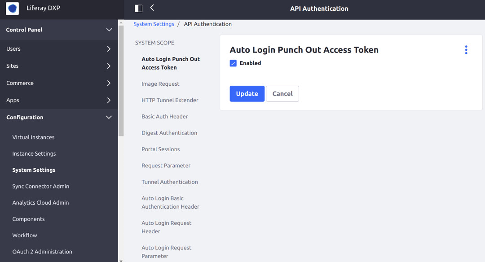
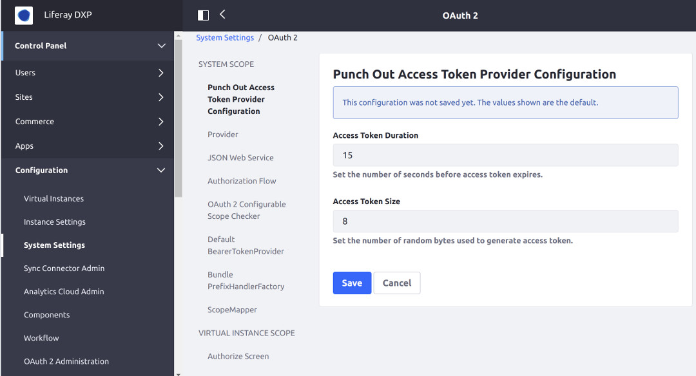

# Liferay Commerce Connector to PunchOut2Go

{bdg-primary}`Subscription`

Liferay provides a PunchOut2Go connector that integrates with a user's existing PunchOut2Go infrastructure. You can download this connector from the [Liferay Help Center](http://customer.liferay.com/downloads) as an LPKG file.

!!! important
    The PunchOut2Go connector requires Liferay Commerce 2.1.2 and Liferay DXP 7.1 FP18+ or 7.2 FP6+.

## Deploy the PunchOut2Go Connector

Before deploying the PunchOut2Go connector, ensure you've already deployed Liferay Commerce to your Liferay server to avoid conflicts.

1. Download the *Commerce Connector to PunchOut2Go* from the [Liferay Help Center](http://customer.liferay.com/downloads).

1. Copy the *PunchOut2Go Connector* `LPKG` into the [`${liferay.home}/deploy`](https://learn.liferay.com/dxp/latest/en/installation-and-upgrades/reference/liferay-home.html) folder.

1. Verify that the following messages appear in the application server console:

   ```bash
   2020-07-24 22:10:01.924 INFO  [fileinstall-/../../liferay-portal-7.1.10.1-sp1/osgi/marketplace][LPKGArtifactInstaller:209] The portal instance needs to be restarted to complete the installation of file:/../../liferay-portal-7.1.10.1-sp1/osgi/marketplace/Liferay%20Commerce%20Connector%20to%20PunchOut2Go%20-%20API.lpkg
   2020-07-24 22:10:01.926 INFO  [fileinstall-../../liferay-portal-7.1.10.1-sp1/osgi/marketplace][LPKGArtifactInstaller:209] The portal instance needs to be restarted to complete the installation of file:/../../liferay-portal-7.1.10.1-sp1/osgi/marketplace/Liferay%20Commerce%20Connector%20to%20PunchOut2Go%20-%20Impl.lpkg`
   ```

1. Restart the application server.

Once the server finishes restarting, the connector is active and ready for configuration.

## Configure the Connector

You can configure the PunchOut2Go connector for each [channel](../../store-management/channels.md). During configuration, you must have the URL of the store's catalog page.

1. Navigate to the *Control Panel* &rarr; *Commerce* &rarr; *Channels*.

1. Select a channel and go to *Punch Out*.

1. Switch the toggle to *Enabled*.

1. Enter the *Punch Out Start URL*.

1. Click *Save* when finished.

### Enable Auto Login Punch Out Access Token

You must enable the punch out access token for the buyer's procurement system to enable access to the Liferay Commerce instance.

1. Navigate to the *Control Panel* &rarr; *Configuration* &rarr; *System Settings*.

1. Click *API Authentication* under *Security*.

   

1. Click *Auto Login Punch Out Access Token* in the left menu.

1. Check the *Enabled* checkbox.

   

1. Click the *Update* button.

### Punch Out Access Token Provider Configuration

After enabling the punch out access token, you can configure the punch out access token provider.

1. Navigate to the *Control Panel* &rarr; *Configuration* &rarr; *System Settings*.

1. Click *OAuth2* under *Security*. The *Punch Out Access Token Provider Configuration* is open by default.

   * **Access Token Duration**: Sets the validity of the token

   * **Access Token Size**: Sets the size of the token

   

1. Click *Save*.

## Create a Punch Out Buyer Role

It is best practice to have a role for vendors using punch out. To learn more about Commerce roles, see [Commerce Roles](../../../users-and-accounts/roles-and-permissions/commerce-roles-reference.md). For more information about roles and permissions in Liferay DXP, see [Understanding Roles and Permissions](https://learn.liferay.com/w/dxp/users-and-permissions/roles-and-permissions/understanding-roles-and-permissions)

1. Navigate to *Control Panel* &rarr; *Users* &rarr; *Roles*.

1. Go to *Site Roles* and click *Add Site Role*.

1. Enter the name as *Punch Out Vendor*.

1. Click *Save*.

1. Click *Define Permissions*.

1. Expand the *Site Administration* in the left menu.

1. Navigate to *Applications* &rarr; *Open Carts*.

1. Check the following permissions at the very least:

   * Check Out Open Orders

   * View Open Orders

   

1. Click *Save*.

This creates the new punch out role with the required bare minimum permissions. Assign this role to buyers that punch out.

## Verify Redirect to Buyer's Procurement System

After deploying and configuring the connector, users are redirected to the appropriate procurement system when they click *Submit*.


## Related Topics

* [Deploying Liferay Commerce to an Existing Liferay Installation](../../../installation-and-upgrades/installing-commerce-2-1-and-below/deploying-liferay-commerce-to-an-existing-liferay-installation.md)
* [Activating Liferay Commerce Enterprise](../../../installation-and-upgrades/activating-liferay-commerce-enterprise.md)