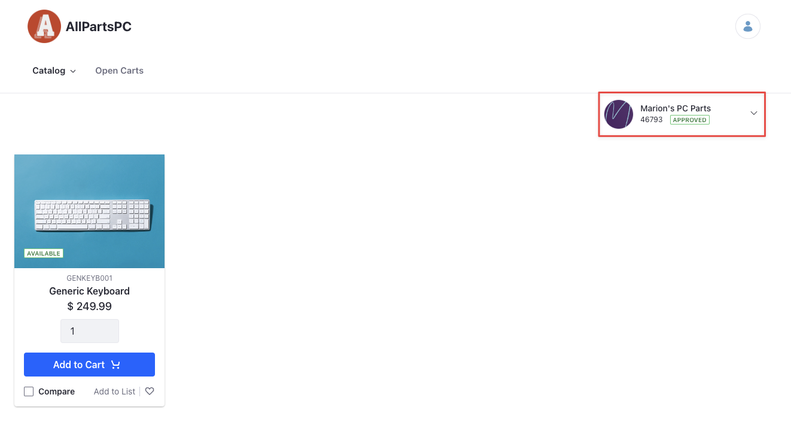

# Using the Account Selector Fragment

{bdg-secondary}`Available Liferay DXP 7.4 U72+/GA72+`

Liferay's account selector fragment provides an easy way to switch between accounts that you have access to and create new orders. 

## Adding the Account Selector Fragment to a Page

The fragment works best if you have a catalog page, open carts page and a checkout page. After creating these pages, you can drag and drop the fragment on any page to display the accounts that the user is able to access. Assuming you already have these 3 pages, 

1. Go to a page, then click _Edit_ () at the top. 

1. In the sidebar, navigate to the Fragments and Widgets menu () and type _account selector_. 

   

1. Drag and drop the account selector fragment to the page. Do not mistake this fragment with the Account Management widget. 

1. Click _Publish_. 

   

The account selector immediately shows the selected account, if any. 

## Account Selector Details

Once you've added the account selector fragment on a page, you can click the account icon to open it. After opening it, you can access all the accounts that you have permission to manage. You can also create a new order from the account selector by clicking on the _Create New Order_ button. 

For this to work correctly, you must have an Open Carts page. When you have an active order, the account selector fragment displays the order number and its status right below the account name. If there's an active workflow, the order is created with the _Draft_ status.

