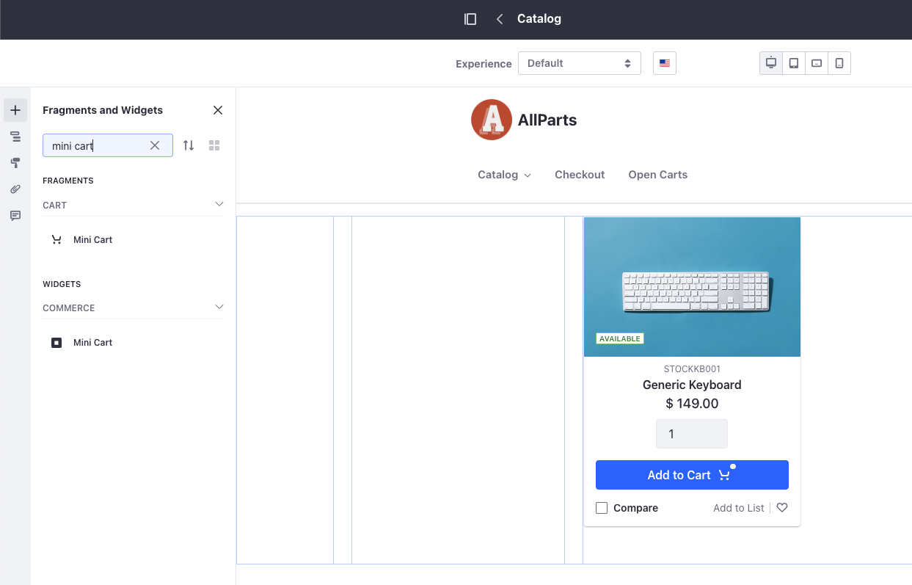
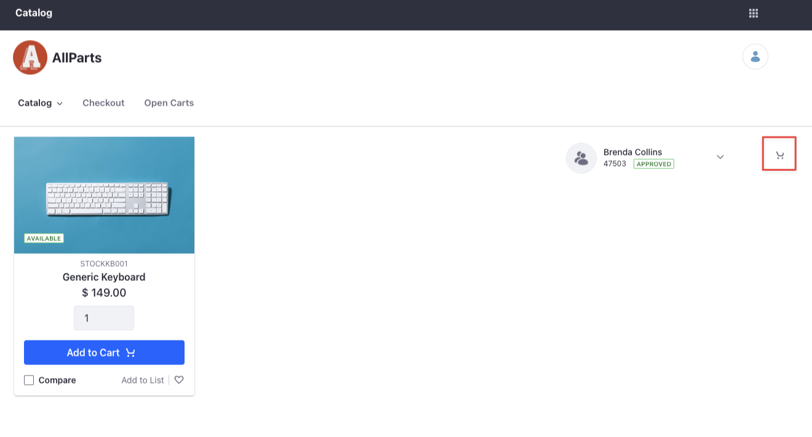
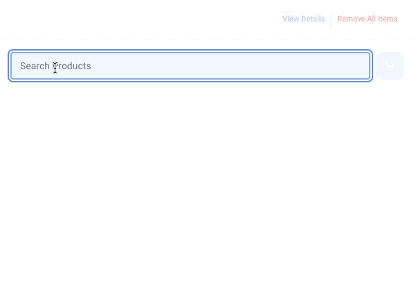

# Using the Mini Cart Fragment

{bdg-secondary}`Available Liferay DXP 7.4 U69+/GA69+`

Liferay's mini cart fragment provides a detailed overview of your cart. You can use it to increase or decrease product quantity, delete products, submit the cart for checkout or use the search bar to quickly add products to cart. 

## Adding the Mini Cart Fragment to a Page

For the fragment to work correctly, you must at least have a catalog page, checkout page and an open carts page. After creating these pages, you can drag and drop the fragment on any page to reflect the status of the cart. Assuming you already have these 3 pages, 

1. Go to a page, then click _Edit_ () at the top. 

1. In the sidebar, navigate to the Fragments and Widgets menu () and type _mini cart_. 

   

1. Drag and drop the mini cart fragment to the page. Do not mistake this fragment with the [Mini Cart](../liferay-commerce-widgets/using-the-mini-cart-widget.md) widget. 

1. Click _Publish_. 

   

The mini cart widget shows the status of the cart immediately. 

## Mini Cart Details

Once you've added the mini cart fragment on a page, 

1. Click _Add to Cart_ on a product. 

   

1. Now, click the cart icon at the top right corner to open the mini cart. You can see the following details: 

   * Product Name
   * SKU
   * Quantity
   * Price
   * Subtotal
   * Subtotal Discount
   * Order Discount
   * Total

   

The header area contains two buttons: 

* View Details - Click this to go to the Open Carts page containing more details about the open order. 
* Remove All Items - Click this, and click _Yes_ to clear your cart. 

The Product List area lists each product in the cart along with its quantity and price. You can click the Delete () button next to a product to delete it. You can increase or decrease the quantity of the product and the Cart Summary section updates automatically. Click _Submit_ to continue to check out. None of these buttons are available when the cart is empty. 

## Quickly Adding Products to the Cart

You can use the search bar in the fragment to quickly add items to the cart. Using this, you can search by a product name or known SKU and add them to an open order from any page containing the fragment. It reduces the time taken to create orders and removes the burden of having to search through the catalog first. 

After adding the mini cart fragment on a page,

1. Create a new order through the [account selector](./using-the-account-selector-fragment.md).

1. Open the mini cart, and search for a known SKU or product.

1. Select the SKU and click the mini cart () icon.

The SKU gets added to your cart. You can also add multiple SKUs at a time by adding all of them from the search bar and then clicking on the mini cart icon once. 

<!-- Add this when ready

### Adding Discontinued Products to Cart

SKUs may reach end-of-life (EOL) and be marked as discontinued. Discontinued SKUs may or may not get a replacement. Replacement SKUs get added automatically to the cart when you try adding the discontinued SKU through quick add-to-cart.  -->