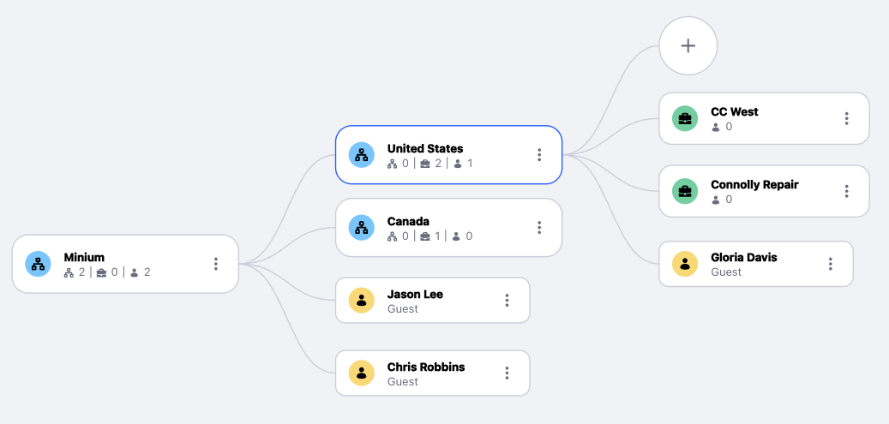

# Using the new Organization Management Chart

{bdg-secondary}`Liferay DXP 2023.Q4+/Portal 7.4 GA102+`

You can use Liferay's revamped organization management chart to view, manage, and search through organizations, its associated accounts, and users.

!!! note
    In earlier versions of Liferay (Liferay DXP 7.4 2023.Q4/Portal 7.4 GA98 and before), the organization management widget came without the following capabilities:

    * The ability to search for organizations, accounts, and users
    * The ability to view and edit details from the side panel.

## Accessing the Organization Management Chart

You can access the organization management chart by going into the Users and Organizations application.

1. Open the *Global Menu* () and navigate to *Control Panel* &rarr; *Users and Organizations*.

1. Click on *Organization Chart*.

This displays the hierarchical structure of organizations.

## Adding the Organization Management Chart Widget to a Page

1. Click the *Add* () button from the top menu.

1. In the *Widgets* section, search for the Organization Management widget.

1. Drag and drop the widget to the desired area in your storefront.

!!! note
    If you are using a content Page, first click *Edit* () from the top menu. The Fragments and Widgets menu opens on the left side. The rest of the steps remain the same.

## Using the Search Bar

You can search for organizations, accounts, and users using the search bar at the top of the organization management chart. It auto-completes what you're searching for, if it exists. Clicking on the result highlights it in the organization management chart. You can clear the search results to remove the highlight

Clicking on *Collapse All* hides the expanded network and shows only the top-level parent nodes. Click on *Expand* () to view the chart in full screen. Note that the search bar and side panel won’t be visible when you’re viewing the chart in full screen.

## Viewing Entities

To view accounts, organizations, or users in detail,

1. Select the node to view from the organization management chart.

1. Click *Actions* () and select *View*.

This opens the side panel in view mode. 

If you click on an organization with related accounts, organizations, or users or an account with related users, they're displayed in the organization management chart as child nodes linked to the parent. For instance, the image below shows the United States organization associated to three accounts and one user. You can click *Add* () to create additional nodes linked to the parent node. Nodes in blue represent organizations, nodes in green represent accounts, and nodes in yellow represent users. 

## Editing Entities

To edit accounts, organizations, or users,

1. Select the node to edit from the organization management chart.

1. Click *Actions* () and select *Edit*.

This opens the side panel in edit mode. 

You can edit the following fields for each entity. 

| Entity       | Editable Fields                                                                                                           |
| :----------- | :------------------------------------------------------------------------------------------------------------------------ |
| Account      | Account Image, Account Name, Tax ID, External Reference Code, Description                                                 |
| Organization | No editable fields                                                                                                        |
| User         | User Image, Screen Name, Email Address, Language, Prefix, First Name, Middle Name, Last Name, Suffix, Job Title, Birthday |

## Removing Entities

To remove accounts, organizations, or users,

1. Select the node to remove from the organization management chart.

1. Click *Actions* () select *Remove*.

Removing a node only removes it from the network of nodes in the chart but doesn't delete it. The organization, account or user still exists. 

## Deleting Entities

To delete accounts, organizations, or users,

1. Select the node to delete from the organization management chart.

1. Click *Actions* () and select *Delete*.

You cannot delete an organization with sub-organizations or users. They must be deleted first, before deleting the parent organization. 

Deleting an account that contains users only deletes the account but not the users.

## Related Topics

* [Creating and Managing Organizations](https://learn.liferay.com/w/dxp/users-and-permissions/organizations/creating-and-managing-organizations)