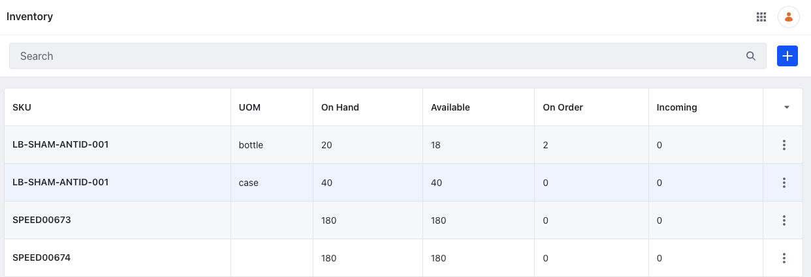

# Inventory Management Reference Guide

To access the inventory settings, open the *Global Menu* () and navigate to *Commerce* &rarr; *Inventory*.

The page displays product variants identified by their SKU code and their availability data.

| Field     | Description                                                                                                                                                                                                                                           |
| :-------- | :---------------------------------------------------------------------------------------------------------------------------------------------------------------------------------------------------------------------------------------------------- |
| SKU       | The main identifier inside the inventory system.                                                                                                                                                                                                      |
| On Hand   | The total number of units for a given SKU aggregating all the quantities available from all the warehouses.                                                                                                                                           |
| Available | The number of units for a given SKU that are purchaseable. Liferay uses the following calculation: [Quantity Available] = [Quantity on Hand] - [Quantity on Order] - [Safety Stock Quantity].                                                         |
| On Order  | The number of units for a given SKU allocated to open orders. These quantities are consumed when an order is shipped.                                                                                                                                 |
| Incoming  | The number of units coming in for the given SKU at a future date (in the form of a replenishment), but not yet received. Values are informative only and not based on any calculations. Administrators can use it to keep track of future quantities. |

## SKU

When viewing an individual SKU, there are four tabs: *Overview*, *On Order*, *Incoming*, and *Changelog*.

### Overview

The *Overview* tab displays a summary of the inventory across all warehouses.

| Field        | Description                                                              |
| :----------- | :----------------------------------------------------------------------- |
| Warehouse    | List of warehouses where the SKU is present.                             |
| On Hand      | The number of units in possession including the safety stock.            |
| Safety Stock | The number of units reserved as safety stock.                            |
| Available    | The number of units that are purchaseable.                               |
| Incoming     | The number of units that are coming into the warehouse at a future date. |

Click *Add* () to update inventory or to transfer inventory between warehouses.

### On Order

The *On Order* tab displays a list of accounts that have placed an order for this SKU. The tab also displays the Order ID, the quantities ordered, and the expiration date.

### Incoming

The *Incoming* tab lists warehouses with the quantities of the SKU that will arrive on a future date as replenishment.

Click the *Add* () button to create an incoming entry for the selected SKU.

| Field                  | Description                                        |
| :--------------------- | :------------------------------------------------- |
| Quantity               | The quantity of items incoming.                    |
| Destination            | The warehouse where the incoming items are stored. |
| Expected Delivery Date | The scheduled date of delivery.                    |

### Changelog

See [Viewing Inventory Changes](./using-the-inventory-management-system.md#viewing-inventory-changes) for more information.

## Commerce 2.1 and Below

The inventory settings are located in the *Control Panel*. To access it, navigate to the *Control Panel* &rarr; *Commerce* &rarr; *Inventory*.

## Additional Information

* [Creating SKUs for Product Variants](../product-management/creating-and-managing-products/products/creating-skus-for-product-variants.md)
* [Low Stock Action](./low-stock-action.md)
* [Setting Up Commerce Warehouses](./setting-up-warehouses.md)
* [Warehouse Reference Guide](./warehouse-reference-guide.md)
