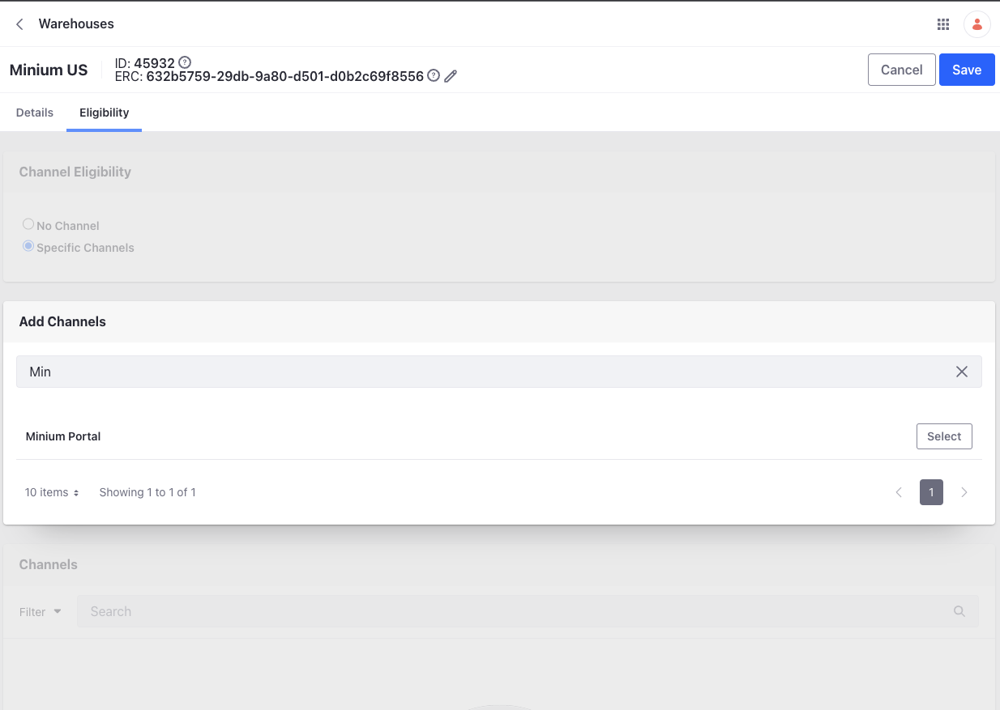
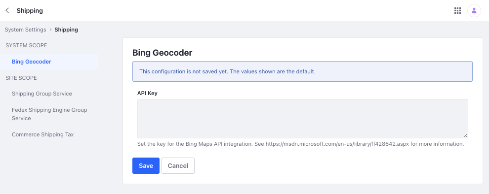
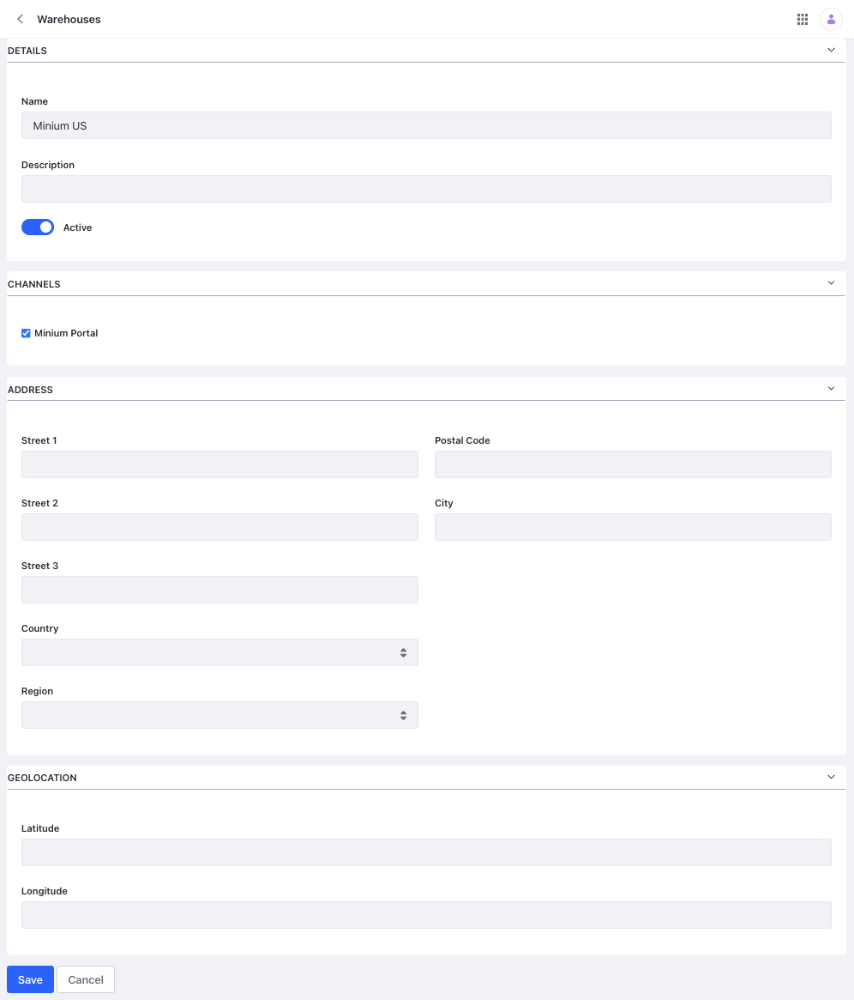

# Setting Up Warehouses

Warehouses represent physical locations where you store product inventory. To activate a warehouse, you must set its geolocation. The Fedex shipping method uses the geolocation to calculate shipping costs. Read [Using the Fedex Shipping Method](../store-management/configuring-shipping-methods/using-the-fedex-shipping-method.md) for more information.  

You can serve a single channel with multiple warehouses or use a single warehouse to serve multiple channels. When using the *Minium* or *Speedwell* accelerators, three sample warehouses serve one channel.

```{note}
Before creating a warehouse, you must enable the applicable country and region of the warehouse. See [Adding Regions](../store-management/adding-regions.md) for more information.
```

## Adding a Warehouse

To add a new warehouse,

1. Open the *Global Menu* (), and navigate to *Commerce* &rarr; *Warehouses*.

1. Click the *Add* button ().

   

1. Enter a name.

1. Click *Submit*.

   This creates the new warehouse. You can now add its address, geolocation and activate it.

   

1. In the *Details* section, you can change the name or add an optional description.

1. To activate the warehouse, switch the toggle to *Active*. Ensure that you enter its geolocation before activation.

1. Enter the latitude and longitude values for the warehouse in the *Geolocation* section.

1. Enter an address for the warehouse in the *Address* section.

   Alternatively, you can configure the [Bing Geocoder](#using-bing-geocoder-to-set-a-warehouses-geolocation) to automatically generate a warehouse's geolocation. To use this feature, the warehouse must have an address.

1. Click on the *Eligibility* tab to associate the warehouse to a specific channel or all available channels. If you want to associate the warehouse to a specific channel, click the *Specific Channels* radio button, enter a channel name and click *Select*. The associated warehouses determine the product inventory for a channel.

   

1. Click *Save*.

### Liferay DXP 7.4 U46/GA46 and Below

1. Open the *Global Menu* (), and navigate to *Commerce* &rarr; *Warehouses*.

1. Click the *Add* button ().

   

1. In the Details section, enter a *Name* and *Description* (optional).

   

1. To activate the warehouse, switch the toggle to *Active*. Ensure that you enter its geolocation before activation.

1. In the *Channels* section, use the checkbox to associate the warehouse to a channel. The associated warehouses determine the product inventory for a channel.

1. Enter an address for the warehouse in the *Address* section.

1. Enter the latitude and longitude values for the warehouse in the *Geolocation* section.

See [below](#using-bing-geocoder-to-set-a-warehouses-geolocation) to learn how to use the Bing Geocoder to automatically generate a warehouse's geolocation.

## Using Bing Geocoder to Set a Warehouse's Geolocation

Liferay integrates with the Bing Maps API to automatically generate geolocations from a warehouse address. To use this feature, you must have a [Bing Maps account](https://docs.microsoft.com/en-us/bingmaps/getting-started/bing-maps-dev-center-help/creating-a-bing-maps-account) and a [Bing Maps Key](https://docs.microsoft.com/en-us/bingmaps/getting-started/bing-maps-dev-center-help/getting-a-bing-maps-key).

Then, follow these steps to configure the Bing Geocoder for your instance:

1. Open the *Global Menu* (), and navigate to *Control Panel* &rarr; *System Settings* &rarr; *Commerce* &rarr; *Shipping* &rarr; *Bing Geocoder*.

1. Enter your *API Key*.

   

1. Click *Save*.

Once the geocoder is configured, you can generate warehouse geolocations for any warehouse with an address. Simply navigate to the warehouses page, click on the *Actions* button () for the desired warehouse, and click on *Geolocate*. The geocoder converts the address into latitude and longitude coordinates.

<!-- There's a bug currently due to which the geolocate option is missing. Have to add an image when it is fixed. -->

## Commerce 2.1 and Below

To add a new warehouse:

1. Go to *Control Panel* &rarr; *Commerce* &rarr; *Settings*.

1. Click the *Warehouses* tab.

1. Click the *Add* () button and enter the following information.

   * **Name:** North Vegas Warehouse
   * **Description:** North Vegas Processing Center

1. Switch the toggle to *Active*.

1. Enter an address.

1. Select a channel. Product inventory for the channel depends on the associated warehouse.

1. Enter the mandatory geolocation data based on your warehouse's location.

   * **Latitude**: 36.282974
   * **Longitude**: -115.136

    

1. Click *Save* when finished.

The new warehouse is now active ready to use.

## Additional Information

* [Adding Regions](../store-management/adding-regions.md)
* [Deactivating a Country for Billing or Shipping](../store-management/deactivating-a-country-for-billing-or-shipping.md)
* [Introduction to Channels](../store-management/channels/introduction-to-channels.md)