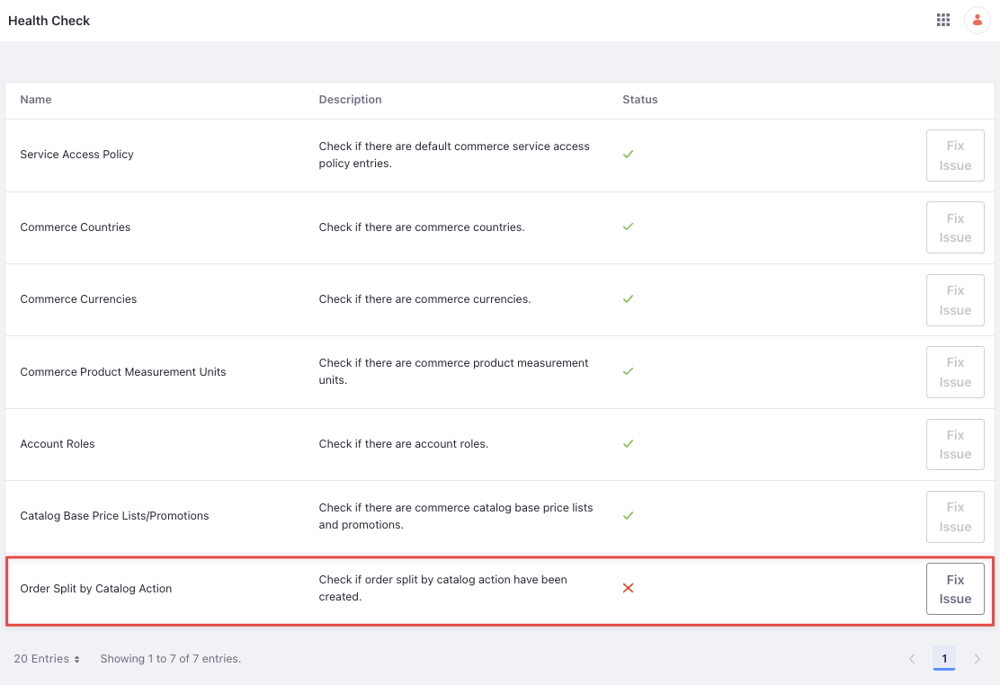
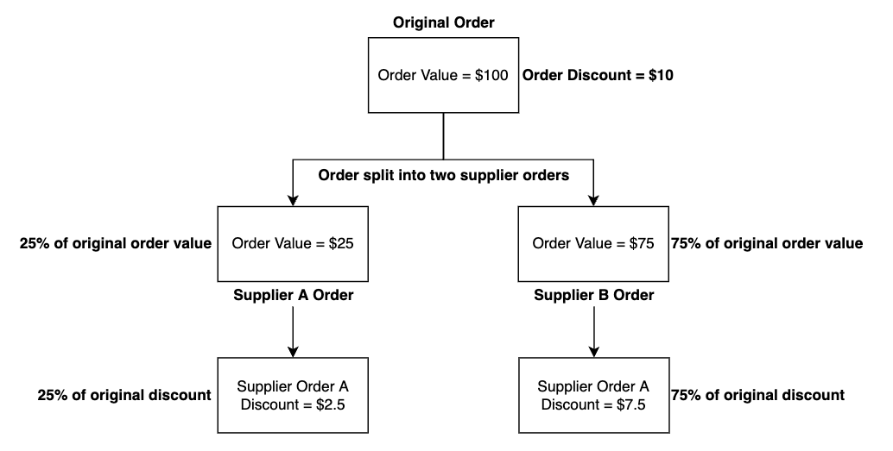

# Order Splitting

{bdg-secondary}`Available Liferay DXP 7.4 U84+/GA84+`

```{important}
Order splitting is currently behind a release feature flag. Read [Release Feature Flags](https://learn.liferay.com/web/guest/w/dxp/system-administration/configuring-liferay/feature-flags#release-feature-flags) for more information. 
```

Sometimes an order has multiple product lines or products fulfilled by different suppliers. In such cases, you may want to split the order into independently fulfilled sub-orders. 

Order splitting splits a customer order into one or more supplier orders based on the order item's catalog. It works in conjunction with supplier roles. See [Supplier Role](../suppliers/supplier-role.md) for more information.

## Creating the Order Splitting Object Action

There are two ways to create the order splitting object action. The first way is to create the object action manually on the commerce order system object. The other way is to use the commerce health check that creates a pre-configured object action for you automatically. 

### Creating the Order Splitting Object Action Manually

1. Open the *Global Menu* () and navigate to *Control Panel* &rarr; *Objects*. 

1. Select *Commerce Order* and click *Actions*. 

1. Click *Add* ():

   **Action Label:** Split Order By Catalog

   **Action Name:** splitOrderByCatalog

1. Use the *Active* toggle to enable the action. 

1. Click on the *Action Builder* tab. 

1. Under Trigger, choose *On Order Status Update* from the drop-down. 

1. Under Condition, activate the toggle and enter the expression: `orderStatus = 10`

   Each order status corresponds to an integer. If you want to use a different order status, use any of the following integers: 

   | Order Status      | Integer Value |
   | :---------------- | :------------ |
   | Open              | 2             |
   | In Progress       | 6             |
   | Pending           | 1             |
   | Processing        | 10            |
   | Shipped           | 15            |
   | Completed         | 0             |
   | Canceled          | 8             |
   | Partially Shipped | 14            |
   | On Hold           | 20            |

   You can also use the expression builder to restrict order splitting to specific order types or channels. See example below:

   `orderTypeId = 12345 AND channelId = 67890 AND orderStatus = 10`

   This expression splits all orders from channel `67890` with the order type ID `12345` when it moves to the processing status.

1. Under Action, select *Split Order by Catalog* from the drop-down.

1. Click *Save*.

### Creating the Order Splitting Object Action using the Health Check

You can also run a health check to create the object action associated with the commerce order system object. 

1. Open the *Global Menu* () and navigate to *Commerce* &rarr; *Health Check*. 

1. Find the *Order Split by Catalog Action* health check. 

1. Click *Fix Issue*.

   

   This creates the object action on the commerce order system object. The order splitting action is disabled when created through the health check. To activate it, 

1. Open the () and navigate to *Control Panel* &rarr; *Objects*. 

1. Select *Commerce Order* and click *Actions*. 

1. You should see the object action created already. Select it and use the *Active* toggle to enable the action. 

This enables order splitting for all orders that contain products from different catalogs. 

## Order Splitting Concepts

### Customer Order

A Customer order is placed by the customer containing products from multiple catalogs. If a customer places an order with two products, each from a different catalog, it appears as a single entry in the *Placed Orders* page. This is the customer order. This order gets split only when you accept the order from the *Orders* page. 

### Supplier Order

Open the *Global Menu* () and navigate to *Commerce* &rarr; *Orders*. You can see a single entry for the customer order. 

Select the order and click *Accept Order*. Now the object action on the commerce order object is executed. Go back to the Orders page and you'll now see three entries: one entry for the customer order and two entries for the supplier orders. The supplier orders are linked to their own channel. 

Suppliers can only view and manage the supplier orders linked to their channels. If there were three products in the original order from three different catalogs, there would be a total of four entries (one customer order + three supplier orders). The customer does not see the supplier orders in the Placed Orders page. 

### Splitting Order Level Discounts

When using the out-of-the-box order splitting rule, discounts are split between suppliers using the percentage value of the supplier order in comparison to the original order to be fair to all suppliers fulfilling a split order. This applies to discounts on the order total and subtotal. Discounts on particular order items remain unchanged. See the illustration below:



The original order's total value is $100 and has a fixed order discount of $10. It is split between two suppliers, A and B, with values $25 and $75 respectively. The discount is split among these two suppliers based on the percentage value of the supplier order with respect to the original order. Here, supplier A's order value of $25 makes up 25% of the original order value. Therefore, supplier A's order gets a discount that is 25% of the original discount. 

```{note}
The above illustration is valid only for fixed discounts. For percentage discounts, the percentage amounts are deducted from each supplier order. For instance, if there's a 10% discount on the order, each supplier order gets a discount of 10%. 
```

## Fulfilling Split Orders

From a customer perspective, there is no change in how information appears. Only administrators can view supplier orders from the Placed Orders screen after they’re split. Customers see only the original orders they placed, and suppliers only see their own supplier orders. 

Updates made to the items in the supplier order are propagated back to the particular item in the customer order as well. For example, if one supplier ships an order and updates the tracking number for one of the shipments, this is visible to the customer for that product. The order status moves from processing to partially shipped. When both supplier orders are delivered, the original customer order is completed.

## Related Topics

* [Suppliers](../suppliers.md)