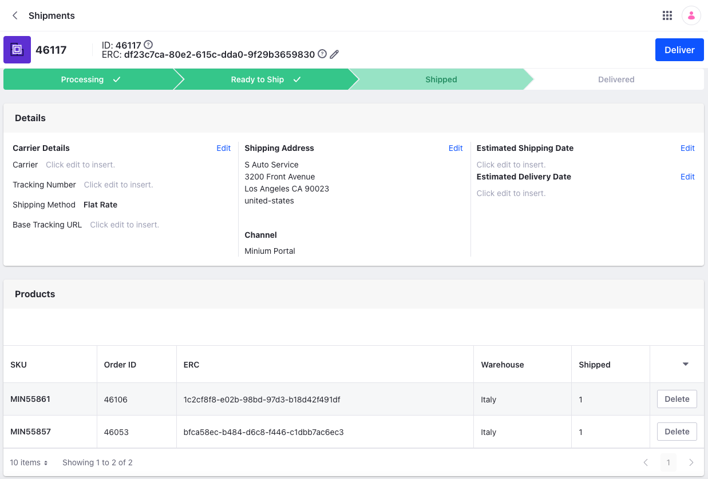
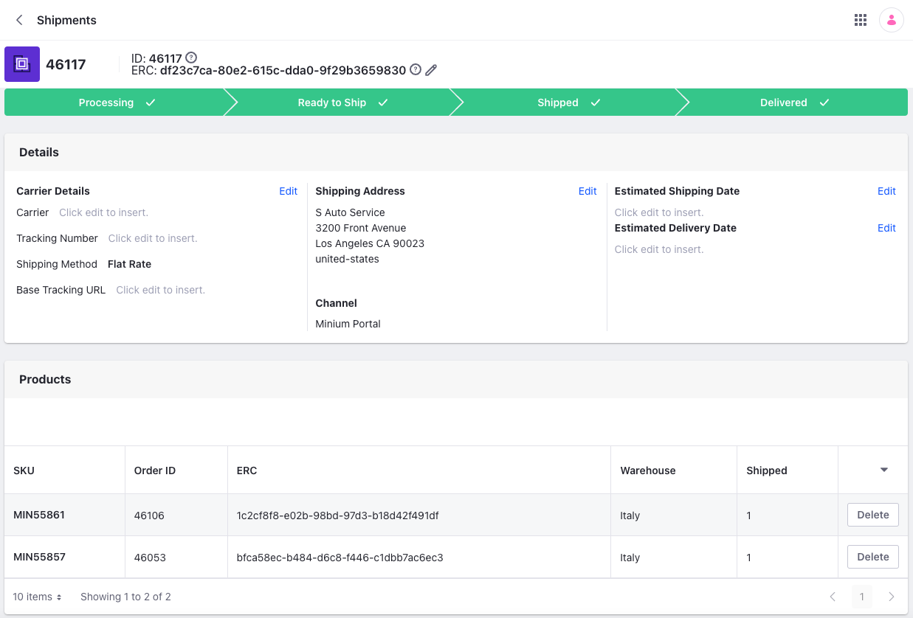

# Introduction to Shipments

You can create *Shipments* when an order is in the [processing](../orders/processing-an-order.md) stage. Once you create a shipment, you are taken to the Shipments page where you can manage shipments and finish processing the order.

```{note}
A single shipment may contain multiple orders but the same account must create all the orders contained in the shipment.
```

To create a shipment,

1. Open the *Global Menu* () and go to *Commerce* &rarr; *Orders*.

1. Select an order that is in the *Processing* status.

1. Click *Create Shipment*.

   

This takes you to the Shipments page where you can finish processing the order. There are four stages for a shipment.

* Processing
* Ready to Ship
* Shipped
* Delivered

```{note}
Starting from Liferay DXP 7.4 U30/GA30, each shipment has an external reference code (ERC) displayed under the shipment ID. Click the *Edit* button () to change the default value. 
```

## Processing

Click on *Finish Processing* after selecting the items in the shipment and quantities from their source warehouse. The order is ready to ship now. You can also view additional details such as the carrier, tracking number, shipping method, tracking URL, addresses, and estimated delivery and shipping dates here.


```{note}
Starting from Liferay DXP 7.4 U35/GA35, each item in the shipment also has an external reference code (ERC) associated with it. You can change this by clicking on the item and entering a value for the *External Reference Code* field.
```

## Ready to Ship

At this stage, you can confirm all the details of the shipment. Once confirmed, click on *Ship* to ship the order. This also moves the order's status from *Processing* to *Shipped*.


## Shipped

After shipping the order, both the order and the shipment move to the *Shipped* status. Upon delivery, you can click the *Deliver* button to mark the shipment as *Delivered*.



## Delivered

All the stages of a shipment are complete upon confirmation of delivery.



After delivery, the order moves to the *Completed* status. See the [Shipments Management Reference Guide](./shipments-management-reference-guide.md) to learn more about the specific features and fields.


## Liferay Commerce 2.1 and Below

Commerce 2.1 is virtually identical to the latest version, except that you access the *Orders* menu via the *Control Panel*. Select an order with the processing status and click  on *Create Shipment*.

See the [Shipments Management Reference Guide](./shipments-management-reference-guide.md) to learn more about the specific features and fields.

## Liferay Commerce 2.0 and Below

The *Shipments* menu is where store managers can create and track a shipment after [receiving an order](../orders/processing-an-order.md#commerce-2-0-and-below).

Navigate to the *Control Panel* &rarr; *Commerce* &rarr; *Shipments*.


The *Shipments* menu displays all created shipments in all statuses. Click the Add () button to add a new shipment.

Clicking on a particular shipment number (for example, *41250*) displays the shipment's *Details* tab and the *Items* tab. Clicking the *Order Number* (*41241*) redirects you to the *Orders* menu.

### Details

The *Shipment Details* tab contains the following information:


| Field | Description |
| :--- | :--- |
| Name | Name of the Buyer |
| Description | Description field |
| Street 1 | Shipping address' first line |
| Street 2 | Shipping address' second line |
| Street 3 | Shipping address' third line |
| City | Shipping address' city |
| Postal Code | Shipping address' postal code |
| Country | Shipping address' country |
| Region | Shipping address' state or province |
| Carrier | Name of the carrier |
| Tracking Number | Shipment's tracking number generated by the **carrier** |
| Shipment Status | Dropdown menu with the options: *Processing*, *Ready to be Shipped*, *Shipped*, and *Delivered*  |
| Shipping Date | Date of shipment delivery to the carrier    |
| Expected Delivery Date | Expected arrival date of the shipment  |

## Items

The *Shipment Items* Tab contains the following information:


| Field | Description |
| :--- | :--- |
| SKU | SKU Number |
| Name | Name of the item |
| Quantity | Number of items in the shipment |
| Warehouse | Name of the warehouse sourcing the shipment |

Clicking the *Add* () button opens a window where you can add more items to the order.

## Additional Information

* [Creating a Shipment](./creating-a-shipment.md)
* [Cancelling a Shipment](./cancelling-a-shipment.md)
* [Processing an Order](../orders/processing-an-order.md)
* [Shipments Management Reference Guide](./shipments-management-reference-guide.md)