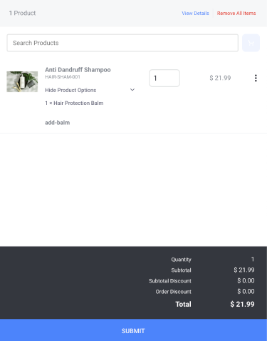

# Creating Product Bundles

Liferay supports the creation of *product bundles* using [product options](./using-product-options.md). With options, you can define values that link the current product with other SKUs (simple, virtual, or grouped). Once defined, customers can select different option values when adding the product to cart.

For example, consider a computer hardware distributor. Customers can select a specific computer model with a standard case, power supply, motherboard, and OS, but they must choose between other hardware components (e.g., CPU, GPU, RAM, storage). Each product variant has its own price based on the selected components. The total cost is calculated by adding the price of the selected value to the price of the current product.

```{note}
In addition to product bundles, Liferay provides grouped products for combining multiple SKUs for sale. This product type groups SKUs for customer convenience or special promotions. Unlike product bundles, each grouped product has its own SKU, and its final cost is determined by its own price entry. See [Creating a Grouped Product](../product-types/creating-a-grouped-product.md) for more details.
```

Follow these steps to create a product bundle:

1. Open the *Global Menu* () and navigate to *Commerce* &rarr; *Products*.

1. Select the product you want to use as the base for the bundle.

1. Select the *Options* tab.

1. In the *Add Options* field, enter a *name* for your new bundle option, and click on *Create New*.

   This creates a new option template and applies it to your product using the default option settings.

   ```{tip}
   Alternatively, you can create an option template via the *Options* page. This method is best for commonly used types of bundles. See [Using Product Options](./using-product-options.md) for more information.
   ```

   

1. Select the new option to edit its details and values.

1. Configure the following option settings:

   * **Description** (Optional): Add a localized *description*.
   * **Position**: Set the option's priority to determine the order in which it's displayed relative to other options.
   * **Use in Faceted Navigation**: Determine whether the option can be used to filter product search results.
   * **Required**: Determine whether users must select an option value before adding the product to the cart.
   * **SKU Contributor**: Determine whether the option's values are used to generate unique product SKUs.
   * **Field Type**: Choose the type of field used for the option.
   * **Price Type**: Choose whether to use *Static* or *Dynamic* pricing for option values.

   ```{note}
   *Dynamic* uses the linked SKU's price for a value, while *Static* uses a fixed price set directly in the value field. Dynamic and  static prices get added to the current product's base price.

   Also, since product bundles use the *Price Type* attribute, they can only use the *Single Selection* and *Select from List* field types. 
   ```

   

1. Scroll down to the *Values* section, click *Add* (), and enter the following details for your value:

   * **Name**: Set the display name used for the value. If you enable SKU Contributor, the option value's SKU uses this name.
   * **Position**: Set the value's priority to determine its placement in the option's field.
   * **Key**: This field is auto-generated to match the name field, though you can set it independently.

   Repeat this process until you've added all the desired values.

   

1. Once created, click on a value to access these additional settings:

   * **Default**: Determine whether the option defaults to the selected value.
   * **Delta Price** (For Static Only): Set a specific price for the value.
   * **Product**: Link an existing SKU to the value and specify its quantity.

   ```{important}
   Each of the option's values must be unique. This means you cannot use the same product+quantity combination for multiple values in the same option. However, you can use the same value in other options added to the product.

   Also bundle values cannot link to other product bundles, to products with a *required* option, or to products with *subscription* enabled. If the bundle uses *dynamic* pricing, it can only link to *APPROVED* product instances.
   ```

1. (Optional) If you've enabled SKU Contributor for your option, go to the *SKUs* tab in the product's page, click *Add* (), and select *Generate All SKU Combinations*.

   This generates a new SKU for each option value, which you can edit in the SKUs tab.

   ```{important}
   When enabled, customers *must* select a value, even if *Required* is not enabled for the option.
   ```

1. Verify your bundle in the product details page.  


## Editing Bundles from the Mini Cart

After adding a product bundle to the mini cart, you can edit it before checking out.

1. Add the product bundle to your cart.

1. Open the mini cart.

   You can click on *Show Product Options* to view the currently selected option from the bundle. You can click on it again to hide the options.

   

1. Click the *Actions* () icon next to the product and select *Edit*.

   

1. Choose one of the other available options.

   

1. Click *Save*.

The price of the cart automatically updates if the selected option is configured with a different price. 

```{important}
The option to edit the bundle isn't available if you add the base product to cart. 
```

## Related Topics

* [Using Product Options](./using-product-options.md)