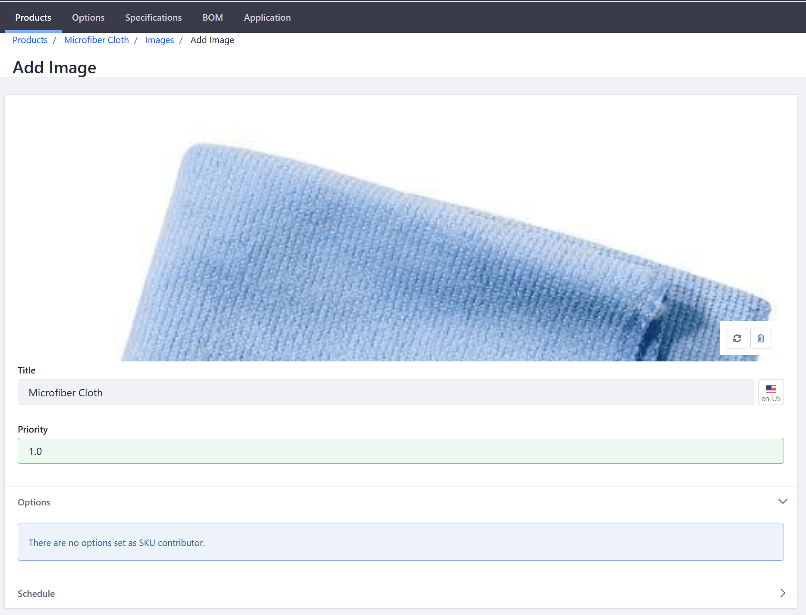

# Product Images

Product images help to ensure that customers know what they are buying and increase the likelihood of a sale. If you have a product with different SKUs you can can upload images for each product variant.

## Adding a Single Image

To add a single image:

1. Open the _Global Menu_ () &rarr; _Commerce_ &rarr; _Products_.

1. Select a product.

1. Go to _Media_ and under Images, click _Add_ () to add a product image.

   

1. Drag and drop an image or click _Select File_ to upload an image.

1. Enter a title and click _Publish_.

{bdg-secondary}`Liferay DXP 2024.Q1+/Portal 7.4 GA112+` You can now tag images using tags from the Global scope. See [Tagging Content and Managing Tags](https://learn.liferay.com/w/dxp/content-authoring-and-management/tags-and-categories/tagging-content-and-managing-tags) for more information.

This adds the new image to the product. Note that under _Options_, the message "_There are no options set as the SKU contributor._" may appear. If this message appears, then the product does not have additional associated SKUs and the image added is the only one associated with the product.

## Adding Multiple Images

You can also associate multiple product images with a single product. Ensure that you have [product options](./using-product-options.md) created and [multiple SKUs](./creating-skus-for-product-variants.md) generated for each option.

After doing so, you can associate different product images to different SKUs.

1. Open the _Global Menu_ () &rarr; _Commerce_ &rarr; _Products_.

1. Select a product.

1. Go to _Media_ and under Images, click _Add_ () to add a product image.

1. Drag and drop an image or click _Select File_ to upload an image.

1. Select an option value from the option dropdown to associate the image with.

   

1. Click _Publish_.

This associates the image with the selected product option value. Repeat these steps for all other available SKUs. For instance, you can use multiple images for a product that comes in different quantities. When searching for a product, you can view all the images in the product details widget.

{bdg-secondary}`Liferay DXP 2024.Q1+/Portal 7.4 GA112+` You can use the _Use in Shopping Experience Image Gallery_ toggle to select images that appear in the product details widget.

## Commerce 2.1 and Below

### Adding a Single Product Image

To add a single image:

1. Navigate to _Control Panel_ &rarr; _Commerce_ &rarr; _Products_.

1. Select a product.

1. Go to _Media_ and under Images, click _Add_ () to add a product image.

1. Drag and drop an image or click _Select File_ to upload an image.

1. Enter a title and click _Publish_.

This adds the new image to the product. Note that under _Options_, the message "_There are no options set as the SKU contributor._" may appear. If this message appears, then the product does not have additional associated SKUs and the image added is the only one associated with the product.

### Adding Multiple Product Images

You can also associate multiple product images with a single product. Ensure that you have [product options](./using-product-options.md) created and [multiple SKUs](./creating-skus-for-product-variants.md) generated for each option.

After doing so, you can associate different product images to different SKUs.

1. Navigate to _Control Panel_ &rarr; _Commerce_ &rarr; _Products_.

1. Select a product.

1. Go to _Media_ and under Images, click _Add_ () to add a product image.

1. Drag and drop an image or click _Select File_ to upload an image.

1. Select an option value from the option dropdown to associate the image with.

   

1. Click _Publish_.

This associates the image with the selected product option value. Repeat these steps for all other available SKUs. For instance, you can use multiple images for a product that comes in different quantities. When searching for a product, you can view all the images in the product details widget.

## Commerce 2.0 and Below

### Adding a Single Product Image

1. Navigate to _Control Panel_ &rarr; _Commerce_ &rarr; _Products_.

1. Select a product.

1. Go to _Images_ and click _Add_ () to add a product image.

1. Drag and drop an image or click _Select File_ to upload an image.

1. Enter a title and set a priority.

    

1. Click _Publish_.

### Adding Multiple Product Images

1. Navigate to _Control Panel_ &rarr; _Commerce_ &rarr; _Products_.

1. Select a product.

1. Go to _Images_ and click _Add_ () to add a product image.

1. Drag and drop an image or click _Select File_ to insert an image.

1. Select an option value from the option dropdown to associate the image with.

1. Click _Publish_.

## Related Topics

To configure a default placeholder image for products that do not have an image uploaded, see [Configuring a Product Placeholder Image](../../catalogs/configuring-a-product-placeholder-image.md).
