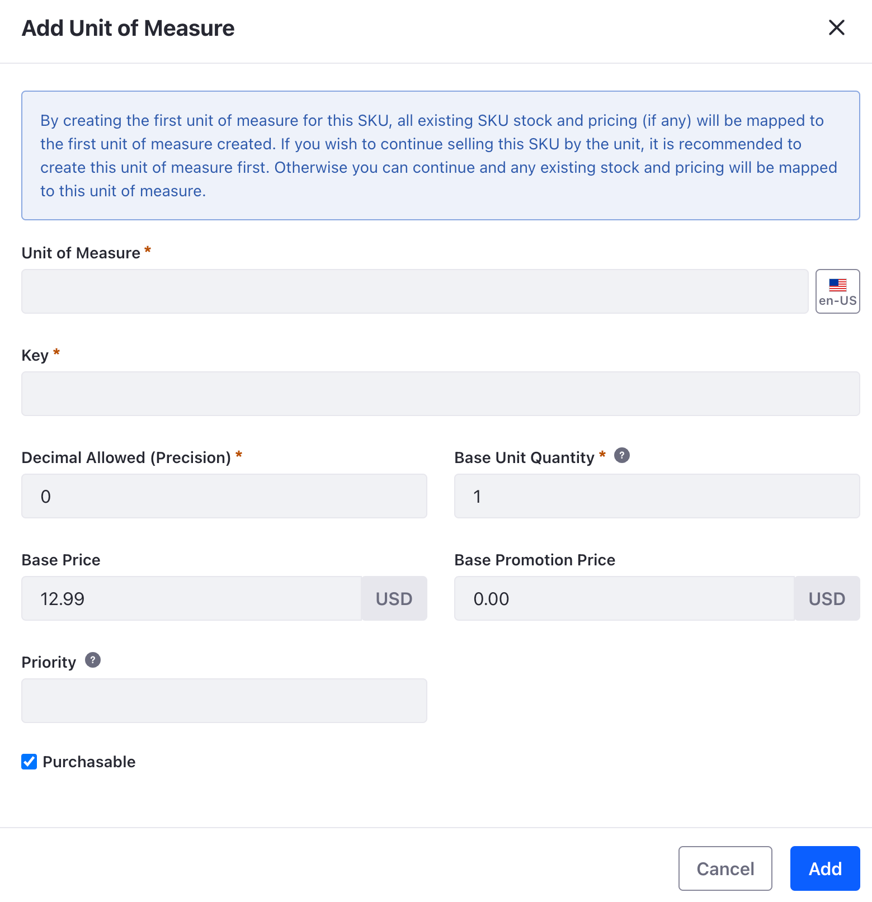

# Units of Measure (UOM)

{bdg-secondary}`Liferay DXP 2023.Q4+/Portal 7.4 GA98+`

Businesses can have different ways of maintaining and selling their stock. This is commonly known as ***Units of Measure*** (UOM). Some of the commonly used units of measure are

* meter/centimeter/millimeter
* ton/kilogram/gram
* pallet/case/unit

!!! important
    Units of Measure (UOM) was released behind a [release feature flag](https://learn.liferay.com/web/guest/w/dxp/system-administration/configuring-liferay/feature-flags#release-feature-flags) in Liferay DXP 2023.Q4/Portal 7.4 GA98. It was made Generally Available (GA) in 2024.Q1/GA112.

You can define your own units of measure to manage, price, and sell your inventory by these defined units. You can also use UOM to sell stock in decimal quantities. 

Units of measure link to SKUs. After creating the first unit of measure, all existing inventory and pricing information for the SKU gets mapped to the new unit. 

!!! important
    The first unit of measure you create adopts the pricing and inventory information related to the SKU. If you are introducing units of measure to previously traded SKUs, you must define the unit corresponding to the existing SKU first, and then create any additional UOMs.

1. Open the *Global Menu* () and navigate to *Commerce* &rarr; *Products*.

1. Select the product for the new unit of measure.

1. Go to the SKUs tab and select the SKU.

1. Select the *Units of Measure (UOM)* tab and click *Add* ().

   

1. Enter the given information to create a new unit called *Bottle*:

   **Unit of Measure:** Bottle

   **Key:** bottle

   **Decimal Allowed (Precision):** 0

   **Base Unit Quantity:** 1

   **Base Price:** $12.99

   **Base Promotion Price:** 0.00

   **Priority:** 1

   **Purchasable:** Enabled

   | Field                       | Description                                                                                                                                     |
   |:----------------------------|:------------------------------------------------------------------------------------------------------------------------------------------------|
   | Unit of Measure             | Name of the unit of measure                                                                                                                     |
   | Key                         | Unique key used to identify the unit of measure                                                                                                 |
   | Decimal Allowed (Precision) | Specifies the decimal increments by which you can purchase the SKU. Default value of 0 specifies decimal quantities are not allowed.            |
   | Base Unit Quantity          | Specifies the increments by which you can purchase the SKU. Default value is 1.                                                                 |
   | Base Price                  | Base price of the unit                                                                                                                          |
   | Base Promotion Price        | Base promotion price of the unit                                                                                                                |
   | Priority                    | Determines the default unit selected on the product details page. The highest priority eligible purchasable unit of measure appears by default. |
   | Purchasable                 | Toggle whether the unit is purchasable.                                                                                              |

   ```{note}
   If you set the base unit quantity to a decimal value like 1.2, you must set the *Decimal Allowed (Precision)* field to 1. The number of decimal points in the Base Unit Quantity field must reflect in the Decimal Allowed (Precision) field for the unit to work correctly. 
   ```

1. Click *Add*.

This creates a new unit of measure called *bottle* and maps all the existing inventory and pricing information to this new unit.
