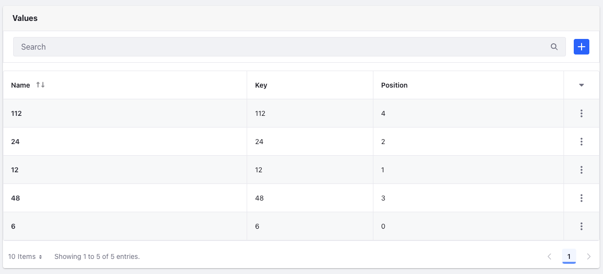
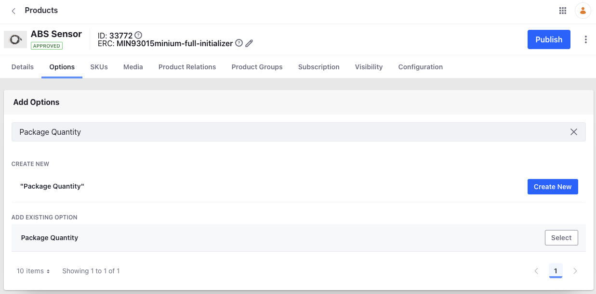
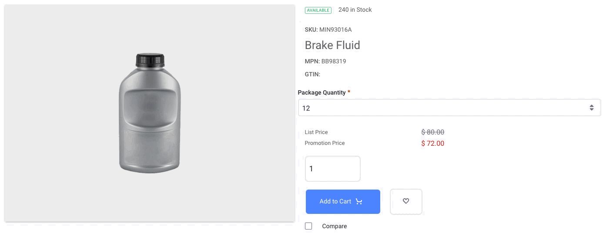

---
toc:
  - ./using-product-options/commerce-2-1-and-below-using-product-options.md
uuid: 0d1d7d64-69cf-423d-b2d3-d1f9dd71afe0
taxonomy-category-names:
- Commerce
- Products
- Product Information
- Liferay Self-Hosted
- Liferay PaaS
- Liferay SaaS
---
# Using Product Options

Product options provide a convenient and flexible way to customize products. Using options, you can add selectable or editable fields to products sold in your site. Your customers can then choose from product variants, bundles, and more.

To start using options, [create and configure](#creating-an-option-template) an option template. Then, depending on your template's configuration, [add values](#adding-values-to-option-templates) to it. Once created, you can [apply the template](#applying-an-option-template-to-a-product) to a product and [configure its settings and values](#configuring-options-and-values-applied-to-products) at a product level, without affecting the global template.

## Creating an Option Template

1. Open the *Global Menu* () and navigate to *Commerce* &rarr; *Options*.

1. Click *Add* ().

   

1. Enter a name in the Name field and select an *Option Field Type*. There are several field types available.

   | Field Type                                                                    | Descrtipion                                                                                 | Example                                                                                               |
   | :---------------------------------------------------------------------------- | :------------------------------------------------------------------------------------------ | :---------------------------------------------------------------------------------------------------- |
   | Select From List                                                              | Adds a drop-down list of text values for the customer to choose from                        | Choose different variants of a product (a smartphone with different RAM + storage configurations)     |
   | Text                                                                          | Adds a blank field for customers to enter text                                              | Add a custom message to a product (t-shirt, mugs, etc.)                                               |
   | Single Selection                                                              | Adds a radio button list for the Option's values                                            | Choose a complimentary gift from several options                                                      |
   | Multiple Selection                                                            | Adds a checkbox list for the Option's values, allowing customers to select multiple values | Add a screen guard and case to a smartphone                                                           |
   | Date                                                                          | Adds a field for customers to enter a date                                                  | Choose a date for product delivery                                                                    |
   | Numeric                                                                       | Adds a blank field for customers to enter an integer                                        | Add a custom number to a product (t-shirt, mugs, etc.)                                                |
   | Boolean                                                                       | Adds a Boolean checkbox for the Option                                                      | Choose from a yes/no option, for instance, adding insurance to a product.                             |
   | {bdg-secondary}`Liferay DXP 2024.Q2+/Portal 7.4 GA120+` Select Date from List | Adds a drop-down list of dates for the customer to choose from                              | Choose from different time slots available for the product, for instance, a concert, live class, etc. |

   The *Key* field is generated automatically to match the name, but you can manually change it if needed.

1. Click *Save*.

   This opens a new configuration page for the created option.

1. (Optional) You can add a description in the *Description* text box.

1. (Optional) Enable the *Use in Faceted Navigation* toggle to use the option as a search filter for products.

1. (Optional) Enable the *Required* toggle to enforce option selection before adding the product to the customer's cart.

1. (Optional) Enable the *SKU Contributor* toggle to use the option's values to [create SKUs](./creating-skus-for-product-variants.md). Customers must select from the available option values.

   !!! important
       You can only enable the *SKU Contributor* toggle with the *Single Selection* and *Select from List* field types.

1. Click *Save*.

Now you can add [generic values](#adding-values-to-option-templates) to the option template or skip this step and [apply the option](#applying-an-option-template-to-a-product) to individual products.

!!! note
    Alternatively, you can create basic option templates via the Products page. Open the *Global Menu* () and go to *Commerce* &rarr; *Products*. Select a product and go to the *Options* tab. In the Add Option field, enter a name for your new option and click *Create New*. This creates and applies the option template to the product.

## Adding Values to Option Templates

If an option uses one of these field types, you must add values to it.

* Select from List
* Single Selection
* Multiple Selection
* {bdg-secondary}`Liferay DXP 2024.Q2+/Portal 7.4 GA120+` Select Date from List

1. Open the *Global Menu* () and navigate to *Commerce* &rarr; *Options*.

1. Select an option template and scroll down to the Values section.

1. Click *Add* ().

1. Enter a *Name* for the value. A Key is generated automatically to match the name, but you can change it manually if needed.

1. Set the value's *Position* to determine the order in which it's listed.

1. Click *Submit* to add the value to the option template.

   

You can add as many generic values to the option as needed.

### Adding Values for Select Date from List

{bdg-secondary}`Liferay DXP 2024.Q2+/Portal 7.4 GA120+`

1. Select the Select Date from List option template. 

1. Scroll down to the Values section and click *Add* ().

1. Enter information for the option value based on the following fields:

   | Field         | Description                                                                                                                                         |
   | :------------ | :-------------------------------------------------------------------------------------------------------------------------------------------------- |
   | Date          | Specifies the date for the option value. The default value is the current date.                                                                     |
   | Time          | Specifies the time for the option value. The default value is the current time in UTC.                                                              |
   | Time Zone     | Specifies the time zone for the option value. The default time zone is UTC.                                                                         |
   | Duration      | Specifies an integer value for the duration.                                                                                                        |
   | Duration Type | Specifies the duration type between hours and days. The default duration type is hours.                                                             |
   | Label         | Specifies the label for the option value. This field is non-editable. It is generated in the format: Date, Time (Time Zone), Duration Duration Type |
   | Position      | Specifies the option value's priority to determine its display order. The default value is `0`.                                                     |

   

1. Click *Submit*.

!!! note
    After adding values, you cannot change the option type. You can use this type as an SKU contributor, and only one option can be selected when buying a product. The date/time values shown in the storefront use the user's locale. If the user doesn't have a locale, it uses the site's locale.

## Applying an Option Template to a Product

1. Open the *Global Menu* (), and navigate to *Commerce* &rarr; *Products*.

1. Select a product and go to the *Options* tab.

1. Enter a name in the *Add Options* field, and click *Create New*. If there's an option template already created, click *Select*.

   

The option is applied immediately to the product. If choosing an existing option template, all values from the template are included. You can choose to add, remove, or edit values without affecting the template values.

If desired, you can add multiple options to the same product. See [Creating SKUs for Product Variants](./creating-skus-for-product-variants.md) for more information.

!!! important
    If you enable the *SKU Contributor* toggle, you must generate SKUs manually for the option's values after they're created. To do this, go to the product's *SKUs* tab, click *Add* (), and select *Generate All SKU Combinations*. Unique SKUs are generated immediately for each value. If no SKUs are generated, the option's field doesn't display its values.

## Configuring Options and Values Applied to Products

Once an option is applied to a product, you can access additional configuration settings for the option and its values.

!!! note
    Changes made to a product's option do not affect the option template and vice versa.

### Additional Option Settings

Select an option from the Options section to view additional settings.

**Name**: Set the option's name.

**Description**: Set an optional option description.

**Position**: Set the option's priority to determine its display order, beginning with `0.0`.

**Field Type**: Set the option's field type.

**Price Type**: Set the price type used for the options's values, *Dynamic* or *Static*.

* *Dynamic* - Requires linking values to SKUs and uses the linked product's price for the value's own price.

* *Static* - Uses a fixed price for the option's values. If the value is linked to a product, the static price overrides the product's price without affecting its list price.

!!! note
    The price type attribute is only compatible with the Single Selection and Select from List field types.

### Additional Value Settings

**Default**: Use the toggle to set the option value as the default for the option.

**Delta Price** (for static pricing only): Set a specific price for the value.

**Product**: Link an existing SKU to the value and specify its quantity.

!!! note
    Products can only be linked to options with the price type attribute.

See [Commerce 2.1 and below: Using Product Options](./using-product-options/commerce-2-1-and-below-using-product-options.md) to learn how to use product options with earlier versions of Liferay.