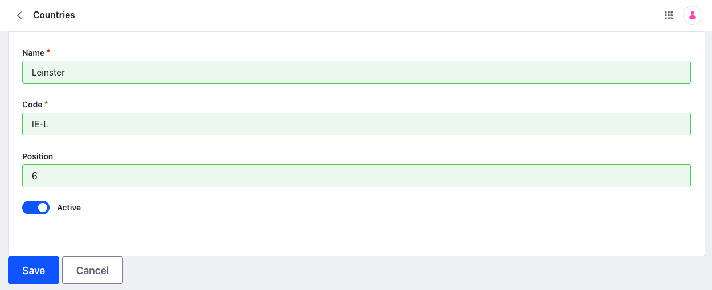
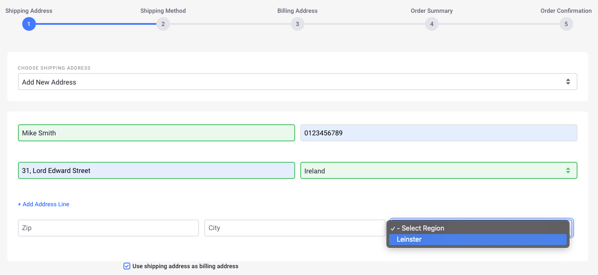
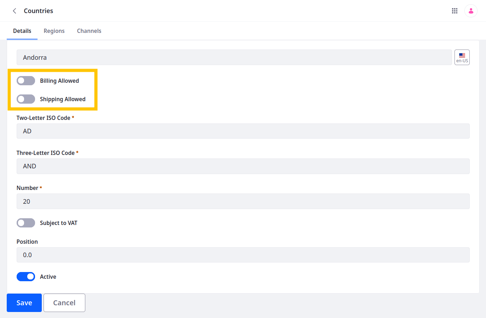

# Countries Configuration Reference

By default, Liferay includes over 240 countries, but you can add countries if needed. When adding or editing countries, you can add states, provinces, or other administrative regions for use with shipping addresses. Also, you can determine which countries are available for each channel or deactivate countries altogether.

## Adding Countries

1. Open the *Global Menu* (), go to the *Commerce* tab, and click *Countries*.

1. Click the *Add* button ().

1. Enter these details for the country.

   | Field                 | Description                                                                               |
   |:----------------------|:------------------------------------------------------------------------------------------|
   | Name                  | Country name                                                                              |
   | Billing Allowed       | Enable/Disable the country in the *Country* dropdown for billing address                  |
   | Shipping Allowed      | Enable/Disable the country in the *Country* dropdown for shipping address                 |
   | Two-Letter ISO Code   | Two letter ISO code per [ISO-3166-2](https://www.iso.org/obp/ui/#search/code/) standard   |
   | Three-Letter ISO Code | Three letter ISO code per [ISO-3166-2](https://www.iso.org/obp/ui/#search/code/) standard |
   | Number                | Numeric code per [ISO-3166-2](https://www.iso.org/obp/ui/#search/code/) standard          |
   | Subject to VAT        | Determine if the country is subject to VAT                                                |
   | Position              | Determine the country's sort order in the Country dropdown                                |
   | Active                | Enable/Disable the country                                                                |

   

1. Click *Save*.

## Adding Regions

You can add  to countries in Liferay. To do this,

1. Open the *Global Menu* (), go to the *Commerce* tab, and click *Countries*.

1. Begin editing a country and go to the *Regions* tab.

1. Click the *Add* button ().

1. Enter these details:

   | Field    | Description                                                                                |
   |:---------|:-------------------------------------------------------------------------------------------|
   | Name     | Region's name                                                                              |
   | Code     | [ISO-3166-2](https://www.iso.org/obp/ui/#search/code/) code for identifying the region     |
   | Position | Determines the region's priority in the Regions dropdown menu on the Shipping Address page |

   This example adds the Leinster region to Ireland.

   

1. Toggle *Active*.

1. Click *Save*.

The region is now available for the country when entering a shipping address.

In this example, Leinster appears in the list of regions for Ireland on the Shipping Address page.

## Filtering Channels for Countries

You may want to restrict some countries in different channels. To do this,

1. Open the *Global Menu* (), go to the *Commerce* tab, and click *Countries*.

1. Begin editing the desired country and go to the *Channels* tab.

1. Toggle *Enable filter channels*.

   

1. Select the channels for which the country is unavailable during checkout.

1. Click *Save*.

During checkout, the country does not appear in the Country dropdown for the selected channels.

## Deactivating a Country for Billing or Shipping

For some stores, you may need to deactivate a country for shipping or billing purposes. To do this,

1. Open the *Global Menu* (), go to the *Commerce* tab, and click *Countries*.

1. Begin editing the desired country.

1. Toggle *Billing Allowed* to disable it for billing.

1. Toggle *Shipping Allowed* to disable it for shipping.  

   

1. Click *Save*.

The country is no longer available for billing and shipping. To completely remove a country as an option, toggle *Active* to disable it.
