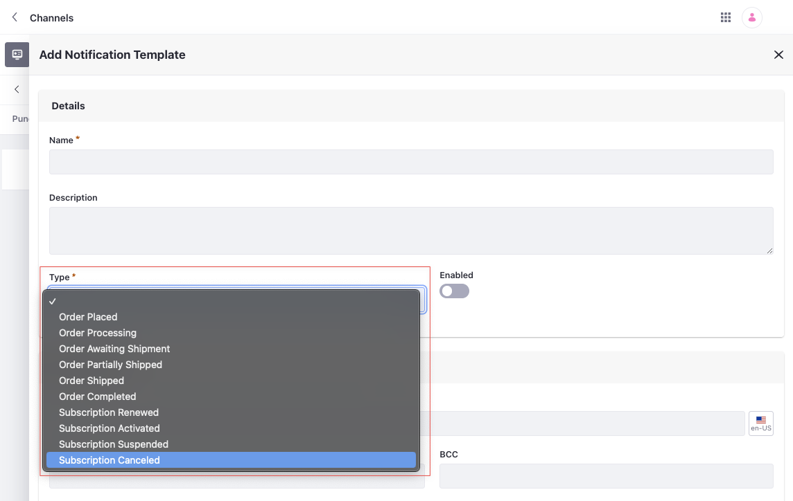
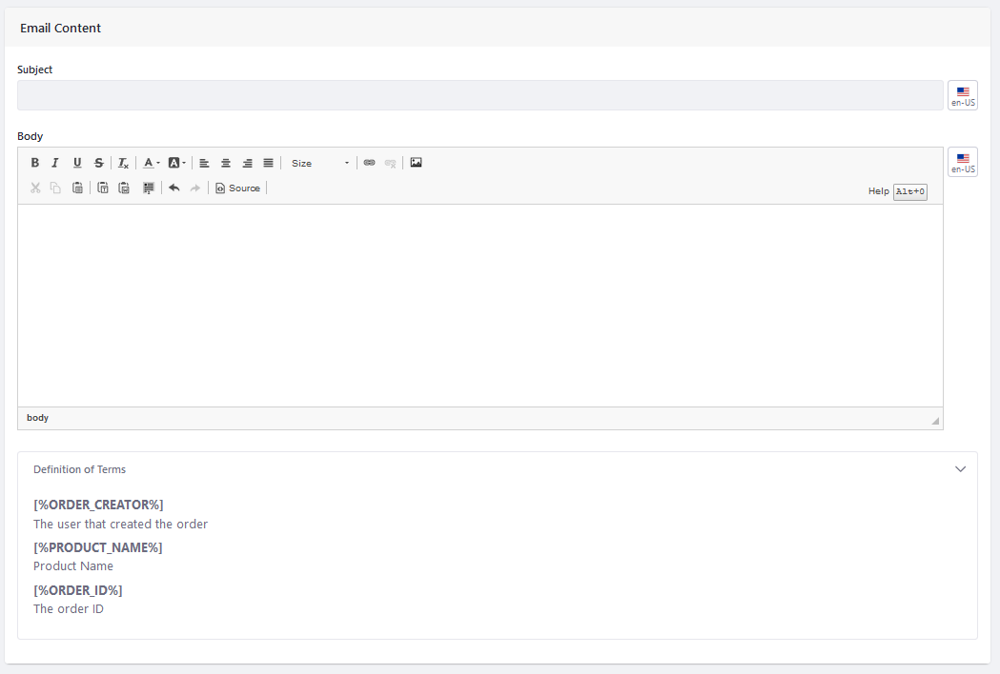

# Notification Template Variables Reference Guide

When creating notification templates, you can use variables to populate email fields dynamically with data from the triggering channel event. Select a notification template *Type* to view its variables. This determines which channel events trigger the notification.

After selecting a type, you can view its variables and their descriptions by expanding *Definition of Terms* in the *Email Settings* and *Email Content* sections. Examples include the customer's name, order ID, shipping and billing addresses, list of order items, and more.

## Email Settings

| Variable                       | Description                                                                                                                                                                      |
| :----------------------------- | :------------------------------------------------------------------------------------------------------------------------------------------------------------------------------- |
| [%ACCOUNT_ROLE_ORDER_MANAGER%] | The order manager(s) linked to the account that placed the order                                                                                                                 |
| [%ORDER_CREATOR%]              | The user that created the order                                                                                                                                                  |
| [%ACCOUNT_ROLE_ADMINISTRATOR%] | The account administrator(s) linked to the account that placed the order                                                                                                         |
| [%USER_GROUP_NAME%]            | The name of a user group. Replace `NAME` with the user group name. For instance, if the user group name is User Group A, then the variable must be `[%USER_GROUP_User Group A%]` |

## Order Based Notification Template Types

Channels have six types of notification templates for order events:

1. Order Placed
1. Order Processing
1. Order Awaiting Shipment
1. Order Partially Shipped
1. Order Shipped
1. Order Completed

| Variable                          | Description                                        |
| :-------------------------------- | :------------------------------------------------- |
| [%ORDER_ITEMS%]                   | A table listing all items in the order             |
| [%ORDER_SHIPPING_ADDRESS%]        | The order's shipping address                       |
| [%ORDER_BILLING_ADDRESS%]         | The order's billing address                        |
| [%ORDER_ID%]                      | The order ID                                       |
| [%ORDER_TOTAL%]                   | The order's total excluding tax                    |
| [%ORDER_DATE%]                    | The date when the order was placed                 |
| [%ORDER_CURRENCY_SYMBOL%]         | The currency symbol of the order (Example: $, £)   |
| [%ORDER_SHIPPING_WITH_TAX_TOTAL%] | The order's total shipping cost including tax      |
| [%ORDER_EXTERNAL_REFERENCE_CODE%] | The order's external reference code                |
| [%ORDER_URL%]                     | The order's URL                                    |
| [%PAYMENT_TERMS_DESCRIPTION%]     | Payment terms attached to the order                |
| [%ORDER_PAYMENT_METHOD%]          | The order's payment method                         |
| [%ORDER_TAX_TOTAL%]               | The total tax for the order                        |
| [%ORDER_WITH_TAX_TOTAL%]          | The total amount for the order including tax       |
| [%ORDER_CREATOR_USER_FIRST_NAME%] | The first name of the user that created the order  |
| [%ORDER_SHIPPING_OPTION%]         | The order's shipping option                        |
| [%ORDER_CREATOR_USER_LAST_NAME%]  | The last name of the user that created the order   |
| [%DELIVERY_TERMS_DESCRIPTION%]    | Delivery terms attached to the order               |
| [%ORDER_CREATOR%]                 | The user that created the order                    |
| [%ORDER_CURRENCY_CODE%]           | The currency code of the order (Example: USD, GBP) |
| [%ORDER_CREATOR_USER_TITLE%]      | The title of the user that created the order       |
| [%ORDER_SHIPPING_TOTAL%]          | The order's total shipping cost excluding tax      |

## Subscription Based Notification Template Types

Channels have four types of notification templates for subscription events:

1. Subscription Renewed
1. Subscription Activated
1. Subscription Suspended
1. Subscription Canceled

| Variable          | Description                     |
| :---------------- | :------------------------------ |
| [%PRODUCT_NAME%]  | Product Name                    |
| [%ORDER_CREATOR%] | The user that created the order |
| [%ORDER_ID%]      | The order ID                    |

## Additional Information

* [Using Notification Templates](./using-notification-templates.md)
