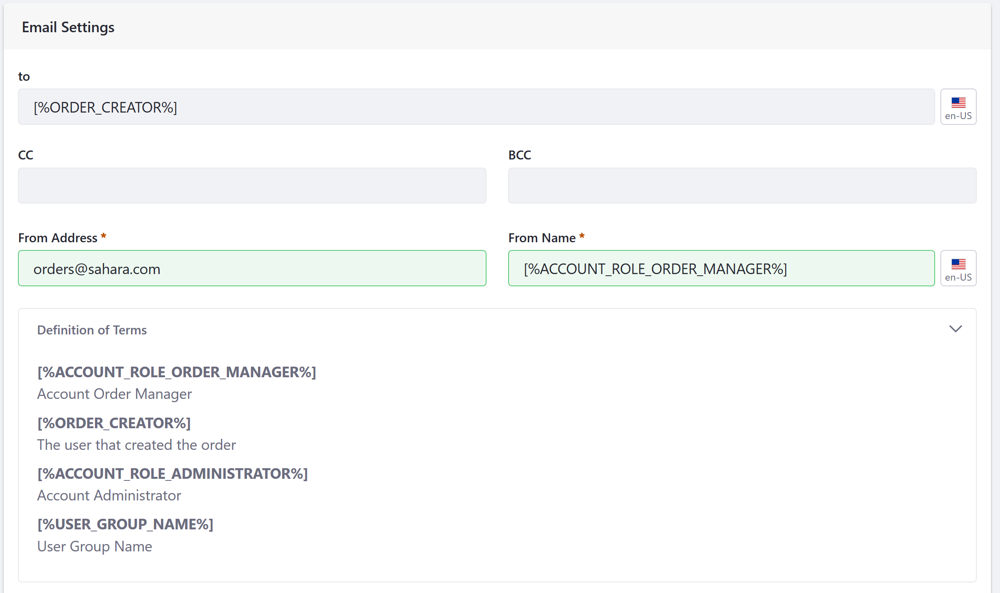
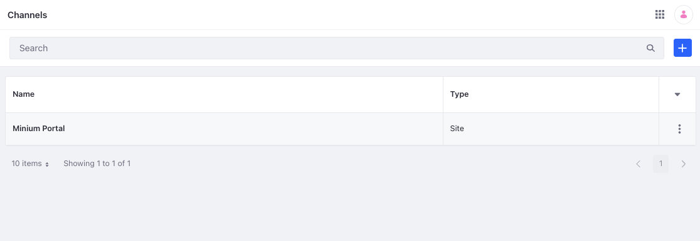

# Using Notification Templates

Email notifications are automatically sent to users based on events in the store. To send them, you must first create a *Notification Template*. Notification templates define the sender, trigger, and content of an email notification.

```{note}
To use Liferay Commerce's Notifications feature, first configure the Mail settings for Liferay Digital Experience Platform (DXP). See [Configuring Mail](https://learn.liferay.com/dxp/latest/en/installation-and-upgrades/setting-up-liferay/configuring-mail.html) for more information.
```

## Event Triggers

Every notification template must be linked to a type. The type refers to the event trigger that initiates the notification. You can choose one of the ten available event triggers when creating a notification template. Note that one notification template can only be used for one event.

| Notification Type       | Event                                                               |
| :---------------------- | :------------------------------------------------------------------ |
| Order Placed            | An order has been placed in the channel.                            |
| Order Processing        | The order is being processed.                                       |
| Order Awaiting Shipment | The order is ready to be shipped.                                   |
| Order Partially Shipped | The items in the order are being shipped separately.                |
| Order Shipped           | The order has been shipped.                                         |
| Order Completed         | The order has been delivered and marked as complete                 |
| Subscription Renewed    | Renewal of a subscription (recurring order)                         |
| Subscription Activated  | Activation of a subscription                                        |
| Subscription Suspended  | Suspension of a subscription pending review or action by the store. |
| Subscription Canceled   | Cancellation of a subscription                                      |

## Creating a Notification Template

Follow these steps to create a notification template for a received order:

1. Open the *Global Menu* () and navigate to *Control Panel* &rarr; *Commerce* &rarr; *Channels*.

   

1. Click on the desired channel.

1. Click the *Notification Templates* tab.

1. Click the *Add* () button to create a new notification template and enter the following information.

   * **Name**: New Orders
   * **Description**: New orders template
   * **Type**: Order Placed
   * **Enabled**: Switch the toggle to *YES*.
   * **To**: The email address of the person you want to send the notification to. You can also enter addresses in the CC and BCC fields.
   * **From Address**: Your store's email address (for example: *orders@yourstore.com*)
   * **From Name**: Name of the store or a customer service representative
   * **Subject**: Email subject (for example: *We have received your order.*)
   * **Body**: Enter a message. You can use placeholders such as `[%ORDER_CREATOR%]` and `[%ORDER_ID%]` to represent a customer's name and order ID respectively. See the [Notification Template Variables Reference Guide](./notification-template-variables-reference-guide.md) to learn more.

   

1. Click *Save*.

The notification template now initiates an automated email upon receiving an order.


## Example: Using Placeholder Values

When creating a notification template, you can use placeholders as a substitute for key values. For the *Email Settings* and *Email Content* fields, the key values include the customer's name, the order ID, shipping and billing addresses, a list of items in the order and more. The following example shows the creation of an email template to confirm the receipt of an order.

### Email Settings

To define the recipient, sender address, and sender name, enter the following:

* **To**: `[%ORDER_CREATOR%]`

* **From Address**: orders@sahara.com

* **From Name**: `[%ACCOUNT_ROLE_ORDER_MANAGER%]`


If notifying more than one recipient, as noted above, you can a comma-delimited list by entering in the *To* field: `[%ORDER_CREATOR%]`,`[%ACCOUNT_ROLE_ADMINISTRATOR%]`. This sends the email to the person who placed the order and the account administrator.

### Email Content

Use this section to define the content of the email notification.

* **Subject**: Order Received

* **Body**:

   ```
   Dear `[%ORDER_CREATOR%]`,

   Your Order `[%ORDER_ID%]` has been received.

   Regards,

   `[%ACCOUNT_ROLE_ORDER_MANAGER%]`
   ```

## Viewing Email Notifications of an Order

Email notifications related to an order are tracked. To view them, open the *Global Menu* () and navigate to *Control Panel* &rarr; *Commerce* &rarr; *Orders*. Select an order and click the *Emails* tab. See [Order Information](../../order-management/orders/order-information.md) to learn more.


## Commerce 2.0 and Below

To create email notifications in Commerce 2.0 and below:

1. Navigate to *Site Administration* &rarr; *Commerce* &rarr; *Settings*.

    

1. Click the *Notifications* tab.

1. Click the *Notification Templates* sub-tab.

1. Click the Add () button to create a new Notification Template and enter the following information.

   * **Name**: New Orders
   * **Description**: New orders template
   * **Account Groups**: (leave blank or designate an **optional** account group)
   * **From Address**: Your store's email address (for example: *orders@yourstore.com*)
   * **From Name**: Name of the store or a customer service representative
   * **Type**: Order Placed
   * **Enabled**: Switch the Toggle to *YES*
   * **Subject**: Email subject (for example: *Your order has been received.*)
   * **Body**: You can use variables such as `[%ORDER_CREATOR%]` and `[%ORDER_ID%]` to represent a customer's name and order ID respectively. See the [Notification Template Variables Reference Guide](./notification-template-variables-reference-guide.md) to learn more.

   

1. Click *Save*.

The notification template now initiates an automated email upon receiving an order. After creating the template, a new notification is added to the notification queue whenever an order is placed. To view this, you can check the *Notifications Queue* sub-tab after placing an order. By default, the Liferay instance checks the queue every 15 minutes to send any unsent notifications. To learn how to change the interval, see [Configuring the Commerce Notification Queue](./configuring-the-commerce-notification-queue.md).

## Additional Information

* [Notification Template Variables Reference Guide](./notification-template-variables-reference-guide.md)
* [Configuring the Commerce Notification Queue](./configuring-the-commerce-notification-queue.md)
