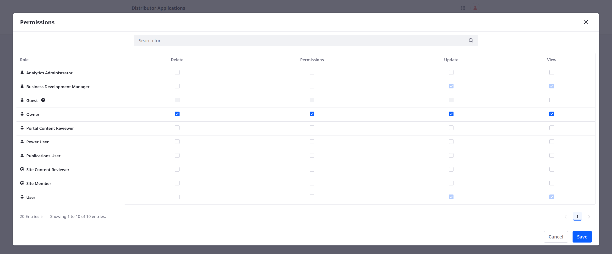
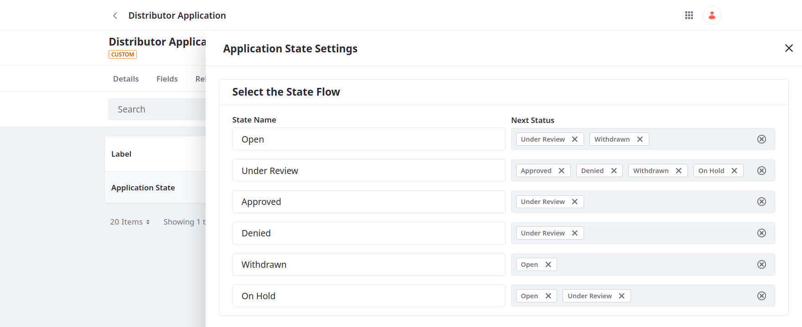
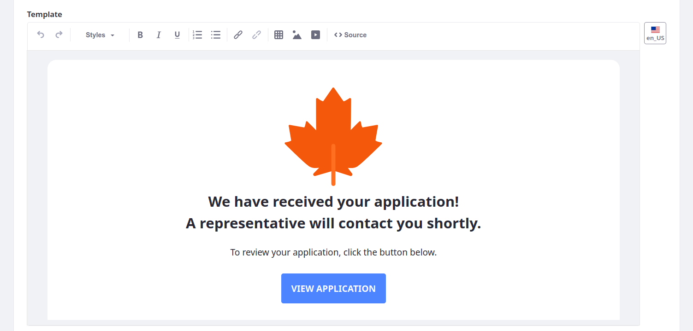

# Implementing Business Logic

Business logic refers to the rules and processes that determine how an application behaves within a system to meet business needs. Implementing business logic effectively can streamline operations, improve efficiency, and promote consistency across your organization.

Examples include,

* [Validating Fields](#validations)
* [Managing Data Access](#permissions)
* [Defining Workflows](#workflows)
* [Automating Notifications](#notifications)

<!--TASK:
* Integrating with External Systems
* Calculations
* Data Transformation
* Localization
* Logging

Use cron...
-->

## Validations

Validations set rules for determining whether field values are valid, ensuring user input meets your criteria. By validating data at the point of entry, applications can ensure the data meets the required format, type, and constraints, preventing data errors and reducing the need for manual data cleanup. In this way, validations can improve the integrity and consistency of gathered data (e.g., email addresses, phone numbers). In Liferay, this involves adding validation rules directly to your object definition. Liferay uses these rules to check field values upon entry submission. If the value is invalid, Liferay displays an error message.

## Permissions

Managing access to data is essential to data privacy and security. In Liferay, you can restrict access to sensitive object data using role permissions and account membership. These permission can be managed at the application and entry levels.

## Workflows

Workflows define approval processes for application entities and can improve task visibility, eliminate bottlenecks in business processes, and reduce the time and resources required to complete tasks. With Liferay, you can build and enable custom approval processes for custom objects. Additionally, you can use picklists to define custom state fields with their own flow.

## Notifications

Notifications can improve visibility in your application by providing real-time updates to users and system administrators for object entry events. With Liferay, this involves creating notification templates and then using those templates with object actions. The template provides the notification content and design, while the object action determines the trigger and conditions for sending the notification (e.g., at entry creation, at entry update).

## Implementing Business Logic for the Distributor Application Flow

Having modeled the Distributor Application object, you can begin incorporating this logic to ensure your solution meets Delectable Bonsai's business requirements. Once implemented, they can onboard distributors quickly and safely.

Ready?

[Let's Go!](./implementing-business-logic/validating-fields.md)
