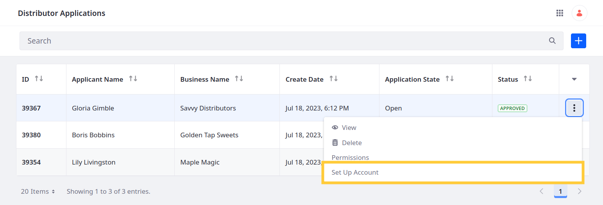
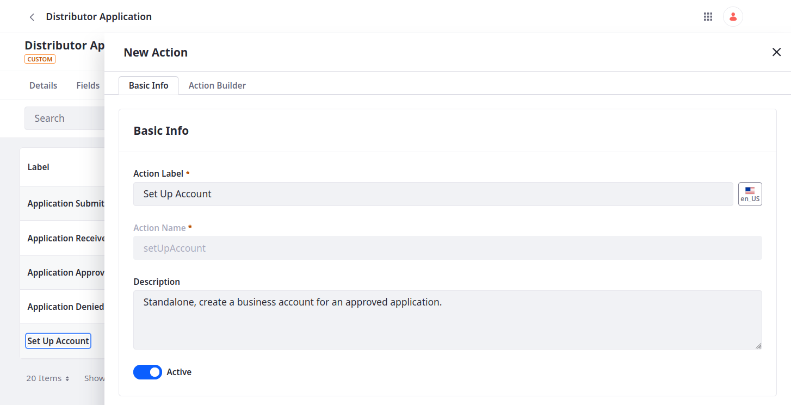
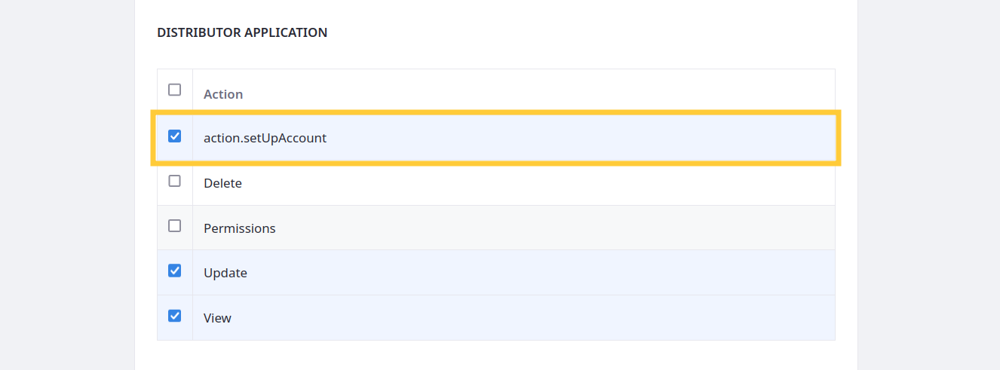

# Automating Account Creation

To complete the onboarding flow, Delectable Bonsai wants to enable managers to easily create business accounts for approved applications. Each account should be named after the application's `businessName` and the applicant should be automatically assigned to the account with the Account Administrator role. Here you'll achieve this using an object action [client extension](https://learn.liferay.com/web/guest/w/dxp/building-applications/client-extensions).



## Setting Up the Client Extension

When you [deployed](./adding-an-approval-workflow.md#deploying-the-client-extensions) the `liferay-course-etc-spring-boot` project for your workflow, you also deployed a custom object action.

Before proceeding, ensure the Spring Boot application is running. If it isn't, navigate to the `liferay-course-etc-spring-boot` project folder and run this command:

```bash
./../../gradlew bootRun
```

Then go to `http://localhost:58081/ready` to confirm the application started successfully.

## Examining the Code

The provided Object Action client extension performs these operations:

1. Creates a business account using the `businessName` from the approved application

1. Associates the applicant with the account using the `applicantEmail` field

1. Assigns the applicant the Account Administrator role

### Receiving the Request Body and Setting Variables

<!--TASK:
```{literalinclude} ./resources/liferay-c6s3.zip/liferay-course-workspace/client-extensions/liferay-course-etc-spring-boot/src/main/java/com/liferay/course/ObjectAction1RestController.java
    :dedent: 1
    :language: java
    :lines: 
```
-->

```java
   @PostMapping
   public ResponseEntity<String> post(
      @AuthenticationPrincipal Jwt jwt, @RequestBody String json) {

      log(jwt, _log, json);

      JSONObject payload = new JSONObject(json);

      JSONObject jsonApplicationDTO = payload.getJSONObject("objectEntryDTODistributorApplication");

      JSONObject jsonProperties = jsonApplicationDTO.getJSONObject("properties");

      String accountName = jsonProperties.getString("businessName");

      String accountERC = "ACCOUNT_" + accountName.toUpperCase().replace(" ", "_");

      String email = jsonProperties.getString("applicantEmail");
   ...
   }
```

The post method for `ObjectAction1RestController` has two parameters: the JSON Web Token (JWT) for authenticating its HTTP calls and the request body, which it receives as a string in JSON format.

After logging the request body, it parses the JSON request payload and ultimately extracts the `businessName` and `applicantEmail` values. These values are stored in the `accountName` and `email` variables, and `accountName` is then use to set the `accountERC` variable.

### Executing the POST Requests

<!--TASK:
```{literalinclude} ./resources/liferay-c6s3.zip/liferay-course-workspace/client-extensions/liferay-course-etc-spring-boot/src/main/java/com/liferay/course/ObjectAction1RestController.java
    :dedent: 1
    :language: java
    :lines: 
```
-->

```java
      try {
         WebClient.Builder builder = WebClient.builder();

         WebClient webClient = builder.baseUrl(
            ...
         ).defaultHeader(
            ...
         ).defaultHeader(
            ...
         ).build();

         createBusinessAccount(
            webClient, jwt, accountERC, accountName
         ).doOnSuccess(
            responseEntity -> logResponse(responseEntity, "Account Created")
         ).then(
            associateUserWithAccount(webClient, jwt, accountERC, email)
         ).doOnSuccess(
            responseEntity -> logResponse(responseEntity, "User Assigned")
         ).then(
            getRoleId(webClient, jwt, accountERC)
         ).flatMap(
            accountRoleId -> {
               return assignAccountRoleToUser(
                  webClient, jwt, accountERC, accountRoleId, email
               ).doOnSuccess(
                  responseEntity -> logResponse(responseEntity, "Role Assigned")
               );
            }
         ).subscribe();
      }
```

After defining variables using the request body (`json`), the code initializes and configures the `WebClient` by determining its base URL and header. It then chains together the `createBusinessAccount`, `associateUserWithAccount`, `getRoleId`, and `assignAccountRoleToUser` methods. Together, these methods create a business account, associate the applicant with it, retrieve the Account Administrator ID, and assign the role to the applicant.

### Creating the Account

<!--TASK:
```{literalinclude} ./resources/liferay-c6s3.zip/liferay-course-workspace/client-extensions/liferay-course-etc-spring-boot/src/main/java/com/liferay/course/ObjectAction1RestController.java
    :dedent: 1
    :language: java
    :lines: 
```
-->

```java
   private Mono<ResponseEntity<String>> createBusinessAccount(
      WebClient webClient, Jwt jwt, String accountERC, String accountName) {

      return webClient.post(
      ).uri(
         "o/headless-admin-user/v1.0/accounts"
      ).bodyValue(
         "{\"externalReferenceCode\": \"" + accountERC + "\", \"name\": \"" + accountName + "\", \"type\": \"business\"}"
      ).header(
         HttpHeaders.AUTHORIZATION, "Bearer " + jwt.getTokenValue()
      )
      ...
   }
```

This method performs an asynchronous POST request to a `headless-admin-user` endpoint using the initialized `WebClient` and creates a business account using the `accountERC` and `accountName` variables to populate the `externalReferenceCode` and `name` fields respectively. Finally, it returns the response entity and logs the HTTP status.

### Associating the Applicant with the Account

<!--TASK:
```{literalinclude} ./resources/liferay-c6s3.zip/liferay-course-workspace/client-extensions/liferay-course-etc-spring-boot/src/main/java/com/liferay/course/ObjectAction1RestController.java
    :dedent: 1
    :language: java
    :lines: 
```
-->

```java
   private Mono<ResponseEntity<String>> associateUserWithAccount(
      WebClient webClient, Jwt jwt, String accountERC, String email) {

      return webClient.post(
      ).uri(
         "o/headless-admin-user/v1.0/accounts/by-external-reference-code/{externalReferenceCode}/user-accounts/by-email-address/{emailAddress}", accountERC, email
      ).header(
         HttpHeaders.AUTHORIZATION, "Bearer " + jwt.getTokenValue()
      )
      ...
   }
```

This method performs an asynchronous POST request to a `headless-admin-user` endpoint using the initialized `WebClient` and associates the user with the account using the `accountERC` and `email` variables. Finally, it returns the response entity and logs the HTTP status.

### Assigning the Account Administrator Role

<!--TASK:
```{literalinclude} ./resources/liferay-c6s3.zip/liferay-course-workspace/client-extensions/liferay-course-etc-spring-boot/src/main/java/com/liferay/course/ObjectAction1RestController.java
    :dedent: 1
    :language: java
    :lines: 
```
-->

```java
   private Mono<ResponseEntity<String>> assignAccountRoleToUser(
      WebClient webClient, Jwt jwt, String accountERC, Integer accountRoleId, String email) {
    
      return webClient.post(
      ).uri(
         "o/headless-admin-user/v1.0/accounts/by-external-reference-code/{externalReferenceCode}/account-roles/{accountRoleId}/user-accounts/by-email-address/{emailAddress}", accountERC, accountRoleId, email
      ).header(
         HttpHeaders.AUTHORIZATION, "Bearer " + jwt.getTokenValue()
      )
      ...
   }
```

This method performs an asynchronous POST request to a `headless-admin-user` endpoint using the initialized `WebClient` and assigned the user an account role using the `accountERC`, `accountRoleId` and `email` variables. The role id is extracted using the `getRoleId` method. Finally, it returns the response entity and logs the HTTP status.

### Retrieving the Role ID

<!--TASK:
```{literalinclude} ./resources/liferay-c6s3.zip/liferay-course-workspace/client-extensions/liferay-course-etc-spring-boot/src/main/java/com/liferay/course/ObjectAction1RestController.java
    :dedent: 1
    :language: java
    :lines: 
```
-->

```java
   private Mono<Integer> getRoleId(WebClient webClient, Jwt jwt, String accountERC) {
      return webClient.get(
      ).uri(
         uriBuilder -> uriBuilder.path(
            "o/headless-admin-user/v1.0/accounts/by-external-reference-code/{externalReferenceCode}/account-roles"
         ).queryParam(
            "filter", "name eq 'Account Administrator'"
         ).build(
            accountERC
         )
      ).header(
         HttpHeaders.AUTHORIZATION, "Bearer " + jwt.getTokenValue()
      ).retrieve(
      ).bodyToMono(
         String.class
      ).map(
         json -> new JSONObject(
            json
         ).getJSONArray(
            "items"
         ).getJSONObject(
            0
         ).getInt(
            "id"
         )
      );
   }
```

This method performs a GET request to a `headless-admin-user` endpoint and returns an integer. When building the URI, the request filters the response to include the Account Administrator role alone. It then extracts and returns the role's `id`.

## Adding the Object Action

1. Begin editing the *Distributer Application* object.

1. Go to the *Actions* tab and click *Add* (  ).

1. Enter these values in the Basic Info tab:

   | Field        | Value                                                              |
   |:-------------|:-------------------------------------------------------------------|
   | Action Label | Set Up Account                                                     |
   | Action Name  | setUpAccount                                                       |
   | Description  | Standalone, create a business account for an approved application. |
   | Active       | True                                                               |

   

1. Go to the *Action Builder* tab and set these values:

   | Field         | Value                                                                             |
   |:--------------|:----------------------------------------------------------------------------------|
   | Trigger       | Standalone                                                                        |
   | Action        | `object-action-executor[function#liferay-course-etc-spring-boot-object-action-1]` |
   | Error Message | Failed to create the business account.                                            |

   

1. Click *Save*.

When saved, Liferay adds the action as an option to each application's actions menu, so you can trigger it manually from the Distributor Applications page.


Liferay also generates two headless APIs for triggering the standalone action.


Finally, Liferay adds a permission for controlling which users can trigger the action. Next, assign this permission to the Business Development Manager role.

## Assigning the Set Up Account Permission

1. Open the *Global Menu* (  ), go to the *Control Panel* tab, and click *Roles*.

1. Edit the *Business Development Manager* role.

1. Go to the *Define Permissions* tab.

1. Add the `Distributor Application: action.setUpAccount` permission.

   

1. Click *Save*.

Now business managers can trigger the action via the Distributor Applications page or using headless APIs.

## Triggering the Set Up Account Action

1. Go to the Distributor Applications page.

1. Click the *Actions* button (  ) for an entry and select *Set Up Account*.

1. Open the *Accounts* application and verify the account was created.

   

1. Go to the *Users* tab and verify the applicant was associated with the account and assigned the Account Administrator role.

   

## Conclusion

Congratulations! You've successfully added the business logic necessary for the Distributor Application object. Now you can design a user interface using Liferay's page builder features.

Module Three: [Designing User Interfaces](../designing-user-interfaces.md)

## Relevant Concepts
