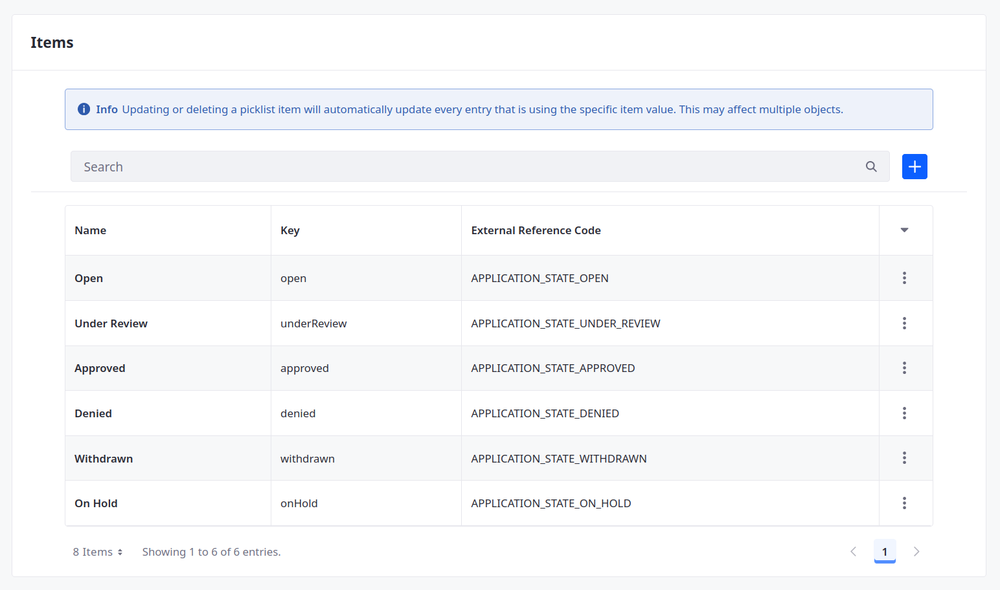
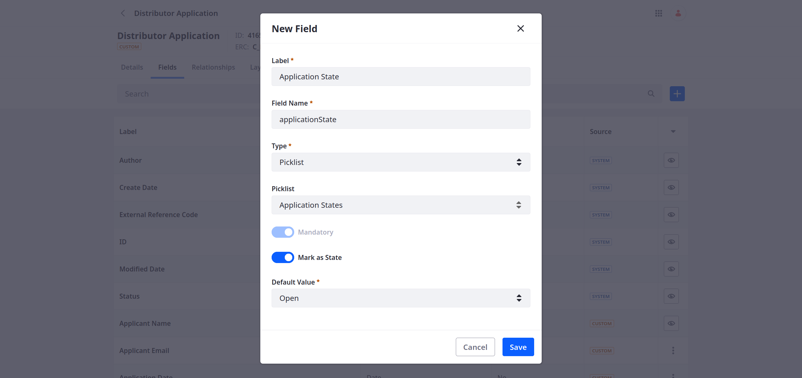
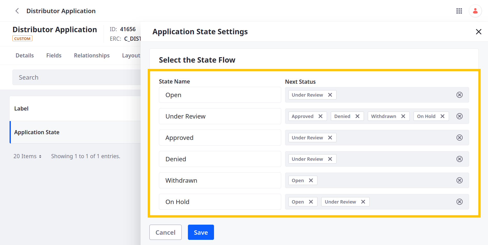

# Defining Workflows

<!-- Workflows define approval processes for entries. With Liferay, you can enable workflow for custom objects or use picklists to define custom states. -->

<!-- Diagram? -->

<!-- Workflows define approval processes for application entities and improve task visibility. Additionally, process automation can help eliminate bottlenecks in business processes, reducing the time and resources required to complete tasks.

What workflow and process automation would we need for the distributor application?

Delectable Bonsai realizes that they want to define custom states for each application, so they can track __ and support additional business logic. States: Under Review, Approved, Denied, Withdrawn.

Client extensions: custom workflow action -->

## Adding a State Field to Distributor Application

<!-- INTRO -->

### Adding a Picklist for Application States

1. Open the *Global Menu* (  ), go to the *Control Panel* tab, and click *Picklists*.

1. Click *Add* (  ).

1. For name, enter Application States and click *Save*.

1. Begin editing the picklist.

   

1. Click *Add* (  ) to add these items to the picklist:

   | Name         | Key           |
   |:-------------|:--------------|
   | Open         | `open`        |
   | Under Review | `underReview` |
   | Approved     | `approved`    |
   | Denied       | `denied`      |
   | Withdrawn    | `withdrawn`   |
   | On Hold      | `onHold`      |

1. Edit each item and set their ERCs to these values:

   | External Reference Code          |
   |:---------------------------------|
   | `APPLICATION_STATE_OPEN`         |
   | `APPLICATION_STATE_UNDER_REVIEW` |
   | `APPLICATION_STATE_APPROVED`     |
   | `APPLICATION_STATE_DENIED`       |
   | `APPLICATION_STATE_WITHDRAWN`    |
   | `APPLICATION_STATE_ON_HOLD`      |

   

1. Change the Picklist's ERC to `LIST_APPLICATION_STATES`.

   

1. Click *Save*.

You can now use the picklist to create a state field in the Distributor Application object.

### Adding the Application State Field

1. Open the *Global Menu* (  ), go to the *Control Panel* tab, and click *Objects*.

1. Begin editing the Distributor Application object and go to the *Fields* tab.

1. Click *Add* (), enter these details, and click *Save*:

   | Field         | Value              |
   |:--------------|:-------------------|
   | Label         | Application State  |
   | Field Name    | `applicationState` |
   | Type          | Picklist           |
   | Picklist      | Application States |
   | Mandatory     | True               |
   | Mark as State | True               |
   | Default Value | Open               |

   

### Managing State Flow

1. While editing the Distributor Application object, go to the *State Manager* tab.

1. Click *Application State*.

1. Set these flow values:

   | Field        | Value                                |
   |:-------------|:-------------------------------------|
   | Open         | Under Review                         |
   | Under Review | Approved, Denied, Withdrawn, On Hold |
   | Approved     | Under Review                         |
   | Denied       | Under Review                         |
   | Withdrawn    | Open                                 |
   | On Hold      | Open, Under Review                   |

   

1. Click *Save*.

When updating the Application State field, user options are determined by the state flow.

## Using the Application State Field

To practice using the application state, you must first add the field to the object's layout and view.

<!-- ### Adding Application State to the Object's Layout and View

### Creating Entries -->

<!-- ## Using Workflow with Distributor Application

### Designing a Workflow Review Process

### Enabling Workflow -->

Next: [Automating Notifications](./automating-notifications.md)

## Relevant Concepts
