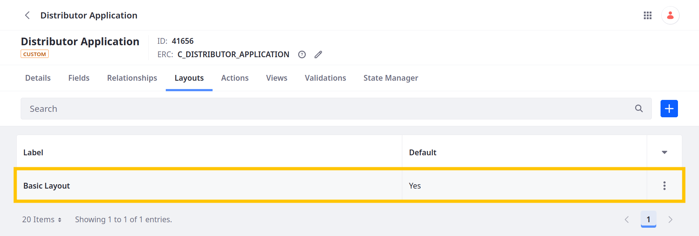
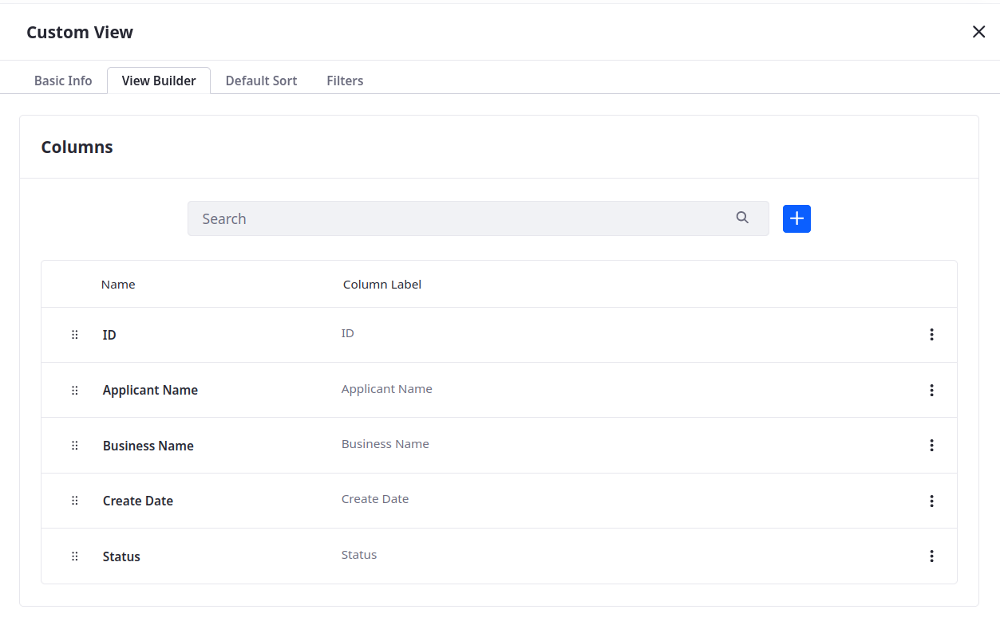
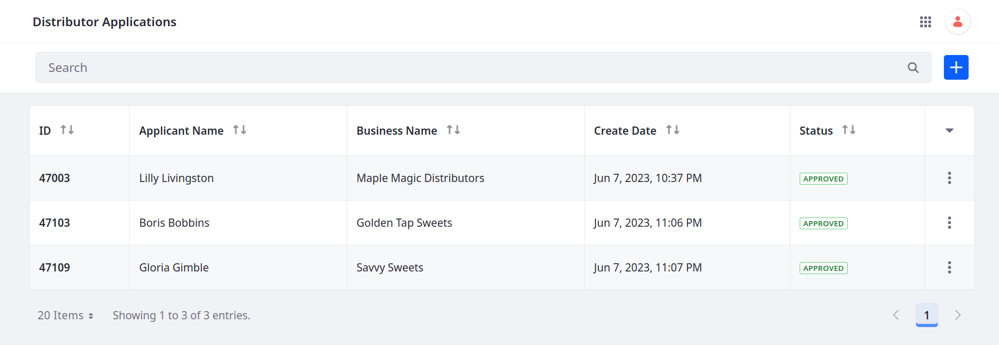

# Adding a Custom Layout and View to Distributor Application

With over 50 fields, the current user interfaces for Distributor Application are no longer viable for creating and displaying entries. This is because the default [layout](https://learn.liferay.com/w/dxp/building-applications/objects/creating-and-managing-objects/layouts) and [view](https://learn.liferay.com/w/dxp/building-applications/objects/creating-and-managing-objects/views) include every object field and display them alphabetically. The layout provides a UI for creating and editing object entries, and the view provides a UI for viewing and managing existing entries.

Before moving forward with modeling data structures, use cURL scripts to create a custom layout and view for Distributor Application.

```{note}
Subsequent lessons explore how to design engaging, responsive user interfaces with Liferay's page builder features. Here, the custom layout and view are used for demonstration purposes during development.
```

## Adding the Layout and View

1. Download and unzip the resources for [this exercise](./liferay-t7z2.zip).

   ```bash
   curl https://learn.liferay.com/courses/latest/en/application-development/modeling-data-structures/adding-a-custom-layout-and-view-to-distributor-application/liferay-t7z2.zip -O
   ```

   ```bash
   unzip liferay-t7z2.zip
   ```

   This .zip file includes shell scripts that use the `object-admin` REST APIs to add a layout and view to the Distributor Application object.

1. Navigate to `liferay-t7z2/curl`.

   ```bash
   cd liferay-t7z2/curl
   ```

1. Run this script to add the layout:

   ```bash
   ./ObjectLayout_POST_BasicLayout_ByExternalReferenceCode.sh
   ```

1. Verify Basic Layout appears in the Layouts tab for the Distributor Application object.

   

   The layout includes two tabs and organizes the fields into collapsible blocks:

   * The first tab is available during entry creation and includes six sections: General Details, Contact Information, Business Details, Business Address, Additional Business Info, and Attachments.

   * The second tab is only available when editing an existing application and includes two sections: Bank Details and Credit Reference Details.

   

1. Add the view:

   ```bash
   ./ObjectView_POST_BasicView_ByExternalReferenceCode.sh
   ```

1. Verify Basic View appears in the Views tab for the Distributor Application object.

   

   The view includes five columns: ID, Applicant Name, Business Name, Create Date, Status.

   

Since the custom layout and view are marked as default for Distributor application, they are active immediately.

## Using the Custom Layout and View

Practice creating entries in the Distributor Application object to verify the object is using the new layout and view.

* Layout:

   

* View:

   

So far you've added all the fields and picklists Delectable Bonsai needs for following KYC policies, complying with AML laws, and weighing the prospective value of each application.

Now Delectable Bonsai needs a way to store evaluation notes and relate them to specific applications. For this, you'll set up the Application Evaluation definition and implement object relationships.

Next: [Setting Up the Application Evaluation Object](./setting-up-the-application-evaluation-object.md)

## Relevant Concepts

* [Layouts](https://learn.liferay.com/w/dxp/building-applications/objects/creating-and-managing-objects/layouts)
* [Views](https://learn.liferay.com/w/dxp/building-applications/objects/creating-and-managing-objects/views)
