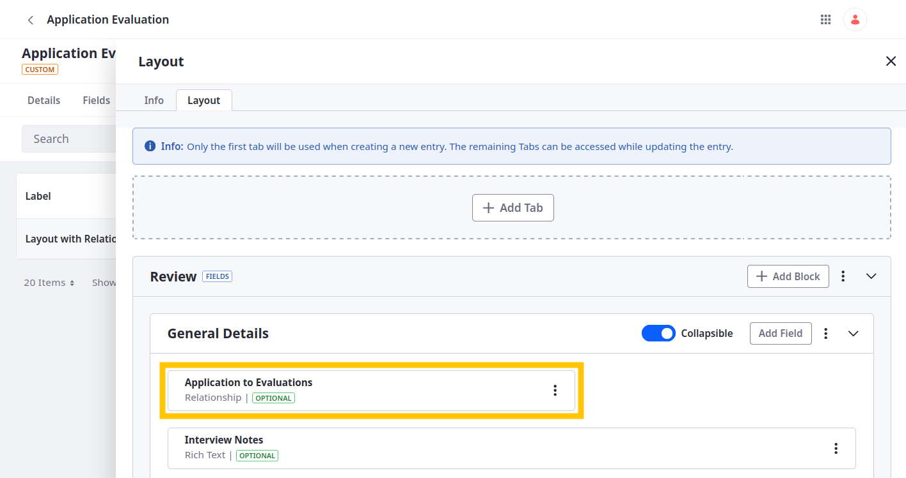

# Adding the Relationship to Custom Layouts

Relationship fields appear automatically in an object's default layout; relationship tables do not. To test the relationship, update the custom layout for Distributor Application to include the relationship table.

Here you'll update the custom layout for Distributor Application to include the relationship table. Then you'll create a custom layout for Application Evaluation that includes the relationship field.

## Adding the Relationship Table to Distributor Application's Layout

1. While editing the Distributor Application object, go to the *Layouts* tab and begin editing the layout.

1. In the Info tab, rename the layout to *Layout with Relationship Table*.

   

1. Go to the *Layout* tab.

1. Click *Add Tab*, enter these details, and click *Save*.

   | Field        | Value                      |
   |:-------------|:---------------------------|
   | Label        | Evaluation Notes           |
   | Type         | Relationship               |
   | Relationship | Application to Evaluations |

   

1. Verify the relationship tab appears at the bottom of the layout.

   

## Adding the Relationship Field to Application Evaluation's Layout and View

1. Download and unzip the resources for [this exercise](./liferay-h2x9.zip):

   ```bash
   curl https://resources.learn.liferay.com/courses/latest/en/application-development/modeling-data-structures/liferay-h2x9.zip -O
   ```

   ```bash
   unzip liferay-h2x9.zip
   ```

1. Navigate to the `curl` folder in the `liferay-h2x9` folder:

   ```bash
   cd liferay-h2x9/curl
   ```

1. Run this script to create a new default layout for Application Evaluations:

   ```bash
   ./ObjectLayout_POST_LayoutWithRelationship_ByExternalReferenceCode.sh
   ```

1. Verify the new layout appears and includes the relationship field.

   

1. Go to the *Views* tab.

1. Run this script to create a new default view for Application Evaluations:

   ```bash
   ./ObjectView_POST_ViewWithRelationship_ByExternalReferenceCode.sh
   ```

1. Verify the new view appears and includes the relationship field.

   

Now you can practice relating object entries!

Next: [Relating Object Entries](./relating-object-entries.md)
