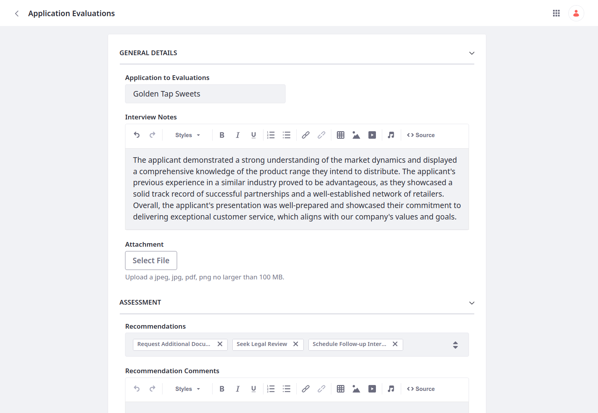
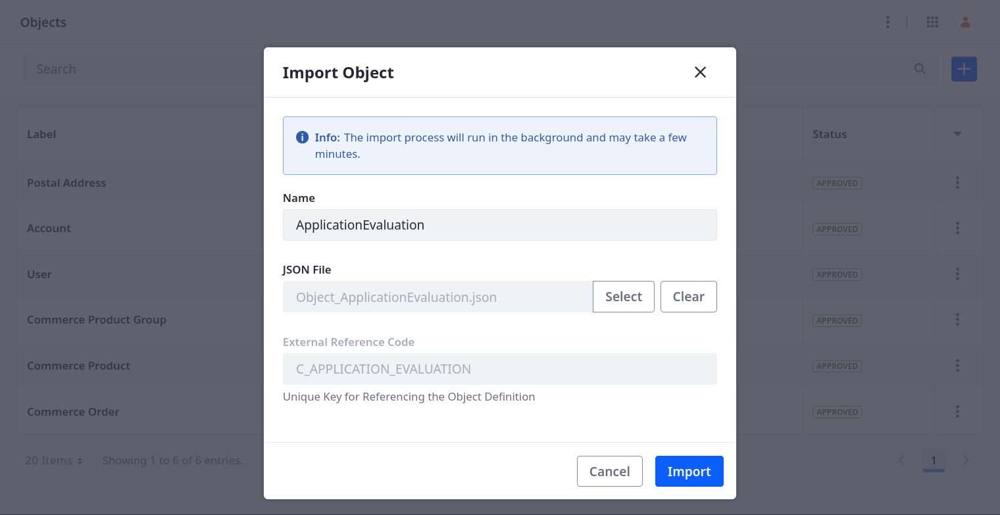

# Setting Up the Application Evaluation Object

Application evaluations need to provide business development managers with an infrastructure for consolidating assessment information about prospective applicants. After some planning, Delectable Bonsai team members created an Application Evaluation object in a separate environment. To migrate this object to the development environment, they exported it as a JSON file.

Here you'll set up the Application Evaluation object by importing this file into your Liferay instance. But first, create the object's picklists using the `headless-admin-list-type` REST APIs.

## Creating the Picklists

The Application Evaluation object requires these picklists: Assessment Scores, Recommendations, and Decisions.

To create them,

1. Download and unzip the resources for [this exercise](./liferay-w1m9.zip):

   ```bash
   curl https://learn.liferay.com/courses/latest/en/application-development/modeling-data-structures/defining-relationships/setting-up-the-application-evaluation-object/liferay-w1m9.zip -O
   ```

   ```bash
   unzip liferay-w1m9.zip
   ```

1. Navigate to the `curl` folder in the `liferay-w1m9` folder:

   ```bash
   cd liferay-w1m9/curl
   ```

1. Run this command to create three picklists for the Application Evaluation object:

   ```bash
   ./ListTypeDefinition_POST_ToInstance.sh
   ```

1. Verify the picklists appear.

   

With the picklists in place, you can import the Application Evaluation object.

## Importing the Application Evaluation Object

1. Download the Application Evaluation JSON file:

   ```bash
   curl https://learn.liferay.com/courses/latest/en/application-development/modeling-data-structures/defining-relationships/setting-up-the-application-evaluation-object/Object_ApplicationEvaluation.json -O
   ```

   This file includes the object's basic schema, including general configurations and custom fields.

1. Open the *Global Menu* (  ), go to the *Control Panel* tab, and click *Objects*.

1. Click the *Actions* button (  ) in the Application Bar and select *Import*.

1. Enter these details and click *Import*

   | Field | Value |
   | :--- | :--- |
   | Name | `ApplicationEvaluation` |
   | JSON File | `Object_ApplicationEvaluation.json` |

   

1. Begin editing the object definition.

   

1. Verify the object includes these custom fields:

   * Business Name
   * Assessment Score
   * Attachment
   * Decision
   * Interview Notes
   * Recommendation Comments
   * Recommendations

   

1. Go to the *Details* tab.

1. Click *Publish*.

Great! Delectable Bonsai can use this object to store notes on prospective distributors.

Now you can define a relationship between the Distributor Application and Application Evaluation objects so you can link their entries.

Next: [Adding a Relationship Between the Object Definitions](./adding-a-relationship-between-the-object-definitions.md)
