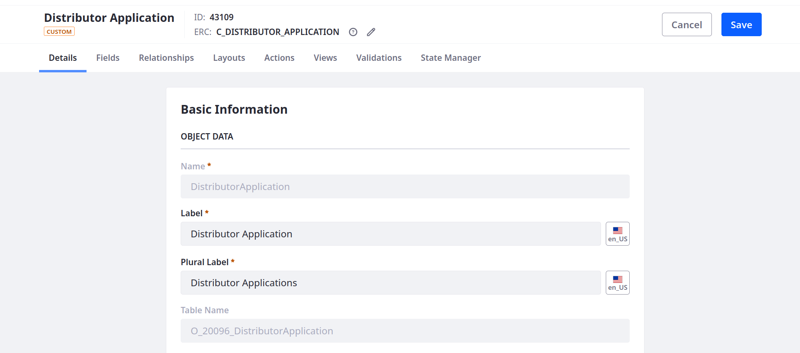

# Determining Data Entities

Here you'll create the Distributor Application object in four steps:

1. [Add the Distributor Application object](#adding-the-distributor-application-object)
1. [Configure the object](#configuring-the-object)
1. [Add a custom field](#adding-a-custom-field)
1. [Publish the object](#publishing-the-distributor-application-object)

After publishing the object definition, you can practice [using the Distributor Application object](#using-distributor-applications) to create entries.

## Adding the Distributor Application Object

1. Open the *Global Menu* (  ), go to the *Control Panel* tab, and click *Objects*.

1. Click *Add* (  ).

1. Enter these details:

   | Field        | Value                    |
   |:-------------|:-------------------------|
   | Label        | Distributor Application  |
   | Plural Label | Distributor Applications |
   | Object Name  | `DistributorApplication` |
   | Storage Type | Default                  |

   

1. Click *Save*.

   This creates a draft object definition with these system fields:

      * `createDate`
      * `creator`
      * `externalReferenceCode`
      * `id`
      * `modifiedDate`
      * `status`

   

## Configuring the Object

Object definitions include configuration options for modifying their general details, behavior, and available features. For example, you can determine how each object's data is scoped, where users can access it in the UI, and whether to maintain a history of entry events.

Configure Distributor Application as follows:

1. Begin editing the object definition draft.

1. Change the definition's ERC (External Reference Code). Consistent, human-readable ERCs can help you move object definitions between instances and reference them via APIs.

   * Click *Edit* ().
   * Replace the UUID with `C_DISTRIBUTOR_APPLICATION`.
   * Click *Save*.

   

1. In the Details tab, configure these settings:

   | Field                                          | Value                  |
   |:-----------------------------------------------|:-----------------------|
   | Entry Display > Title Field                    | ID                     |
   | Scope > Scope                                  | Company                |
   | Scope > Panel Category Key                     | Control Panel > Object |
   | Account Restriction > Active                   | False                  |
   | Account Restriction > Account Restricted Field | N/A                    |
   | Configuration > Show Widget                    | True                   |
   | Configuration > Enable Categorization          | True                   |
   | Configuration > Enable Comments                | False                  |
   | Configuration > Enable Entry History           | False                  |

   This configures the Distributor Application to store data by instance and appear in the Global Menu (  ) according to its panel category key (i.e., Control Panel > Objects). Additionally, users can add the object to site pages as a widget and assign tags and categories to Distributor Application entries.

1. Click *Save*.

## Adding a Custom Field

Before you can publish an object definition, it must have at least one field.

1. Go to the *Fields* tab.

1. Click *Add* (  ).

1. Enter these values:

   | Field                     | Value           |
   |:--------------------------|:----------------|
   | Label                     | Applicant Name  |
   | Field Name                | `applicantName` |
   | Type                      | Text            |
   | Mandatory                 | True            |
   | Accept Unique Values Only | False           |

   

1. Click *Save*.

   The new field appears in the Fields tab with the `Custom` badge.

   

## Publishing the Distributor Application Object

When you publish custom objects, Liferay creates a database table for storing data entries. Publishing also registers the object with the OSGi framework, integrates it with [Liferay's core features](https://learn.liferay.com/w/dxp/building-applications/objects/understanding-object-integrations) (e.g., permissions, workflow, headless), and provides a basic user interface.

1. Go to the object's Details tab.

1. Click *Publish*.

   

This activates Distributor Application and creates a database table with the `applicantName` field along with the default system fields. See [Publishing Object Drafts](https://learn.liferay.com/en/w/dxp/building-applications/objects/creating-and-managing-objects/creating-objects#publishing-object-drafts) for more information on what happens during publishing.

## Using Distributor Applications

Now that Distributor Application is published, you can begin using it:

1. Open the *Global Menu* (  ), go to the *Control Panel* tab, and click *Distributor Applications*.

   

1. Click *Add* (  ).

1. Enter an applicant name and click *Save*.

1. Return to the Distributor Applications page to verify successful entry creation.

   Here entries appear in a table that includes the object's custom field alongside the `id`, `status`, and `author` system fields.

   

1. Click the *Actions* button () for the entry and select *Delete*.

1. Practice creating, updating, and removing entries before moving forward.

You can also use the REST APIs generated for Distributor Application during publishing to create, edit, query, and remove entries. These APIs are available at the `c/distributorapplications` path. See [Headless Framework Integration](https://learn.liferay.com/en/w/dxp/building-applications/objects/understanding-object-integrations/headless-framework-integration) for a complete list of available APIs and [Custom Object API Basics](https://learn.liferay.com/en/w/dxp/building-applications/objects/objects-tutorials/using-apis/object-api-basics) for an introductory tutorial.

Now that the object is defined, you can add more fields to collect the necessary applicant information.

Next: [Adding Fields to the Distributor Application Object](./adding-fields-to-the-distributor-application-object.md)

## Relevant Concepts

* [Objects](https://learn.liferay.com/en/w/dxp/building-applications/objects)
* [Creating Objects](https://learn.liferay.com/en/w/dxp/building-applications/objects/creating-and-managing-objects/creating-objects)
* [Understanding Object Integrations](https://learn.liferay.com/w/dxp/building-applications/objects/understanding-object-integrations)
