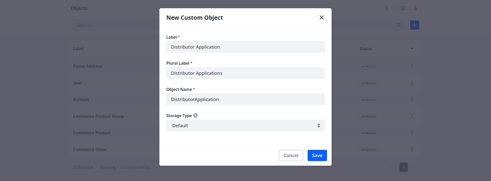
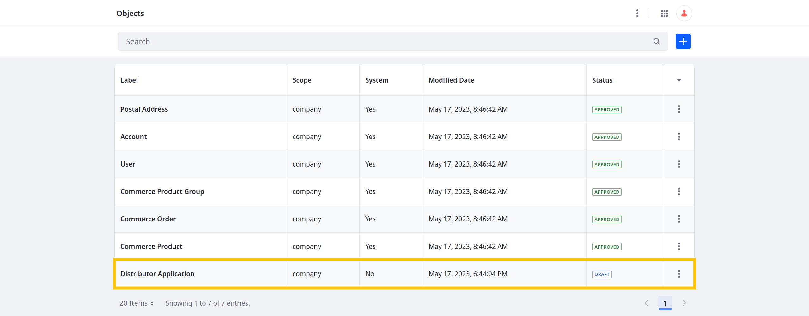
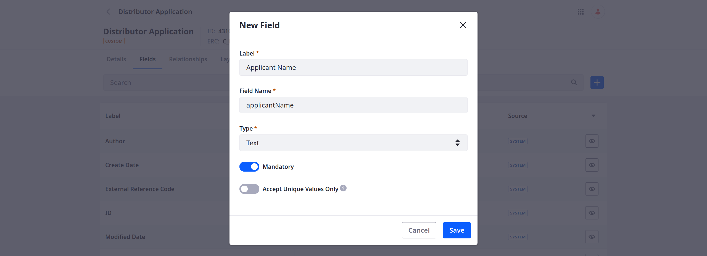

# Determining Data Entities

Developing applications begins with identifying the data entities you need to create and handle within your custom solution/use case<!--w/c-->. Whether insurance claims, support tickets, or commerce products, each type of entity is represented as a database table that determines its fundamental schema/structure<!--w/c-->, including data fields and relationships.

<!-- Diagram? -->

Liferay provides the [Objects application](https://learn.liferay.com/en/w/dxp/building-applications/objects) for creating custom data models and extending supported system applications. When you publish custom objects, Liferay creates a database table for storing data entries. It also generates headless APIs for performing CRUD operations and provides a basic front-end. Using Liferay objects, you can build a robust and flexible foundation for your solution that is able to support the specific business processes and needs of your organization.

```{note}
Previously, adding custom data entities to the Liferay platform required building and deploying OSGi modules. In 7.4+, this process is replaced by Liferay Objects. <!--REFINE-->
```

```{tip}
Liferay places limitations on some definition options after publishing. For example, fields included in a definition at the time of publishing cannot be removed, though you can remove fields added after publishing. Publishing your definition early in the development process can help you maintain maximal freedom while iterating on your application. <!--REFINE-->
```

## Creating the Distributor Application Object

As mentioned previously, Delectable Bonsai needs a solution for receiving and approving applications to become product distributors. At its most basic implementation, this solution requires a single object definition for creating and storing applications submitted by potential distributors.

Next,

* [Add the Distributor Application object definition](#adding-a-definition-draft)
* [Configure the definition's details](#configuring-the-object-definition)
* [Add a custom field](#adding-a-custom-field)
* [Publish the definition](#publishing-the-object-definition)

```{tip}
This exercise creates the definition using the Objects UI. Alternatively, you can view and edit the definition using the Objects Admin REST service. See [Objects Admin API Basics]() for more information. <!--REFINE-->
```

### Adding a Definition Draft

1. Open the *Global Menu* (  ), go to the *Control Panel* tab, and click *Objects*.

1. Click the *Add* button (  ).

1. Enter these details:

   | Field        | Value                    |
   |:-------------|:-------------------------|
   | Label        | Distributor Application  |
   | Plural Label | Distributor Applications |
   | Object Name  | DistributorApplication   |
   | Storage Type | Default                  |

   

1. Click *Save*.

   This creates a draft object definition with these standard data fields: `createDate`, `creator`, `externalReferenceCode`, `id`, `modifiedDate`, and `status`.

   

### Configuring the Object Definition

1. Begin editing the draft object definition.

1. Click the *Edit* button  for the definition's ERC (External Reference Code).

1. Replace the UUID with `C_DISTRIBUTOR_APPLICATION` and click *Save*.

   

1. In the Details tab, configure these settings

   | Field                 | Value                   |
   |:----------------------|:------------------------|
   | Scope                 | Company                 |
   | Panel Category Key    | Control Panel > Objects |
   | Show Widget           | True                    |
   | Enable Categorization | True                    |
   | Enable Comments       | False                   |
   | Enable Entry History  | False                   |

1. Click *Save*.

### Adding a Custom Field

Before you can publish an object definition, you must add at least one custom field to it.

1. Go to the *Fields* tab.

1. Click the *Add* button (  ).

1. Enter these values:

   | Field                     | Value           |
   |:--------------------------|:----------------|
   | Label                     | Applicant Name  |
   | Field Name                | `applicantName` |
   | Type                      | Text            |
   | Mandatory                 | True            |
   | Accept Unique Values Only | False           |

   

1. Click *Save*.

   The new field appears in the Fields tab with the `Custom` badge.

   

### Publishing the Object Definition

1. Go to the *Details* tab.

1. Click *Publish*.

   

Publishing a definition creates a database table with all fields included in the object at the time of publishing. Any field added after publishing is added to a side table in the database.Publishing also registers the application with the OSGi framework and integrates it with Liferay's core features (e.g., permissions, workflow, headless). See [Publishing Object Drafts](https://learn.liferay.com/en/w/dxp/building-applications/objects/creating-and-managing-objects/creating-objects#publishing-object-drafts) for more information. <!--REFINE-->

### Creating Distributor Application Entries

Since Distributor Application is company scoped, you can access it via the Global Menu (  ) according to the definition's panel category key: Control Panel > Objects.


Opening the application, you can view and create object entries. The object's application page displays entries using a default table view that includes the object's custom fields alongside the default `id`, `status`, and `author` fields.


During publishing, Liferay generates REST APIs for Distributor Application, which you can use to create, edit, query, and remove entries. See [Headless Framework Integration](https://learn.liferay.com/en/w/dxp/building-applications/objects/understanding-object-integrations/headless-framework-integration) for a complete list of available APIs and [Custom Object API Basics](https://learn.liferay.com/en/w/dxp/building-applications/objects/objects-tutorials/using-apis/object-api-basics) for an introductory tutorial.


Now that we have our object definition, we can add fields to collect the necessary applicant information.

Next: [Defining Attributes](./defining-attributes.md)

## Relevant Concepts

* [Objects](https://learn.liferay.com/en/w/dxp/building-applications/objects)
* [Creating Objects](https://learn.liferay.com/en/w/dxp/building-applications/objects/creating-and-managing-objects/creating-objects)
