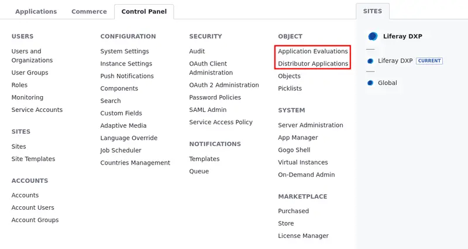

# Deploying the Application
<!-- TASK: RENAME ARTICLE TO "Deploying Clarity's Application" or "Setting Up Clarity's Workspace"-->
Clarity's development team has been working on implementing their distributor onboarding solution. Throughout this process, they've used low-code features like [Objects](https://learn.liferay.com/w/dxp/building-applications/objects), [Picklists](https://learn.liferay.com/w/dxp/liferay-development/objects/picklists), and [Workflows](https://learn.liferay.com/w/dxp/process-automation/workflow/). They have also leveraged page builder features to design a dynamic, responsive user interface for their custom application. Additionally, they've created a microservice client extension to help automate their onboarding workflow.

While most parts of the solution are complete, some features remain unfinished. Throughout this module, you'll take on the role of Ian Miller and contribute to Clarity's solution. But before you can do that, let's get your working environment set up.

Here you'll learn how to:

* Set up the Clarity workspace
* Build and deploy the solution using client extensions
* Test the solution in Liferay's UI

## Exercise One: Setting Up the Clarity Workspace

The Clarity workspace is available in the [liferay-portal](https://github.com/liferay/liferay-portal/tree/master/workspaces/liferay-clarity-workspace) repo.

To set it up locally,

1. Download and unzip the workspace in a folder of your choice using these commands:

   ```bash
   curl -o com.liferay.sample.workspace-latest.zip https://repository.liferay.com/nexus/service/local/artifact/maven/content\?r\=liferay-public-releases\&g\=com.liferay.workspace\&a\=com.liferay.clarity.workspace\&\v\=LATEST\&p\=zip
   ```

   ```bash
   unzip com.liferay.sample.workspace-latest.zip
   ```

1. After extracting the workspace, go to the `client-extensions/` folder.

   ```bash
   cd [workspace-root]/client-extensions/
   ```

1. Run this command to build the client extensions:

   ```bash
   ../gradlew clean build
   ```

The compiled `.zip` files appear in each project's `dist/` folder.

```bash
[project-name]
├── batch
├── build
├── dist
│   └── [project-name].zip
└── client-extension.yaml
```

Now that the client extensions are ready, you can deploy them to your Liferay instance.

## Exercise Two: Deploying the Client Extensions

The specific process for deploying client extensions depends on your Liferay hosting model (i.e., Self-Hosted, PaaS, or SaaS). However, in all cases, you must add the compiled `.zip` file to the Liferay server's `[Liferay Home]/osgi/client-extensions/` folder.

!!! note "Deploying to Self-Hosted Instances"
    The following exercise assumes you're using Liferay SaaS. If you're self-hosting, navigate to the `client-extensions/` folder in your workspace and run this command: `../gradlew clean distBundleZip`. Alternatively, you can manually copy the `.zip` file to your server's `[Liferay Home]/osgi/client-extensions/` folder. See [Deploying to Your Liferay Instance](https://learn.liferay.com/w/dxp/liferay-development/client-extensions/working-with-client-extensions) for more information.

Deploying client extensions to a SaaS environment requires the Liferay Cloud CLI tool you installed in [Module 2](../module-2-developer-setup/liferay-workspace.md#prerequisites). To do this,

1. Go to the `liferay-clarity-batch` folder.

   ```bash
   cd liferay-clarity-batch/
   ```

1. Run this command to deploy the compiled `.zip`:

   ```bash
   lcp deploy --ext [path-to-zip-file]
   ```

   <!--TASK: Add the file path ^ -->

1. When prompted, select the desired project environment.

   

1. Once finished, open the [Cloud Console](https://console.liferay.cloud/) and go into the target environment's _Services_ menu. Make sure the `liferayclaritybatch`'s service status shows `ready`.

<!--Q: Just the liferayclaritybatch service? What about the microservice client extension?-->

Now that you've deployed the solution's client extensions, all the necessary components are available in your Liferay instance. Let's verify this by testing the solution.

### Exercise Three: Testing the Distributor Application

The solution includes two Liferay objects: the Distributor Application object and the Application Evaluation object. In the following lessons, you'll learn more about these objects and how they're configured. For now, let's create and review a Distributor Application entry.

To do this,

1. Sign in as Ian Miller.

   * Email: `ianmiller@clarityvisionsolutions.com`
   * Password: `learn`

1. Open the _Global Menu_ () and go to the _Control Panel_ tab. Application Evaluations and Distributor Applications should appear in the Object category.

   

1. Open _Distributor Applications_.

1. Click _Add_ () to create an entry.

1. Fill out the form with any information, then click _Save_.

1. Return to the Distributor Applications overview page and verify your entry appears in the table.

   

   Now you can create an evaluation for this entry.

1. Open the _Global Menu_ (), go to the _Control Panel_ tab, and click _Application Evaluations_.

1. Click _Add_ () to create an evaluation for the application.

1. In the Application to Evaluations field, select the application you created. It is identified by the Business Name field.

1. Fill out the evaluation form with any information, then click _Save_.

1. Return to the Application Evaluations overview page and verify the entry appears in the table.

   

This evaluation is automatically related to the selected application. You can confirm this relationship between them by returning to _Distributor Applications_ overview page, selecting the application, and going to the _Evaluation Notes_ tab.

   

## Conclusion

Congratulations! You've set up the prebuilt Clarity workspace and deployed its client extensions to your Liferay instance. Next, let's explore the solution's data structures and fill in the missing pieces.

Next Up: [Modeling Data Structures](./modeling-data-structures.md)

## Additional Resources

* [Objects](https://learn.liferay.com/w/dxp/liferay-development/objects)
* [Picklists](https://learn.liferay.com/w/dxp/liferay-development/objects/picklists)
* [Liferay Workspace](https://learn.liferay.com/web/guest/w/dxp/building-applications/tooling/liferay-workspace)
* [Client Extensions](https://learn.liferay.com/w/dxp/liferay-development/building-applications/client-extensions)
* [Deploying Client Extensions](https://learn.liferay.com/w/dxp/building-applications/client-extensions/working-with-client-extensions#deploying-to-your-liferay-instance)
