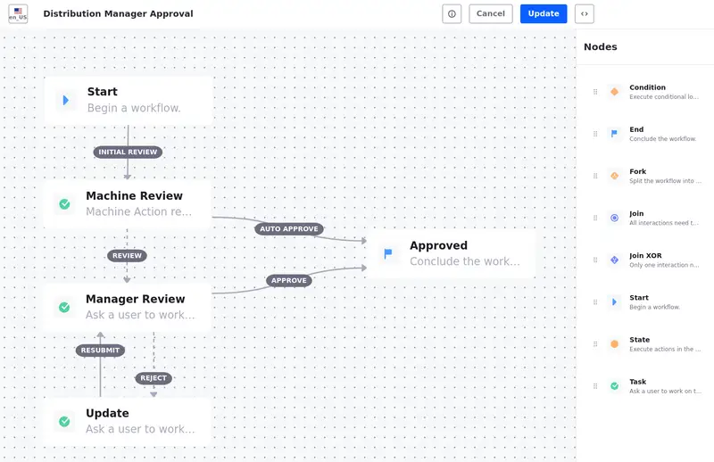
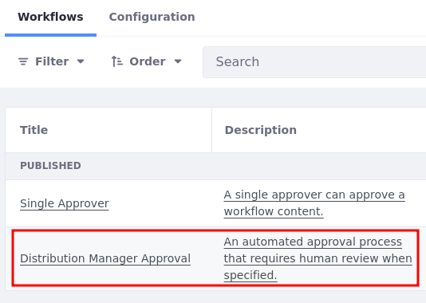
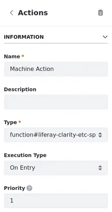

# Implementing Business Logic

Business logic refers to the rules and processes that determine how an application behaves within a system to meet business needs. Implementing business logic effectively can streamline operations, improve efficiency, and promote consistency across your organization.

This article discusses the types of business logic you can implement with Liferay in the context of Clarity's distributor application solution. Now that you understand how Clarity has modeled the Distributor Application object, you can learn about how they use business logic to define application behavior. Implementing business logic allows Clarity to onboard distributors quickly and safely.

## Validations

Validations set rules to ensure user input meets your criteria. By preventing data errors and reducing the need for manual cleanup, validations improve the integrity of gathered data.

Liferay provides built-in validation functions for email addresses, phone numbers, and website URLs. You can add validation rules directly to object definition fields, have them trigger on submission of an object entry, and display an error message for invalid input.

You can navigate to the editing menu for the Distributor Application object and go to the _Validations_ tab to see how Clarity ensures applicants provide valid, consistent data in their distributor applications by validating these fields:

* Applicant Email
* Primary Contact Email
* Primary Contact Phone Number
* Business Phone Number
* Bank Phone Number
* Reference Phone Number
* Business Website


## Permissions

In addition to validating input fields, Clarity wants to ensure that all authorized users (and only authorized users) can submit distributor applications. Managing access to data with account membership and role permissions is critical for data privacy and security. You can manage permissions at the application and entry levels.

### Exercise 1

In order to satisfy Clarity's proper business requirement, let's modify the *User* role with permissions to create, read, update, and delete Distributor Application object entries.

1. Navigate to _Global Menu_ () &rarr; _Control Panel_ &rarr; Roles.

1. Select the _User_ role and go to the _Define Permissions_ tab.

1. Add these permissions:

   | Permission                                                            |
   |:----------------------------------------------------------------------|
   | Distributor Applications: View                                        |
   | Distributor Applications > Distributor Application: Delete            |
   | Distributor Applications > Distributor Application: Update            |
   | Distributor Applications > Distributor Applications: Add Object Entry |

   

1. Click _Save_.

1. Verify the User role has the desired permissions.

   

Clarity also wants to allow only members of the business development team to view submitted applications and fill out evaluations. To achieve this, let's create the Business Development Manager. This role has read permissions for Distributor Application object entries and permissions to create, read, update, and delete Application Evaluation object entries. A user must be assigned to this role to view applications and submit evaluations.

1. Go back to the Roles menu.

1. Click _Add_ ().

1. Enter these details and click _Save_:

   | Field       | Value                                                                                                        |
   |:------------|:-------------------------------------------------------------------------------------------------------------|
   | Type        | Regular                                                                                                      |
   | Title       | Business Development Manager                                                                                 |
   | Description | Business Development Managers are responsible for the final review and approval of distributor applications. |
   | Key         | Business Development Manager                                                                                 |

1. Go to the _Define Permissions_ tab, add these permissions, then click _Save_:

   * Distributor Applications

     | Permission                                                              |
     |-------------------------------------------------------------------------|
     | Distributor Applications: Access in Control Panel                       |
     | Distributor Applications: View                                          |
     | Distributor Applications > Distributor Application: action.setUpAccount |
     | Distributor Applications > Distributor Application: Update              |
     | Distributor Applications > Distributor Application: View                |

   * Application Evaluations

     | Permission                                                          |
     |---------------------------------------------------------------------|
     | Application Evaluations: Access in Control Panel                    |
     | Application Evaluations: View                                       |
     | Application Evaluations > Application Evaluation: Add Discussion    |
     | Application Evaluations > Application Evaluation: Delete            |
     | Application Evaluations > Application Evaluation: Delete Discussion |
     | Application Evaluations > Application Evaluation: Update            |
     | Application Evaluations > Application Evaluation: Update Discussion |
     | Application Evaluations > Application Evaluation: View              |
     | Application Evaluations > Application Evaluations: Add Object Entry |

   

   Notice that Liferay automatically assigns the `Portal: View Control Panel Menu` permission.

1. For test purposes, go to the _Assignees_ tab and assign this role to Douglas Morgan, the Distribution Manager for Clarity.

Great! Now Clarity can make sure the business development team's manager can view submitted applications, create evaluations, and approve or deny applications.

## States

After configuring user permissions for accessing object data, Clarity now needs a way to track the progress of a distributor application and trigger additional business logic when application entries reach certain statuses.

To do this, they leveraged Liferay's custom state field capability by creating a new picklist field called *Application State* to the Distributor Application object definition. This field uses the *Application States* picklist as its set of valid input.

When editing the Distributor Application object in the UI, you can navigate to the _State Manager_ tab and see how the Application State flow is configured.

| Current State | Next State                           |
|---------------|--------------------------------------|
| Open          | Under Review, Withdrawn              |
| Under Review  | Approved, Denied, Withdrawn, On Hold |
| Approved      | Under Review                         |
| Denied        | Under Review                         |
| Withdrawn     | Open                                 |
| On Hold       | Open, Under Review                   |


When users update the *Application State* field of a Distributor Application object entry, their picklist options are determined by the state flow table.

## Workflows

Currently, all updates to the *Application State* field are approved automatically, regardless of the current state value. Clarity wants to require final approval from a team manager whenever *Application State* changes to `Approved` or `Denied`.

Workflows can improve task visibility, eliminate bottlenecks in business processes, and reduce the time and resources required to complete tasks. Additional custom business logic can be defined around states with Liferay's workflow functionality.



### Exercise 2

Clarity wants to implement a workflow for reviewing and approving changes made to applications. Let's deploy the `Distribution Manager Approval` workflow process using Client Extensions and finish configuring it in Liferay's UI.

1. In your terminal, go to the `[workspace-root]/client-extensions/liferay-clarity-workflow-batch/` folder.

1. Build and deploy the client extension project into your Liferay instance (see [Deploying the Application](./deploying-the-application.md) to learn how). Make sure the deployment was successful.

1. Repeat the previous steps in the `liferay-clarity-spring-boot/` folder. Ensure it was successfully deployed.

   !!! important
       If you're a Liferay Self-Hosted user, navigate to the `liferay-clarity-spring-boot/` project and start the Spring Boot application with this command:

   ```bash
   ../../gradlew bootRun
   ```

   When the application starts, go to http://localhost:58081/ready. If the application is ready for use, the page says “READY.” See [Microservice Client Extensions](https://learn.liferay.com/web/guest/w/dxp/building-applications/client-extensions/microservice-client-extensions) for more information.

1. Go into your Liferay instance and navigate to _Global Menu_ () &rarr; _Applications_ &rarr; _Process Builder_.

1. Confirm the Distribution Manager Approval workflow process appears.

   

1. Go to the _Configuration_ tab.

1. Finally, click _Edit_ for Distributor Application, select _Distribution Manager Approval_, then click _Save_.

   

### Bonus Exercise 1

You’ve set up an approval workflow that requires manager review for the application's entries. You can test its functionality by following these steps:

1. Create/edit a Distributor Application entry and change its state to Approved. After that, the entry's status should be Pending.

1. Impersonate the Douglas Morgan user and check for a workflow notification.

1. Assign the review task to yourself and approve it. The entry's status should be Approved after doing that.

## Notifications

While Clarity has defined workflows around state changes, they have no automated notifications for when such events occur. As of now, members of the business development team can only learn of new application submissions by checking the Distributor Application object manually. Similarly, applicants can only learn about their application status if they are informed directly by a business development specialist or manager. This strategy doesn't scale and leaves room for human error, resulting in missed opportunities or poor user experience.

To address these issues, you can implement notifications by first creating notification templates and then applying those templates to object entry events (entry creation, entry update, etc.). The template provides the notification content and design, while the object entry event determines the condition to trigger the notification. Notifications can improve visibility in your application by providing real-time updates to users and administrators for object entry events.

### Exercise 3

1. In your terminal, go to the `[workspace-root]/client-extensions/liferay-clarity-notifications-batch/` folder.

1. Build and deploy the client extension project into your Liferay instance.

1. After the deployment finishes, go into your Liferay instance and navigate to _Global Menu_ () &rarr; _Control Panel_, then select _Templates_ under Notifications.

1. Once the menu opens, confirm that all four notification templates are present.

   

These templates are utilized to define notification actions in the Distributor Application object, which are used to improve visibility for new applications and automate updates for applicants, notifying them when their application is received, approved, or denied.

If you go to the Actions tab while editing the Distributor Application object, you can notice there are three prebuilt actions for automated notifications.

* Application Received
* Application Approved
* Application Denied

Clarity still needs an automated notification action for administrative users that triggers whenever an applicant submits a new application. Let's add a notification action to the Distributor Application.

1. Navigate to *Global Menu* () &rarr; *Control Panel* &rarr; *Objects*, then select *Distributor Application*.

1. Go to the _Actions_ tab.

1. Click *Add* () to create a new object action.

1. Enter these values in the Basic Info tab:

   | Field        | Value                                                     |
   |--------------|-----------------------------------------------------------|
   | Action Label | Application Submitted                                     |
   | Action Name  | applicationSubmitted                                      |
   | Description  | On After Add, send notifications to administrative users. |
   | Active       | True                                                      |

   

1. Go to the Action Builder tab and set these values:

   | Field                 | Value                              |
   |-----------------------|------------------------------------|
   | Trigger               | On After Add                       |
   | Condition             | N/A                                |
   | Action                | Notification                       |
   | Notification Template | Application Submitted, Admin, User |

   

1. Click _Save_.

<!--TODO: Add steps for testing notification-->

After adding and activating the notification actions, they'll be triggered when adding and updating object entries. These notifications can help improve visibility for new applications and keep applicants up to date on the state of their applications.

Now that you've learned about implementing business logic in low code applications, let's move on to [Designing User Interfaces](./designing-user-interfaces.md).

## Additional Resources

* [Client Extensions](https://learn.liferay.com/web/guest/w/dxp/building-applications/client-extensions)
* [Object Validations](https://learn.liferay.com/w/dxp/building-applications/objects/creating-and-managing-objects/validations)
* [Roles and Permissions](https://learn.liferay.com/w/dxp/users-and-permissions/roles-and-permissions)
* [Object States](https://learn.liferay.com/w/dxp/building-applications/objects/creating-and-managing-objects/fields/adding-and-managing-custom-states)
* [Enabling Workflow for Objects](https://learn.liferay.com/w/dxp/building-applications/objects/enabling-workflows-for-objects)
* [Object Actions](https://learn.liferay.com/w/dxp/building-applications/objects/creating-and-managing-objects/actions)
