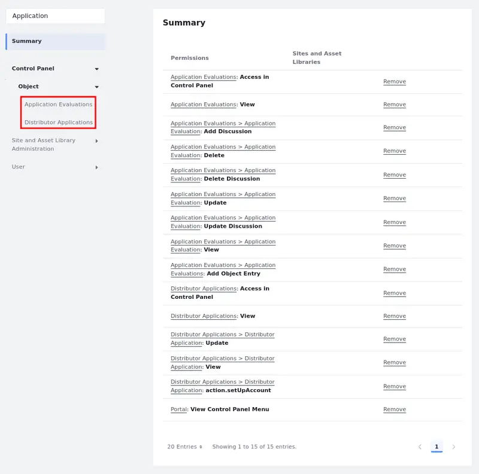
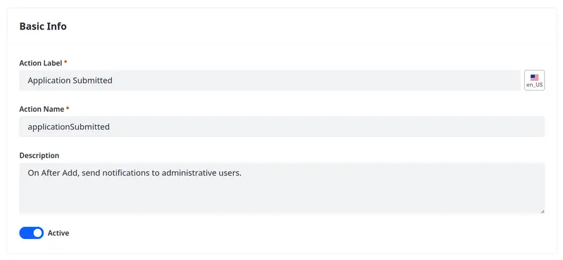
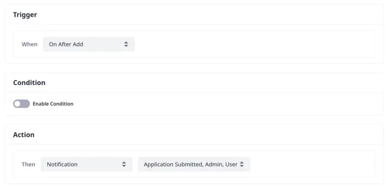

# Implementing Business Logic

Business logic refers to the rules and processes that determine how an application behaves within a system to meet business needs. Implementing business logic effectively can streamline operations, improve efficiency, and promote consistency across your organization. Here we'll explore how Clarity can leverage Liferay's features to add business logic to their distributor onboarding solution. While some parts of Clarity's business logic are already complete, others need to be implemented to finish Clarity's distributor onboarding solution.

## Validating Fields

Ensuring data integrity is crucial to effective business operations. With Liferay, you can set object validations to enforce rules on user input that prevent errors and ensure your application is collecting the data you want. This minimizes the need for manual corrections, ensuring consistent and reliable data (e.g., valid email formats and phone number patterns).

When using validations, you can select from out-of-the-box options (e.g., valid email formats and URL patterns) or define your own through the UI. For advanced use cases, you can also use the Object Validation Rule client extension. Once defined, Liferay checks field values on entry submission and displays an error message for invalid input.


Clarity's Distributor Application object already includes the validations they need. To view them, open the *Objects* application, begin editing the *Distributor Application* object, and go to the *Validations* tab.

<!--TASK:  -->

## Managing Data Access

Managing access to data with account membership and role permissions is critical for data privacy and security. Since Liferay objects are integrated with the permissions framework, you can use roles and permissions to manage access to Distributor Applications and Application Evaluations. This can help Clarity ensure that only authenticated users can submit applications, while allowing a limited number of employees to review submissions.

<!--TASK:  -->

By default, custom Object permissions are not assigned to user roles. So you must manually grant access to objects and their entries. When you deployed Clarity's distributor onboarding solution, you also created a business role for reviewing applications, but it doesn't have any permissions assigned to it. You'll assign the proper permissions in a later exercise.

## Defining Workflows

Workflows define approval processes for application entities and can improve task visibility, eliminate bottlenecks in business processes, and reduce the time and resources required to complete tasks. You can build and enable custom approval processes for custom objects. When you deployed the distributor onboarding solution, you also added a custom workflow definition.


In addition to workflow, you can use picklists to define custom state fields with their own flow. This is helpful when you need to assign multiple states to an object entry at the same time. For example, Clarity wants to track the evaluation state of applications independently from their workflow status. To implement this, Clarity leveraged Liferay picklists with objects to define custom states for entries. They then defined a flow for valid state field transitions in the *State Manager* tab.

| Current State | Next State                           |
|---------------|--------------------------------------|
| Open          | Under Review, Withdrawn              |
| Under Review  | Approved, Denied, Withdrawn, On Hold |
| Approved      | Under Review                         |
| Denied        | Under Review                         |
| Withdrawn     | Open                                 |
| On Hold       | Open, Under Review                   |


After setting this up, Clarity can use the field with validations and actions to add business logic for different states. They also can use the field alongside workflow statuses to define more complex review and approval processes. In a later exercise, you'll finish setting up Clarity's workflow for Distributor Applications.

## Automating Notifications

Notifications can improve visibility in your application by providing real-time updates to users and system administrators for object entry events. This involves creating notification templates and then using those templates with object actions. The template provides the notification content and design, while the object action determines the trigger and conditions for sending the notification (e.g., at entry creation, at entry update).

<!--TASK: -->

Currently, Clarity's onboarding solution includes three automated notifications. They inform applicants when their applications are received, approved, or rejected. In a later exercise, you'll add another notification for informing Clarity's business development team of new submissions.

## Exercise One: Assigning Object Permissions

Clarity wants to allow all authenticated users to submit distributor applications. To do this, let's grant the default *User* role permission to access Distributor Applications and add entries:

1. Open the *Global Menu* (), go to the *Control Panel* tab, and click *Roles*.

1. Select the *User* role and go to the *Define Permissions* tab.

1. Add these permissions:

   | Permission                                                            |
   |:----------------------------------------------------------------------|
   | Distributor Applications: View                                        |
   | Distributor Applications > Distributor Application: Delete            |
   | Distributor Applications > Distributor Application: Update            |
   | Distributor Applications > Distributor Applications: Add Object Entry |

   <!--TASK: Confirm whether the delete and update permissions are necessary. I suspect they are not necessary, since entry creators are assigned the entry 'owner' role, which allows them to update for delete the entry.-->

   

1. Click *Save*.

1. Verify the User role has the desired permissions.

   

Clarity also wants to allow members of their business development team to review all applications and fill out evaluations. To achieve this, let's grant the Business Development Manager role the necessary permissions:

1. Return to the *Roles* overview page and select *Business Development Manager*.

1. Go to the *Define Permissions* tab, add these permissions, and click *Save*:

   * Distributor Applications

     | Permission                                                              |
     |-------------------------------------------------------------------------|
     | Distributor Applications: Access in Control Panel                       |
     | Distributor Applications: View                                          |
     | Distributor Applications > Distributor Application: action.setUpAccount |
     | Distributor Applications > Distributor Application: Update              |
     | Distributor Applications > Distributor Application: View                |

   * Application Evaluations

     | Permission                                                          |
     |---------------------------------------------------------------------|
     | Application Evaluations: Access in Control Panel                    |
     | Application Evaluations: View                                       |
     | Application Evaluations > Application Evaluation: Add Discussion    |
     | Application Evaluations > Application Evaluation: Delete            |
     | Application Evaluations > Application Evaluation: Delete Discussion |
     | Application Evaluations > Application Evaluation: Update            |
     | Application Evaluations > Application Evaluation: Update Discussion |
     | Application Evaluations > Application Evaluation: View              |
     | Application Evaluations > Application Evaluations: Add Object Entry |

   

   Notice that Liferay automatically assigns the `Portal: View Control Panel Menu` permission.

1. For test purposes, go to the *Assignees* tab and assign this role to Douglas Morgan, the Distribution Manager for Clarity.

Great! Now Clarity can make sure the business development team's manager can view submitted applications, create evaluations, and approve or deny applications. Next, let's finish setting up Clarity's workflow.

## Exercise Two: Setting Up the Approval Workflow

As previously mentioned, Clarity has already implemented a workflow process for reviewing and approving changes made to applications, but this workflow depends on a [microservice client extension](https://learn.liferay.com/web/guest/w/dxp/liferay-development/integrating-microservices) to function properly. Currently, all updates to the *Application State* field are approved automatically. However, the workflow is supposed to require a final manager review before allowing users to set the *Application State* field to `Approved` or `Denied`.

To accomplish this, let's deploy the client extension and finish configuring the workflow definition in the Liferay UI:

1. Open your terminal and go to the `[workspace-root]/client-extensions/liferay-clarity-etc-spring-boot/` folder.

1. Build and deploy the client extension project into your Liferay instance (see [Deploying the Application](./deploying-the-application.md) to learn how). Make sure the deployment was successful.

   !!! important
       If you're a Liferay Self-Hosted user, run this command from the `liferay-clarity-etc-spring-boot/` folder to start the Spring Boot application:

       ```bash
       ../../gradlew bootRun
       ```

   <!--TASK: Verify this ^ works-->

   When the application starts, go to http://localhost:58081/ready. If the application is ready for use, the page says “READY.”

1. In your Liferay instance, open the *Global Menu* (), go to the *Applications* tab, and click *Process Builder*.

1. Select the *Distribution Manager Approval* workflow process.

   

1. Click the *Machine Review* task.

1. In the sidebar panel, select *Machine Action* under Actions.

1. For type, select the `function#liferay-clarity-etc-spring-boot-workflow-action-application` function.

   

1. Click *Update*.

   Now that the Distribution Manager Approval workflow is fully set up, you can enable it for the Distributor Application object.

1. Return to the *Process Builder* overview page and go to the *Configuration* tab.

1. Click *Edit* for Distributor Application, select *Distribution Manager Approval*, and click *Save*.

   

This enables the workflow. Now you can test it by editing an object entry and setting its state field to *Under Review*. This update should be approved automatically by the workflow action. Next, update the state field to `Approved`. The entry's status should be `Pending`. You can then impersonate Douglas Morgan and check for a workflow notification. You can then assign the task to Morgan and approve it. Once finished, the entry's status should be `Approved`.

<!--TASK: Add a gif

-->

## Exercise Four: Setting Up Notifications

Currently, Clarity's solution only includes notifications for notifying applicants of changes in their application's status. But they do not have notifications for alerting their business development team of new submissions. Relying on team members to manually check for new submissions does not scale and leaves room for human error, resulting in missed opportunities or poor user experience.

Here you'll add a notification template and set up an object action for triggering it:

1. Open the *Global Menu* (), go to the *Control Panel* tab, and click *Templates* under Notifications.

   The provided solution includes these templates:

   * Application Received
   * Application Approved
   * Application Denied

1. Click *Add* () and select *User Notification*.

1. Scroll down to Definition of Terms and use the Entity drop-down menu to select the *Distributor Application* object.

   <!--TASK:  -->

   You can use these field references in the template to populate notifications dynamically with entry data. In the General Terms section are terms for referencing fields for the user that triggers the notification action.

1. Enter these values for Basic Info:

   | Field       | Value                                                                                               |
   |:------------|:----------------------------------------------------------------------------------------------------|
   | Name        | Application Submitted, Admin, User                                                                  |
   | Description | Sends user notifications to an administrative role whenever a distributor application is submitted. |

   <!--TASK:  -->

1. Enter these values for Settings:

   | Field      | Value                        |
   |:-----------|:-----------------------------|
   | Recipients | Role                         |
   | Role       | Business Development Manager |

   <!--TASK:  -->

1. Enter this value for Content:

   | Field   | Value                                                                                                                                                        |
   |:--------|:-------------------------------------------------------------------------------------------------------------------------------------------------------------|
   | Subject | APP-[%DISTRIBUTORAPPLICATION_ID%]: [%DISTRIBUTORAPPLICATION_APPLICANTNAME%] submitted a distributor application for [%DISTRIBUTORAPPLICATION_BUSINESSNAME%]. |

   

1. Click *Save*.

   Now you can add a notification action to the Distributor Applications object that uses this template.

1. Open the *Global Menu* (), go to the *Control Panel* tab, and click *Objects*.

1. Select *Distributor Application* and go to the *Actions* tab.

   The provided solution includes three notification actions:

   * Application Received
   * Application Approved
   * Application Denied

1. Click *Add* () to create a new object action.

1. Enter these values in the Basic Info tab:

   | Field        | Value                                                     |
   |--------------|-----------------------------------------------------------|
   | Action Label | Application Submitted                                     |
   | Action Name  | applicationSubmitted                                      |
   | Description  | On After Add, send notifications to administrative users. |
   | Active       | True                                                      |

   

1. Go to the *Action Builder* tab and set these values:

   | Field                 | Value                              |
   |-----------------------|------------------------------------|
   | Trigger               | On After Add                       |
   | Condition             | N/A                                |
   | Action                | Notification                       |
   | Notification Template | Application Submitted, Admin, User |

   

1. Click *Save*.

Now whenever users submit an application, employees with the Business Development Manager role are automatically notified. To test the notification, create another application entry and impersonate Douglas Morgan. You should see a platform notification.


## Conclusion

Congratulations! You've learned about implementing business logic with Liferay objects and client extensions. Now let's move on to designing a user interface for the solution.

Next Up: [Designing User Interfaces](./designing-user-interfaces.md)

## Additional Resources

* [Client Extensions](https://learn.liferay.com/w/dxp/liferay-development/client-extensions)
* [Object Validations](../../../../../dxp/latest/en/liferay-development/objects/creating-and-managing-objects/validations.md)
* [Roles and Permissions](https://learn.liferay.com/w/dxp/users-and-permissions/roles-and-permissions)
* [Object States](../../../../../dxp/latest/en/liferay-development/objects/creating-and-managing-objects/fields/adding-and-managing-custom-states.md)
* [Enabling Workflow for Objects](../../../../../dxp/latest/en/liferay-development/objects/enabling-workflows-for-objects.md)
* [Object Actions](../../../../../dxp/latest/en/liferay-development/objects/creating-and-managing-objects/actions.md)
