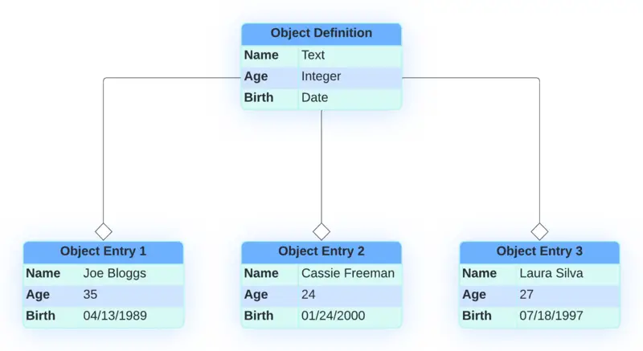
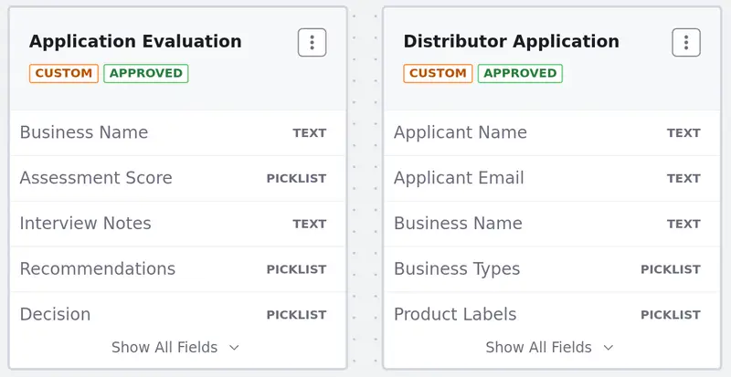
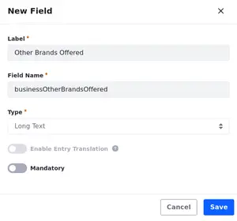
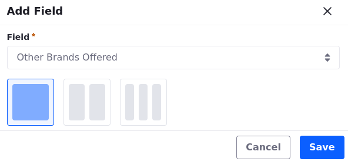

# Modeling Data Structures

Your first step in building an application is to model its data structures by considering the types of data entities you want to store and manipulate, the attributes of each entity type, and the relationships between different entity types. All of this functionality is captured by [Liferay Objects](https://learn.liferay.com/web/guest/w/dxp/building-applications/objects), which are the foundation of low-code applications in Liferay. This lesson discusses the features of Liferay Objects in the context of Clarity's distributor application solution.

From the time of creation, all objects are fully integrated with Liferay's core frameworks to provide a unified experience across the platform and leverage all of its capabilities. This means that permissions, workflow, APIs, data mapping for page elements, and a consistent UI and UX are automatically handled when you build an application with Liferay's low-code tools. You can focus on developing your solution without having to reinvent the wheel.

<!--[TODO: Update with Design ticket] IMAGE: Diagram showing how Objects fit into the Liferay ecosystem and integrate with the various core frameworks -- headless APIs, Job Scheduler, Workflows, Forms, etc. -->

## Identifying Data Entities

Clarity must store and manage two types of data entities for the distributor application flow:

* Distributor Applications
* Application Evaluations

You can model these two data entity types with *object definitions*. Object definitions include a standard set of system fields along with configuration options for modifying their general details, behavior, scope/permissions, and available features. When an object definition is published, Liferay creates a database table for storing *entries* of that object.

!!! note "Object Definition vs. Object Entry"
    An object definition specifies a type of data entity, while an object entry is an individual instance of that data entity. A single object definition can (and often does) have multiple object entries in its corresponding database table.

Once you determine the types of entities required in your application, you can add relevant attributes to them.

## Adding Attributes

Attributes represent database columns that store specific types of information for an application, such as text, numeric values, or file attachments. You can define attributes for the data structures in your application by adding fields to the corresponding object definitions. Fields are populated by user input when an object entry is created. In addition to standard fields, you can also add picklists as object attributes to provide users with predefined single-select and multi-select fields. Fields and picklists can be added via the UI or REST APIs.

For Clarity's use case, each Distributor Application should store the necessary business information for verifying each applicant's identity and credit for Know Your Customer (KYC) best practices and compliance with Anti-Money Laundering (AML) laws. As such, the Distributor Application object contains fields for the applicant's name, title, email, and phone number, along with a *Comments* field for the applicant to write a message.

Additionally, Clarity must collect information that can help them assess the relative value of each prospective distributor. In this case, they want applicants to select from predefined options, so they have added the following picklists to the Distributor Application object definition:

* Business Types
* Distribution Regions
* Distribution Channels
* Order Types
* Product Types
* Annual Purchase Volumes
* Product Labels

The second object needed for this use case is the Application Evaluation. Clarity employees would use this object to evaluate incoming distributor applications, so it should store notes and recommendations made during the review process. The Application Evaluation object definition contains the following custom fields:

* Business Name (text)
* Assessment Score (picklist)
* Attachment (file)
* Decision (picklist)
* Interview Notes (text)
* Recommendations (picklist)
* Recommendation Comments (text)

### Exercise 1

The Distributor Application object contains a great number of custom fields for collecting business information in compliance with KYC and AML policies, but Clarity still needs one that can be used by the applicant to describe other brands that they offer. Let's add that field to the object.

1. Navigate to *Global Menu* () &rarr; *Control Panel* &rarr; *Objects*, then select *Distributor Application*.

1. Go to the *Fields* tab.

1. Click *Add* () to create a new custom field, enter these values, and click Save:

   | Field                    | Value                        |
   |:-------------------------|:-----------------------------|
   | Label                    | Other Brands Offered         |
   | Field Name               | `businessOtherBrandsOffered` |
   | Type                     | Long Text                    |
   | Enable Entry Translation | False                        |
   | Mandatory                | False                        |

   

Each saved field is added immediately to the object and automatically appears in its default layout when creating entries. However, the Distributor Application object has a custom layout that will need to be modified to include the new custom field.

1. Navigate to the *Layouts* tab and click on *Main Layout*.

1. Go to *Layout*.

1. Find the Business Details block under the Application tab, then click *Add Field*.

   

1. Select *Other Brands Offered* as an option, choose the single column box for the field size, and click *Save*.

   

Now the new field will display in the form layout when you create an entry.

### Exercise 2

As mentioned previously, Clarity uses picklists to create predefined options for the applicants to choose from. The Product Types picklist, which should offer a selection of different categories for eyewear, is currently missing its configurations. Let's jump in and fix the picklist.

1. Navigate to *Global Menu* () &rarr; *Control Panel* &rarr; *Picklists*, then select *Product Types*.

1. Click *Add* () and create these items in the picklist:

   | Name       | Key        |
   |:-----------|:-----------|
   | Eyeglasses | eyeglasses |
   | Sunglasses | sunglasses |
   | Lenses     | lenses     |
   | Contacts   | contacts   |
   | Other      | other      |

1. Edit each item and set their ERCs to these values:

   | Name       | External Reference Code |
   |:-----------|:------------------------|
   | Eyeglasses | PRODUCT_TYPE_EYEGLASSES |
   | Sunglasses | PRODUCT_TYPE_SUNGLASSES |
   | Lenses     | PRODUCT_TYPE_LENSES     |
   | Contacts   | PRODUCT_TYPE_CONTACTS   |
   | Other      | PRODUCT_TYPE_OTHER      |

   

1. Click *Save*.

Once saved, the Distributor Application's `Products of Interest` custom field is automatically updated with the new values, since it's related to this picklist. Applicants are now able to select their desired products.

## Defining Relationships

Defining relationships is key to creating data models that accurately represent real-world entities. Object relationships determine how data is connected in your application and capture entity interactions and dependencies. You can define one-to-many and many-to-many relationships between object definitions. These relationships add fields or tables to each object for relating their entries, enabling you to access entry data in different object contexts.

A one-to-many relationship occurs when a single entity of type A can be related to one or more entities of type B. For example, if you were to model a university organization, the University object definition would have a one-to-many relationship with the Student object definition. Each university has multiple students, but each student can only attend a single university.

On the other hand, a many-to-many relationship occurs when one entity of type A can be related to multiple entities of type B, *and* one entity of type B can be related to multiple entities of type A. In the university example, you could implement a many-to-many relationship between the Student object and the Professor object, because each student can have multiple professors and each professor can have multiple students.

For Clarity's solution, a single distributor application can have multiple evaluations attached to it. To model this, they have added a one-to-many relationship to the Distributor Application object definition and specified Application Evaluation as the relatable object.

<!--TODO: Image above should probably have multiple Application Evaluations to better visualize the one-to-many relationship-->

Once the relationship has been added between the object definitions, you can relate individual object entries to one another through either the Liferay UI or relationship REST APIs. See the previous article's [bonus exercise](./deploying-the-application.md#bonus-exercise) for a hands-on example.

Now that you've learned about the process of modeling data structures with Liferay Objects, let's move on to [Implementing Business Logic](./implementing-business-logic.md).

## Additional Resources

* [Objects](https://learn.liferay.com/en/w/dxp/building-applications/objects)
* [Picklists](https://learn.liferay.com/w/dxp/building-applications/objects/picklists)
* [Creating and Managing Objects](https://learn.liferay.com/web/guest/w/dxp/building-applications/objects/creating-and-managing-objects)
* [Object Fields](https://learn.liferay.com/web/guest/w/dxp/building-applications/objects/creating-and-managing-objects/fields)
* [Object Relationships](https://learn.liferay.com/web/guest/w/dxp/building-applications/objects/creating-and-managing-objects/relationships)
