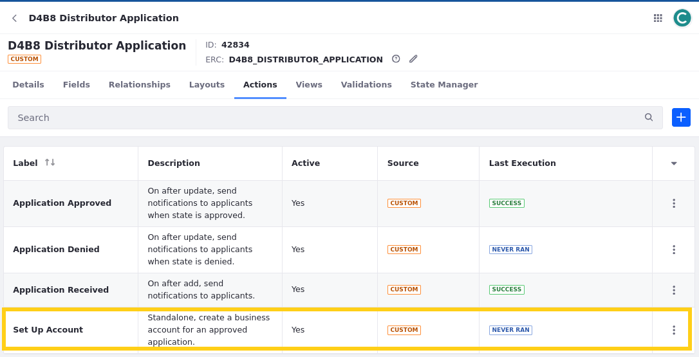

# Adding Business Logic to Clarity's Solution

While you have Clarity's custom distributor onboarding solution up and running, it requires additional work to integrate fully with Liferay DXP. In the following exercises, you will 

* Enable an approval workflow for Distributor Applications with a microservice client extension.
* Set up an object action to automate account creation.
* Configure notifications for new Distributor Application submissions.

Implementing business logic is a key differentiator between just tacking on extra functionality and actually extending the platform. 

## Exercise: Enabling the Approval Workflow
<!--Exercise 20i-->

Clarity has already implemented a workflow process for reviewing and approving changes made to applications, but this workflow depends on a [microservice client extension](https://learn.liferay.com/web/guest/w/dxp/liferay-development/integrating-microservices) to function properly. Currently, all updates to the *Application State* field are approved automatically. However, the workflow is supposed to require a final manager review before allowing users to set the *Application State* field to `Approved` or `Denied`.

<!--TASK: Improve; this is the first time we mention the state field.-->

Here you'll deploy the microservice client extension and finish configuring the workflow definition in the Liferay UI as the Clarity Admin user.

To do this,

1. Open your terminal and go to the `[repository-root]/client-extensions/liferay-clarity-etc-spring-boot/` folder.

1. Build and deploy the client extension project into your Liferay instance. Make sure the deployment was successful.

   ```bash
   blade gw clean deploy
   ```

   Or use Gradle Wrapper:

   ```bash
   ../../gradlew clean deploy
   ```

1. Run this command from the `liferay-clarity-etc-spring-boot/` folder to start the Spring Boot application:

   ```bash
   blade gw bootRun
   ```

   Or use Gradle Wrapper:

   ```bash
   ../../gradlew bootRun
   ```

1. When the application starts, go to http://localhost:58081/ready. If the application is ready for use, the page says “READY.”

1. In your Liferay instance, open the *Global Menu* (), go to the *Applications* tab, and click *Process Builder*.

   

   The Distribution Manager Approval workflow is already fully configured. All you have to do is enable it for the Distributor Application object.

1. Go to the *Configuration* tab.

1. Click *Edit* for D4B8 Distributor Application, select *D4B8 Distribution Manager Approval*, and click *Save*.

   

This enables the workflow. Now you can test it by editing an object entry and setting its state field to *Under Review*. This update should be approved automatically by the workflow action. Next, update the state field to `Approved`. The entry's status should be `Pending`. You can then impersonate Harper Roberts and check for a workflow notification. You can then assign the task to Roberts and approve it. Once finished, the entry's status should be `Approved`.

## Exercise: Automating Account Creation
<!--Exercise 20j-->

To complete the onboarding flow, Clarity wants to automate account creation for approved applications. The client extension you deployed in the previous exercise includes an object action client extension for this. When triggered, this action creates an account using the application's business name, associates the applicant with the account, and assigns the applicant the Account Administrator role. Since the client extension is already deployed and the microservice is running, all you have to do is create an object action to finish setting it up as the Clarity Admin user.

To do this,

1. Begin editing the *D4B8 Distributor Application* object.

1. Go to the *Actions* tab and click *Add* ().

1. Enter these values in the Basic Info tab:

   | Field        | Value                                                              |
   |:-------------|:-------------------------------------------------------------------|
   | Action Label | Set Up Account                                                     |
   | Action Name  | setUpAccount                                                       |
   | Description  | Standalone, create a business account for an approved application. |
   | Active       | True                                                               |

1. Go to the *Action Builder* tab and set these values:

   | Field         | Value                                                                                    |
   |:--------------|:-----------------------------------------------------------------------------------------|
   | Trigger       | Standalone                                                                               |
   | Action        | `object-action-executor[function#liferay-clarity-etc-spring-boot-object-action-account]` |
   | Error Message | Failed to create the business account.                                                   |

1. Click *Save*.

   

1. Open the *Global Menu* (), go to the *Control Panel* tab, and click *Roles*.

1. Add the Set Up Account action permission to the D4B8 Business Development Manager role.

1. In the left menu, go to *Control Panel* &rarr; *Object* &rarr; *D4B8 Distributor Applications*.

   | Permission                                                               |
   |--------------------------------------------------------------------------|
   | Resource Permissions > D4B8 Distributor Application: action.setUpAccount |

When saved, Liferay adds the Set Up Account action as an option in each object entry's *Actions* menu (), so you can trigger it manually. Now you can try it out!


After triggering the action, open the *Global Menu* (), go to the *Control Panel* tab, and click *Accounts*. If successful, the new account should appear and the Clarity Admin user should be assigned to it as the account manager.

## Exercise: Setting Up Notifications
<!--Exercise 20k-->

Currently, Clarity's solution only includes notifications for notifying applicants of changes in their application's status. But they do not have notifications for alerting their business development team of new submissions. Relying on team members to manually check for new submissions does not scale and leaves room for human error, resulting in missed opportunities or poor user experience.

Here you'll add a notification template and set up an object action for triggering it as the Clarity Admin user.

To do this,

1. Open the *Global Menu* (), go to the *Control Panel* tab, and click *Templates* under Notifications.

   The provided solution includes these templates:

   * Application Approved
   * Application Denied
   * Application Received

   

1. Click *Add* and select *User Notification*.

   Here you can begin designing the template.

   **Tip**: You can access object field references to populate notifications dynamically with data for the entry or user who triggers the notification action. To view available variables, scroll down to Definition of Terms and select *D4B8 Distributor Application* object in the dropdown menu.

1. Enter these values for Basic Info:

   | Field       | Value                                                                                               |
   |:------------|:----------------------------------------------------------------------------------------------------|
   | Name        | D4B8 Application Submitted, Admin, User                                                             |
   | Description | Sends user notifications to an administrative role whenever a distributor application is submitted. |

   <!--TASK:  -->

1. Enter these values for Settings:

   | Field      | Value                               |
   |:-----------|:------------------------------------|
   | Recipients | Role                                |
   | Role       | `D4B8 Business Development Manager` |

   <!--TASK:  -->

1. Enter this value for Content:

   | Field   | Value                                                                                                                                                                      |
   |:--------|:---------------------------------------------------------------------------------------------------------------------------------------------------------------------------|
   | Subject | `APP-[%D4B8DISTRIBUTORAPPLICATION_ID%]: [%D4B8DISTRIBUTORAPPLICATION_APPLICANTNAME%] submitted a distributor application for [%D4B8DISTRIBUTORAPPLICATION_BUSINESSNAME%].` |

1. Click *Save*.

   Now you can add a notification action to the Distributor Applications object that uses this template.

1. Open the *Global Menu* (), go to the *Control Panel* tab, and click *Objects*.

1. Select *D4B8 Distributor Application* and go to the *Actions* tab.

   The provided solution includes three notification actions:

   * Application Received
   * Application Approved
   * Application Denied

   

1. Click *Add* to create a new object action.

1. Enter these values in the Basic Info tab:

   | Field        | Value                                                     |
   |--------------|-----------------------------------------------------------|
   | Action Label | Application Submitted                                     |
   | Action Name  | applicationSubmitted                                      |
   | Description  | On After Add, send notifications to administrative users. |
   | Active       | True                                                      |

   

1. Go to the *Action Builder* tab and set these values:

   | Field                 | Value                                   |
   |-----------------------|-----------------------------------------|
   | Trigger               | On After Add                            |
   | Condition             | N/A                                     |
   | Action                | Notification                            |
   | Notification Template | D4B8 Application Submitted, Admin, User |

   

1. Click *Save*.

Now whenever users submit an application, employees with the Business Development Manager role are automatically notified. To test the notification, create another application entry and impersonate Harper Roberts. You should see a platform notification.


## Conclusion

Congratulations! You've successfully enabled an approval workflow, automated account creation, and configured notifications for Clarity's distributor solution, integrating it further with Liferay DXP. The last step in customization is designing user interfaces.

[Designing User Interfaces](./designing-user-interfaces.md)

## Additional Resources

* [Client Extensions](https://learn.liferay.com/w/dxp/liferay-development/client-extensions)
* [Object Validations](https://learn.liferay.com/w/dxp/liferay-development/objects/creating-and-managing-objects/validations)
* [Roles and Permissions](https://learn.liferay.com/w/dxp/users-and-permissions/roles-and-permissions)
* [Object States](https://learn.liferay.com/w/dxp/liferay-development/objects/creating-and-managing-objects/fields/adding-and-managing-custom-states)
* [Enabling Workflow for Objects](https://learn.liferay.com/w/dxp/liferay-development/objects/enabling-workflows-for-objects)
* [Object Actions](https://learn.liferay.com/w/dxp/liferay-development/objects/creating-and-managing-objects/actions)
