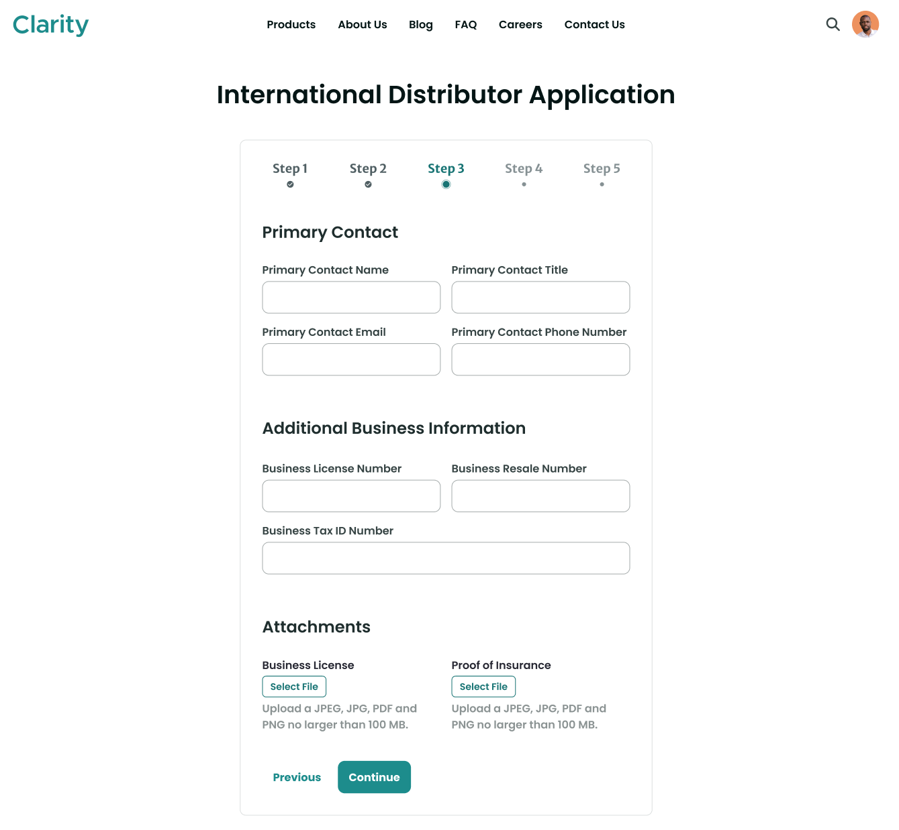
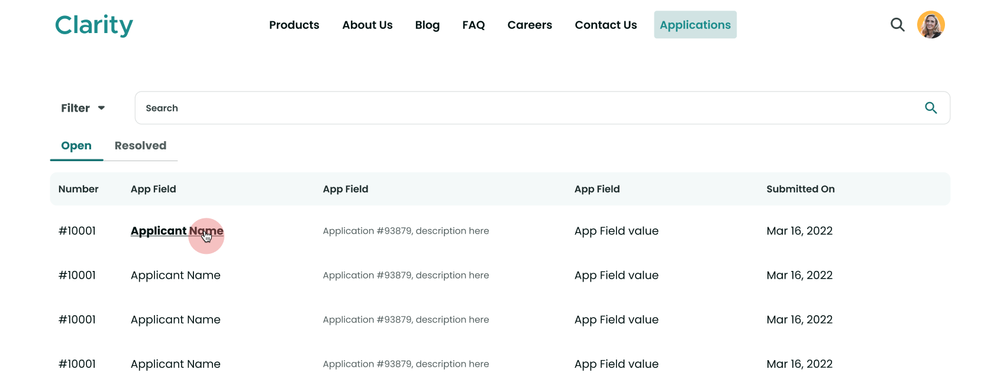
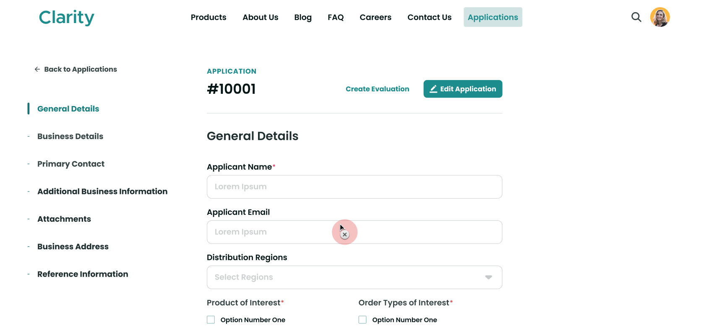

# Designing User Interfaces

Designing user interfaces for applications is integral to creating intuitive and engaging digital experiences. Liferay DXP provides tools for creating dynamic and responsive user interfaces for your custom solutions. You can use page builder features like fragments and widgets in site pages to design forms, display data, and more. If needed, you can define FreeMarker templates to modify how an object's widget and entries render in site pages or use client extensions to create custom page widgets. Together, these tools can help create seamless and engaging site experiences for your users.

Here we'll explore how Clarity can implement custom designs for their international distributor application.

## Forms Pages

Currently, Clarity’s distributor application solution uses object layouts for creating entries. While this display is serviceable for administrative users, they have limited customization options. To create forms for end-users, you should leverage Liferay's page builder features, including form fragments. These forms can be simple, single step forms or complex multi-step forms. 

Clarity can use display page templates and fragments to quickly implement the above multi-step form design. Display page templates define each step, while the step indicator is a custom fragment that leverages the [Clay multi-step nav component](https://clayui.com/docs/components/multi-step-nav.html). The remaining functionality uses OOTB fragments. 

Using the same tools, Clarity can design a custom success page for users once they submit the form. This above design directs users to view and edit their application or return to the site's home page.

## Data Overview Pages

Once entries are created, Clarity's business development team needs a way to review submissions. Their current solution uses object views, which displays entries in a simple table. To create a custom overview page, they can add the object's widget to a page and style it using a FreeMarker template. Alternatively, they could create the following design using collections, fragments, and search widgets.

## Display and Edit Pages

Now Clarity needs a way to display individual entries. This display should enable applicants to edit their submissions and give Clarity's users a way to quickly create an evaluation for the submission. Clarity can implement the following design using display page templates and fragments.

## Conclusion

Congratulations! You've completed *Module 10: Customizing Liferay DXP*. Throughout this module, you've learned best practices for customizing the Liferay platform with objects and client extensions. You put these best practices into action by setting up Clarity's custom solution for onboarding distributors and implementing business logic to integrate it with Liferay's out-of-the-box capabilities.

Next Up: [Course Conclusion](../conclusion.md)
