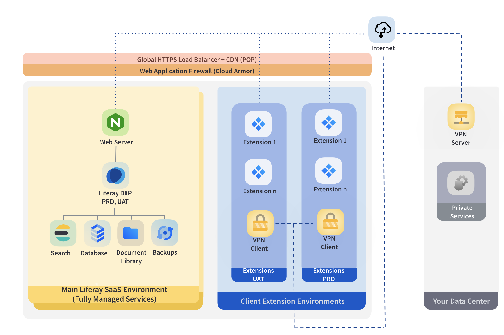

# Liferay Deployment Options

<!--TASK: Add Abstract-->

Before developing custom solutions with Liferay DXP, the first step is to select a deployment option. This decision determines your hosting and management strategy. Liferay offers three deployment models, each with its own advantages and considerations: Liferay SaaS, Liferay PaaS, and Liferay Self-Hosted.

Let's explore each of these options in greater detail to determine which best suits Clarity's needs and goals.

## Liferay Self-Hosted

With Self-Hosted, Liferay provides just the Liferay DXP software. It is up to the customer to manage everything else:

* **Server Management & Security**: Set up, maintain, and secure the physical servers running Liferay DXP.
* **Software Stack Configuration**: Set up and configure databases, search engines, web servers, and other services necessary for an enterprise experience with Liferay DXP.
* **Software Stack Maintenance**: Apply updates, patches, and security hotfixes to Liferay DXP and the entire software stack.
* **Architecture Design**: Design the architecture for scaling, load balancing, backups, and disaster recovery.
* **Custom Solutions**: Creating and maintaining custom solutions like websites and client extensions.

Liferay Self-Hosted offers the ultimate control and customization for your Liferay DXP environment. You have complete freedom to manage your server infrastructure, software configuration, and security, allowing for deep integrations and highly personalized experiences. However, this flexibility comes with the responsibility of ongoing maintenance, including updates and security patches, which requires significant technical expertise.

If you're interested in this deployment approach, there is a wealth of documentation and tutorials to help you get started:

* [Installation and Upgrades](https://learn.liferay.com/w/dxp/installation-and-upgrades)
* [Installing and Upgrading a Search Engine](https://learn.liferay.com/w/dxp/using-search/installing-and-upgrading-a-search-engine)
* [Clustering for High Availability](https://learn.liferay.com/w/dxp/installation-and-upgrades/setting-up-liferay/clustering-for-high-availability)
* [Maintaining a Liferay Installation](https://learn.liferay.com/w/dxp/installation-and-upgrades/maintaining-a-liferay-installation)

That said, all of this work might be more than what Clarity Vision Solutions wants to take on at this stage of their business. Let's move on to evaluate Liferay PaaS next.

## Liferay PaaS

While Liferay Self-Hosted requires Clarity to fully manage their own infrastructure, Liferay PaaS provides cloud-based infrastructure and platform services to simplify the management and scalability of Liferay DXP. This includes:

* Web Server
* Backups
* Search Engine
* Database
* DevOps CI/CD Pipeline

Furthermore, with Liferay PaaS, Liferay's cloud infrastructure includes features like, autoscaling, auto-failover, and load balancing. Configuration and monitoring is done through the Liferay Cloud Console and a connected GitHub repository using a configuration-as-code approach. Liferay PaaS also supports a variety of approaches for customization and development, but these approaches also carry the same upgrade-related risks that were mentioned before with Liferay Self-Hosted.

Learn more about the Liferay PaaS and working with its cloud infrastructure tools in the [Liferay Cloud documentation](https://learn.liferay.com/web/guest/w/liferay-cloud/index).

While Liferay PaaS takes care of the cloud infrastructure and core platform updates, you'll still need to handle Liferay DXP upgrades, patch implementation, and security hotfix application. All of this maintenance and management represents overhead that Clarity is not interested in.

Finally, let's evaluate Liferay SaaS.

## Liferay SaaS

With Liferay SaaS, the cloud infrastructure and Liferay DXP application is deployed and managed for you. This is the fastest way to get started building solutions with Liferay. Clarity will never have to worry about about whether their site is up and running. Instead they can immediately begin working with Liferay's out-of-the-box features.

With this deployment approach Liferay provides:

* Product support
* Application Uptime SLA
* Platform Software
* Cloud Architecture and Infrastructure
* Upgrades
* Regular Updates
* Patches and Security hotfixes

Liferay takes care of the full tech stack including the web server running Liferay, the database, search, and file storage. Each Liferay SaaS account comes with a production (`PRD`) Liferay environment as well as a test (`UAT`) Liferay environment.

Client extension environments are also provided for custom development and customizations. Custom development is done through the use of Liferay Workspace and Client Extensions, both topics that are covered briefly in [Module 3: Developer Setup](../module-3-developer-setup.md) and later applied in [Module 10: Customizing Liferay DXP](../module-10-customizing-liferay-dxp.md). A VPN client is also available in these extension environments to enable client extensions to integrate to systems within your own data center.

With Liferay SaaS, backups and upgrades are fully managed and done for you. There is no need to update your environment or patch previous releases. You can rest assured that your Liferay application is always up-to-date with the latest releases.

<!--TASK: Add?

Also consider adding a reference to https://www.liferay.com/free-trial/pre-built-trial

## Liferay SaaS First

Liferay SaaS empowers customer to rapidly deploy a secure digital platform with minimal IT resources, allowing customer to focus on core business initiatives.

* **Faster Time to Value**: Get up and running with Liferay without managing hardware and software setup
* **Reduced IT Burden**: Liferay handles infrastructure, security and maintenance freeing customer’s  IT team for more valuable tasks
* **Automatic Updates**: Benefit from continuous updates, latest capabilities and bug fixes without manual intervention
* **Scalability**: Liferay SaaS scales automatically to meet customer needs, eliminating infrastructure headaches
-->

With a tight deadline and a strong desire to manage costs, Clarity Vision Solutions has decided that Liferay SaaS is the deployment option for them. Liferay SaaS enables Clarity's delivery team to focus on delivering more business value rather than maintaining infrastructure and supporting applications.

## Conclusion

Great! You've reviewed Liferay's deployment options and selected Liferay SaaS for Clarity Vision Solutions. Next, let's review the Liferay SaaS onboarding process.

Up Next: [Liferay SaaS Onboarding](./liferay-saas-onboarding.md)
