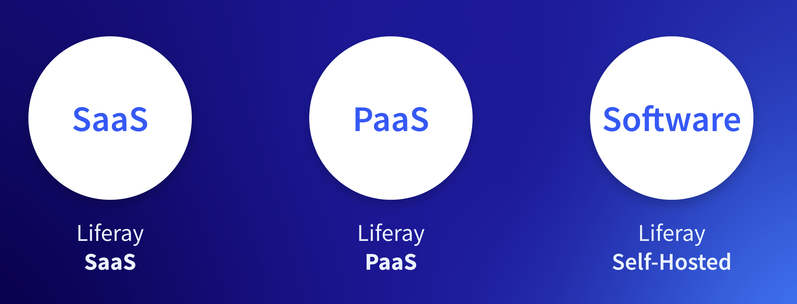

# Liferay Deployment Options

As the decision maker for Clarity one of the first important choices you must make is the deployment approach you will take with Liferay. The Liferay DXP platform is available in three different deployment approaches: Liferay SaaS, Liferay PaaS, and Liferay Self-Hosted. In this module, we will learn the distinctions between each of the deployment approaches.

At a high level:

* Liferay Self-Hosted - Have full control and ownership of all aspects of deployment and maintenance of Liferay.
* Liferay PaaS - Have Liferay manage your cloud infrastructure while keeping control over your database, file storage, backups, etc.
* Liferay SaaS - All installation, maintenance, backups, upgrades, etc. are handled by Liferay.

Let's go into these distinctions in further detail.

## Liferay Self-Hosted

With the self-hosted approach, Liferay provides just the Liferay DXP software. It is up to the customer to be responsible for everything else:

* Hardware and infrastructure: referring to the actual servers that the software is hosted on
* Platform-related software and configuration: setup and configuration of a database, search engine, and more
* Architecture: design and configuration of architecture for scaling, load balancing, backups, and failover situations
* Preparation, management, and deployment of updates, patches, and security hotfixes for the entire stack
* and of course...
* Solution Development: the actual building of the Enterprise Site that the Clarity company wants to build

The biggest positive to this approach is that you have full control of your Liferay DXP deployment and you have every possible tool available to you for development and customization. Of course, this can backfire as some methods of customization can make future upgrades extremely challenging. If this is a deployment approach that you're interested in, there is a wealth of documentation and tutorials available for you to follow in order to correctly stand up their Liferay Self-Hosted deployments. See the documentation to learn more:

* [Installation and Upgrades](https://learn.liferay.com/w/dxp/installation-and-upgrades)
* [Installing and Upgrading a Search Engine](https://learn.liferay.com/w/dxp/using-search/installing-and-upgrading-a-search-engine)
* [Clustering for High Availability](https://learn.liferay.com/w/dxp/installation-and-upgrades/setting-up-liferay/clustering-for-high-availability)
* [Maintaining a Liferay Installation](https://learn.liferay.com/w/dxp/installation-and-upgrades/maintaining-a-liferay-installation)

With that said, all of this work might be more than what Clarity Vision Solutions wants to take on at this stage of their business. Let's move on to evaluate Liferay PaaS next.

## Liferay PaaS

While Liferay Self-Hosted requires Clarity to fully manage their own infrastructure, Liferay PaaS provides cloud-based infrastructure and platform services to simplify the management and scalability of Liferay DXP! This includes:

* Web Server
* Backups
* Search Engine
* Database
* DevOps CI/CD Pipeline

Furthermore, with Liferay PaaS your site infrastructure includes features like, Autoscaling, Auto-Failover, and Load Balancing. Configuration and monitoring is done through the Liferay Cloud Console and a connected GitHub repository using a configuration-as-code approach. Liferay PaaS also supports a variety of approaches for customization and development, but these approaches also carry the same upgrade-related risks that were mentioned before with Liferay Self-Hosted.

Learn more about the Liferay PaaS and working with its cloud infrastructure tools in the [Liferay Cloud documentation](https://learn.liferay.com/web/guest/w/liferay-cloud/index).

While Liferay PaaS takes care of the cloud infrastructure and core platform updates, you'll still need to handle Liferay DXP upgrades, patch implementation, and security hotfix application.

Finally, let's evaluate Liferay SaaS.

## Liferay SaaS

<!-- @Makoto - please enhance this section of the article with content and diagram from https://docs.google.com/presentation/d/1QZ-uVKOJnyg8T2WmOqhxChBlaPww6H7C_CnuPNPzdEA/edit#slide=id.g2b413a43341_0_163 -->

With Liferay SaaS, the cloud infrastructure and Liferay DXP application is functionally invisible to you and to Clarity Vision Solutions. With this deployment approach Liferay provides:

* Product support
* Application Uptime SLA
* Platform Software
* Cloud Architecture and Infrastructure
* Upgrades
* Regular Updates
* Patches and Security hotfixes

Notably, with Liferay SaaS, backups and upgrades are fully managed and done invisibly to you. There is no need to update your environment or patch previous releases. You can rest assured that your Liferay environment is always up-to-date with the latest releases.

The fastest way to get started building solutions with Liferay is Liferay SaaS. You can begin working with Liferay's out-of-the-box features immediately. Custom development and customizations are still available for Liferay SaaS through the use of Liferay Workspace and Client Extensions, both topics that are covered briefly in [Module 2](../module-2-developer-setup.md) and later applied in [Module 9](../module-9.md). 

With a tight deadline and a strong desire to manage costs, Clarity Vision Solutions has decided that Liferay SaaS is the deployment approach for them. Next we will step through the Liferay SaaS onboarding process.

Up Next: [Liferay SaaS Onboarding](./liferay-saas-onboarding.md)
