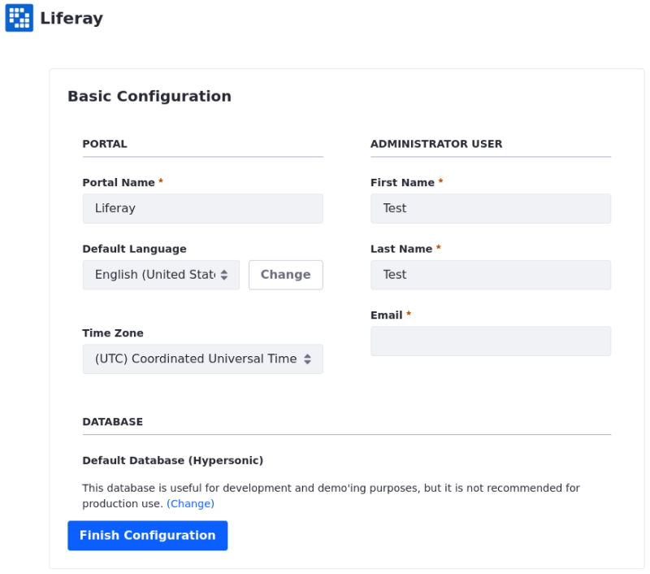
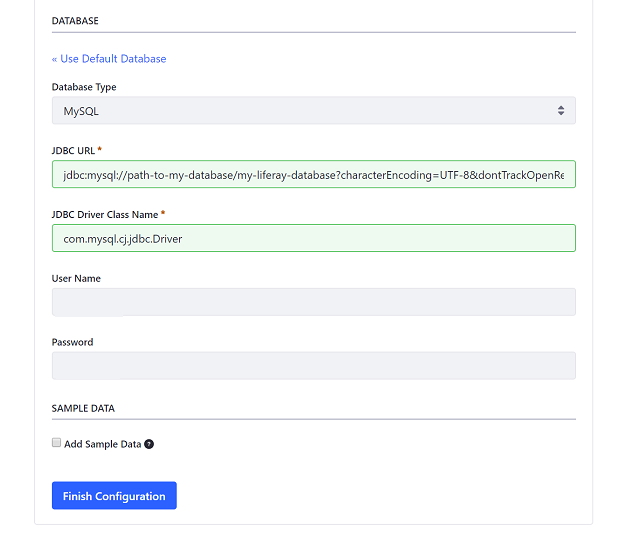

# Liferay Self-Hosted

At a high level:
* Download a Liferay Tomcat bundle. Set your `[Liferay_Home]` folder, configure your database, and start Liferay.
* To upgrade, download a new Liferay Tomcat bundle and start up Liferay. Point the new version to your `[Liferay_Home]` folder and database. Restart Liferay with the new version.

## Initial Setup

You can install Liferay DXP or Liferay Portal on any [supported application server](https://help.liferay.com/hc/en-us/articles/4411310034829-Liferay-DXP-7-4-Compatibility-Matrix#application-server). The Tomcat Bundle includes the Apache Tomcat application server with Liferay DXP/Portal pre-deployed. It’s the easiest, fastest way to install Liferay.

### Prerequisites

A Java JDK 11 is required. See [the compatibility matrix](https://help.liferay.com/hc/en-us/articles/4411310034829-Liferay-DXP-7-4-Compatibility-Matrix) to choose a JDK. See [JVM Configuration](https://learn.liferay.com/web/guest/w/dxp/installation-and-upgrades/reference/jvm-configuration?p_l_back_url=https%3A%2F%2Flearn.liferay.com%2F) for recommended settings.

### Download

1. Go to the [Help Center](https://customer.liferay.com/downloads) (subscription) or [Community Downloads](https://www.liferay.com/downloads-community).

1. Navigate to the Liferay DXP/Portal version you want.

1. Download a Tomcat Bundle:

| File                      | Description                                     |
|:--------------------------|:------------------------------------------------|
| Tomcat Bundle (`.tar.gz`) | GZipped bundle archive that installs on any OS  |
| Tomcat Bundle (`.7z`)     | 7-Zipped bundle archive that installs on any OS |

### Install

Extract the bundle to a location on your host. This location is called your [Liferay Home](https://learn.liferay.com/web/guest/w/dxp/installation-and-upgrades/reference/liferay-home?p_l_back_url=https%3A%2F%2Flearn.liferay.com%2F).

### Run Liferay

Once you have installed and extracted the bundle, you now need to run it.

1. Go to your Liferay Home and navigate to *tomcat-x.x.xx* &rarr; *bin*.

1. Run the startup script bundled with your application server. Tomcat bundle example:

    ```bash
    ./catalina.sh run
    ```

    The instance runs and prints log messages, including this Tomcat startup completion message:

    ```
    INFO [main] org.apache.catalina.startup.Catalina.start Server startup in [xx,xxx] milliseconds
    ```

    The Setup Wizard appears in your web browser at `http://localhost:8080`.

    

1. Set your portal’s name, default language and time zone.

1. Set the Administrator User first name, last name, and email address.

1. In the Database section, you can use the default one (Hypersonic) or change to a different database. Read through [Configuring a Database](https://learn.liferay.com/w/dxp/installation-and-upgrades/installing-liferay/configuring-a-database) in case you want to use another database.

    !!! warning
        DO NOT use HSQL in production-grade Liferay DXP instances.

1. Click *Finish Configuration*.

    The Setup Wizard stores your configuration values in a `portal-setup-wizard.properties` file in your Liferay Home.

1. Continue by accepting the Terms of Use, changing your password, and answering the password recovery question.

Liferay is ready to use!

## Upgrades

Follow the steps to perform an Liferay upgrade for Tomcat.

1. Download and extract the Liferay Tomcat bundle you wish to upgrade to.

1. Back up your `[Liferay_Home]/data` folder as well as your database.

1. Start up the new Liferay Tomcat bundle. The setup wizard appears as you start the bundle for the first time. In the database section, click _Change_. Input your Liferay installation's database settings.

   

   Finish the configuration.

1. In your `[Liferay_Home]` folder, create a `portal-ext.properties` file. 

1. Open the file and set `upgrade.database.auto.run=true`. Save the property file and restart Liferay.

1. As Liferay restarts, the database is automatically upgraded. You are now running the new version of Liferay.
