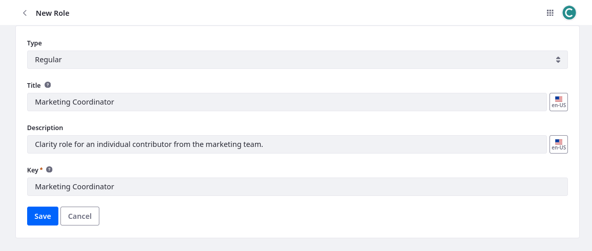
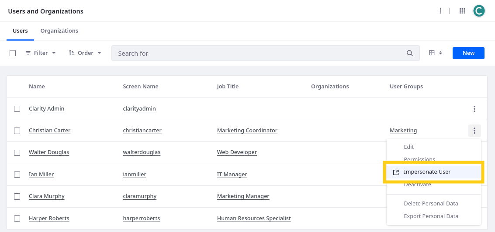
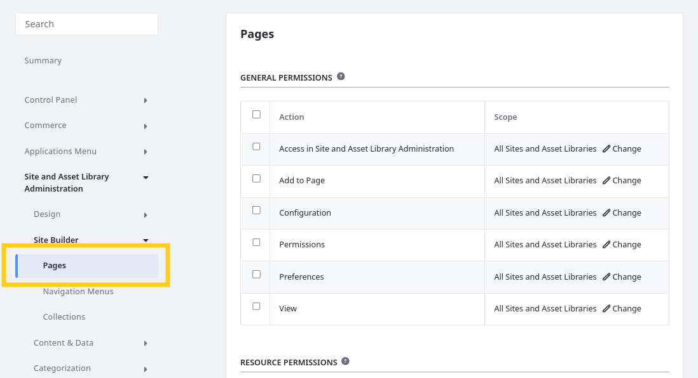

# Creating and Assigning Roles to Clarity's Users

Liferay employs a role-based access control (RBAC) model to manage user permissions. Roles and permissions are fundamental to Liferay's security architecture. Roles are collections of permissions granted to users or groups. Permissions are granular checks that determine how a user can interact with Liferay's applications and resources. This article guides you through creating roles, defining their permissions, and assigning these roles to Clarity's users.

## Exercise: Creating and Assigning User Roles

<!-- Exercise 3c -->

Each Clarity persona belongs to different teams with different responsibilities. You can use Liferay roles to model this structure. A role is a list of permissions that empower users to perform specific actions within the Liferay instance.

While Clarity can leverage many of Liferay's OOTB roles, they also want these custom roles:

| Type    | Title                    | Description                                                         |
|:--------|:-------------------------|:--------------------------------------------------------------------|
| Regular | Content Manager          | Clarity role for those managing content on Liferay.                 |
| Regular | IT Manager               | Clarity role for a manager within the IT department.                |
| Regular | Web Developer            | Clarity role for a front end developer within the IT Department.    |
| Regular | Marketing Coordinator    | Clarity role for an individual contributor from the marketing team. |
| Site    | Site Content Contributor | Site based role for those contributing to the Clarity site.         |

The training workspace includes all of these roles except for Marketing Coordinator. Here you'll create and assign the Marketing Coordinator role as the Clarity Admin user.

To begin,

1. Open the *Global Menu* (), go to the *Control Panel* tab, and click *Roles*.

1. Click *New*.

1. Enter these details for the role:

   | Field       | Value                                                                 |
   |:------------|:----------------------------------------------------------------------|
   | Type        | `Regular`                                                             |
   | Title       | `Marketing Coordinator`                                               |
   | Description | `Clarity role for an individual contributor from the marketing team.` |
   | Key         | `Marketing Coordinator`                                               |

   

1. Click *Save*.

   This creates the role, so you can add permissions and assign it to users. Since this role should apply to all marketing team members, you can assign it to the Marketing user group.

1. Go to the *Assignees* tab and click *User Groups*

   

1. Click *New*.

1. Select *Marketing*.

   

1. Click *Add*.

Great! You've created and assigned a role to Clarity's marketing users. However, the role doesn't have any permissions yet. Next, you'll add permissions to the role. This enables anyone with the role to fulfill their responsibilities in the Clarity website.

## Exercise: Defining Role Permissions

<!-- Exercise 3d -->

Permissions grant the ability to access data and perform specific actions in a Liferay instance. Now that you've created the Marketing Coordinator role, you'll start adding specific permissions associated with the role as the Clarity Admin user.

Throughout this process, you'll impersonate Christian Carter to see the practical effect of granting the Marketing Coordinator role additional permissions.

To do this,

1. Open the *Global Menu* (), go to the *Control Panel* tab, and click *Users and Organizations*.

1. Click *Actions* () for Christian Carter and select *Impersonate User*.

   

   This opens a new tab where you can view the Liferay instance using Christian Carter's permissions.

   Notice how he doesn't have access to any of the applications or resources he needs as a marketing coordinator.

   

   Clarity needs all Marketing Coordinators to have access to assets in the team's asset library.

1. Return to the Clarity Admin tab, go to the *Roles* application and click the *Marketing Coordinator* role to begin editing as the Clarity Admin user.

1. Go to the *Define Permissions* tab.

1. In the left menu, go to *Applications Menu* &rarr; *Content* &rarr; *Asset Libraries*.

   **Tip**: Enter "Asset Libraries" into the search bar to quickly locate this section.

   

1. Select these permissions:

   | Section                                    | Permission                                      |
   |:-------------------------------------------|:------------------------------------------------|
   | Application Permissions                    | Access in Control Panel                         |
   | Application Permissions                    | View                                            |
   | Resource Permissions > Asset Library Entry | View Site and Asset Library Administration Menu |

1. Click *Save*.

   This updates the Marketing Coordinator role's permissions.

   **Note**: Liferay automatically assigns the `Portal: View Control Panel Menu` permission when you grant the `Access in Control Panel` permission.

1. Refresh the tab where you're impersonating Christian Carter.

   Notice that he can now access the Asset Libraries application in the Global Menu.

   

   Marketing Coordinators also need to access files in the Documents and Media application.

1. Return to the Clarity Admin tab.

1. In the left menu, go to *Site and Asset Library Administration* &rarr; *Content & Data* &rarr; *Documents and Media*.

   **Note**: If you search "Documents and Media" two options appear with the same name. Select the option under Content & Data.

   

1. Select these permissions:

   | Section                                 | Permission                                      |
   |:----------------------------------------|:------------------------------------------------|
   | General Permissions                     | Access in Site and Asset Library Administration |
   | General Permissions                     | View                                            |
   | Resource Permissions > Documents        | View                                            |
   | Resource Permissions > Documents Folder | View                                            |

1. Click *Save*.

1. Refresh the tab where you're impersonating Christian Carter.

   Notice that he can now access the Documents and Media application in the Site Menu.

   

   Marketing Coordinators also need the ability to update pages.

1. Return to the Clarity Admin tab.

1. In the left menu, go to *Site and Asset Library Administration* &rarr; *Site Builder* &rarr; *Pages*.

   

1. Select this permission.

   | Section                     | Permission |
   |:----------------------------|:-----------|
   | Resource Permissions > Page | Update     |

1. Click *Save*.

1. Refresh the tab where you're impersonating Christian Carter.

   Notice that he can now access edit tools for site pages.

   

Well done! Now all members of the Marketing user group have the correct base permissions. Clarity can assign additional roles to individual users or user groups to grant the ability to access more data or perform other actions.

Next, you can opt to learn more about roles and user permissions by creating a manager role. Otherwise, you can move to Lesson 4 and explore how to create and configure sites.

## Exercise: Fine Tuning Manager Permissions (Bonus)

<!-- Exercise 3e -->

So far you've been using the Clarity Admin user to make changes. This user is the omni-administator and has all Liferay permissions. In real world scenarios, companies should strictly guard access to this user and greatly restrict which users have full admin privileges. Companies like Clarity should set up manager roles that only have the permissions necessary for their responsibilities.

Here you'll set up a management group that has authority to configure permissions for their team members, without granting them full admin privileges as the Clarity Admin user.

To do this,

1. Go to the *User Groups* application in the Global Menu.

1. Create a `Marketing Managers` user group.

1. Add Clara Murphy to the group.

1. Go to the *Roles* application in the Global Menu.

1. Create a `Marketing Manager` role.

1. While editing the *Marketing Manager* role, go to the *Define Permissions* tab.

1. In the left menu, go to *Control Panel* &rarr; *Users* &rarr; *User Groups*.

1. Select this permission:

   | Section                 | Permission              |
   |:------------------------|:------------------------|
   | Application Permissions | Access in Control Panel |

1. Click *Save*.

1. In the left menu, go to *Control Panel* &rarr; *Users* &rarr; *Users and Organizations*.

1. Select this permission:

   | Section         | Permission |
   |:----------------|:-----------|
   | Resource > User | View       |

1. Click *Save*.

1. Go to the *Assignees* tab and assign this role to the *Marketing Managers* user group.

   These permissions grant the ability to view the User Groups application and view users. Next, you'll give the Marketing Manager role permission to view and add members for the Marketing user group.

1. Go to the *User Groups* application in the Global Menu.

1. Click *Actions* () for the Marketing user group and select *Permissions*.

             

1. For the Marketing Manager role, select these permissions and click *Save*:

   | Role              | Permission     |
   |:------------------|:---------------|
   | Marketing Manager | Assign Members |
   | Marketing Manager | View Members   |
   | Marketing Manager | View           |

   

1. Go to the *Users and Organizations* application in the Global Menu.

1. Impersonate Clara Murphy to verify the Marketing Manager role permissions.

   Clara should see the Marketing user group. She should also be able to view members of the user group and add new members to the group.

   

   **Note**: This is just an example of the types of permissions you can assign to manager roles.

<!-- Great! For now, you've finished setting up Clarity's users, user groups, and roles. Next, we'll turn our attention to Clarity's website. -->

## Conclusion

Congratulation! You've completed Module 4: Security and Identity Management. Throughout this module, you've learned best practices for authenticating and authorizing users in Liferay DXP. You also finished setting up Clarity's users, user groups, and roles for their public enterprise website. 

In the next module, you'll learn about building sites with Liferay.

Next Up: [Module 5: Site Building](../module-5-site-building.md)