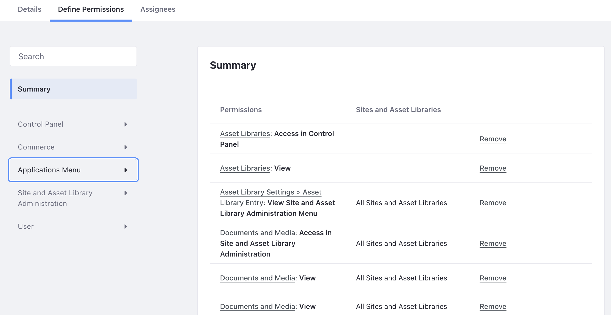

# Managing and Organizing Clarity Users

Clarity team members were provisioned through Okta and have already logged into Liferay, but their roles and permissions have not been set yet. Liferay's out-of-the-box features are designed to help you manage and grant permissions to all of these users based on their role in Clarity and the responsibilities they have on the new site.

At Clarity, each group has different responsibilities in developing the new enterprise website. Let’s look at Clarity's users, their respective role and group memberships, and their assigned responsibilities for the new site.

| Name | Role | User Group | Responsibility|
|:---|:---|:---|:---|
| Ian Miller | IT Manager | IT | Ensures efficient operation of IT infrastructure by aligning technology strategy with organizational objectives. |
| Walter Douglas | Web Developer | IT | Ensures functionality, security, and performance of Clarity's website by designing, building, and maintaining it. |
| Clara Murphy | Marketing Content Manager | Content Manager | Creates and implements content strategies to attract and engage visitors, driving brand awareness and conversions. |
| Christian Carter | Marketing Content Contributor | Content Creator | Supports marketing initiatives by creating high-quality content like blog posts and product descriptions. |
| Harper Roberts | HR Content Contributor | Content Creator | Develops and maintains career page content and job descriptions with the aim of attracting and informing potential candidates. |

## Structuring Your Organization through User Groups

!!! important
    Deciding how to group and assign permissions to users is a key decision point as you build out your enterprise website. Using Liferay's user groups feature to model your organization’s structure and responsibilities on the new site is the recommended approach in this situation.

In Liferay, permissions are assigned to roles, as opposed to being assigned to individuals. Liferay provides [out-of-the-box roles](https://learn.liferay.com/en/w/dxp/users-and-permissions/roles-and-permissions/understanding-roles-and-permissions) that come by default. Custom roles can also be created with your choice of permissions to fit your business. These Liferay roles are then assigned to individuals.

To increase efficiency, roles can also be assigned to entire user groups. One of Clarity's goals is to improve their user experience and apply personalized experiences for its users. Therefore, Clarity can leverage their existing groupings from Okta and assign custom roles to different user groups in Liferay. Let’s walk through an example of this.

### Exercise 1

The content creator user group requires permissions to edit site pages as well as add blog posts. Let's create the custom role and assign it to the user group.

1. Navigate to _Control Panel_ &rarr; _Roles_. Under the _Regular Roles_ tab, click the add icon.

1. Input `Content Creator` as the title of the new role. Click _Save_. 

1. Click the _Define Permissions_ tab. In the left navigation, expand _Site and Asset Library Administration_ and click _Site Builder_ &rarr; _Pages_. Scroll down to the _Page_ section and check the _Update_ checkbox. Scroll down to the bottom and click _Save_. 

1. Still under the _Site and Asset Library Administration_ menu, click _Content & Data_ &rarr; _Blogs_. Under _Blog Entries_, check the _Add Entry_ checkbox. Under the _Blogs Entry_, check the _Update_ checkbox. Scroll down to the bottom and click _Save_. 

1. The summary of the permissions under the _Define Permissions_ tab should look like the screenshot below.

    

1. Next, click the _Assignees_ tab. Click the _User Groups_ tab. Click the add icon.

1. In the pop-up window, select the content creator user group and click _Add_.

1. To verify the permissions, navigate to _Control Panel_ &rarr; _Users and Organizations_. Click the options icon for Christian Carter and click _Impersonate User_. Navigate to Clarity's blog page and verify that the user can add a blog entry.

Well done! Now every team member that is part of the content creator user group now has the correct permissions.

To learn more about user management in general, see our [documentation](https://learn.liferay.com/w/dxp/users-and-permissions).

### Bonus Exercise

You've learned how to create a custom role for the content creator user group. 

Your next challenge is to create custom roles for Clarity's other roles and assign them to the other user groups.

## Organizations

Clarity relies on user groups and roles for a significant portion of their user and permission management. However, Liferay offers Organizations as an additional user management tool. 

Organizations can be used to model the hierarchy of your company. It is also an important part of managing groups of accounts. In the next article, you'll be adding Lily Lewis, Opportune Optics' Account Manager, to the Opportune Optics organization.

While Clarity is not yet using Liferay's organization features, they will likely need to adopt this feature as their business grows and their site requirements evolve.

Learn more about organizations [here](https://learn.liferay.com/w/dxp/users-and-permissions/organizations/understanding-organizations).

Next Up: [Modeling B2B Relationships with Liferay Accounts](./modeling-b2b-relationships-with-liferay-accounts.md)
