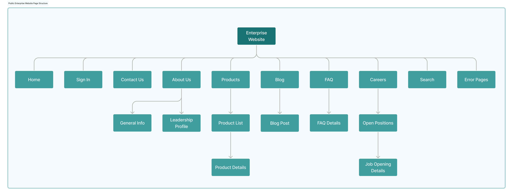
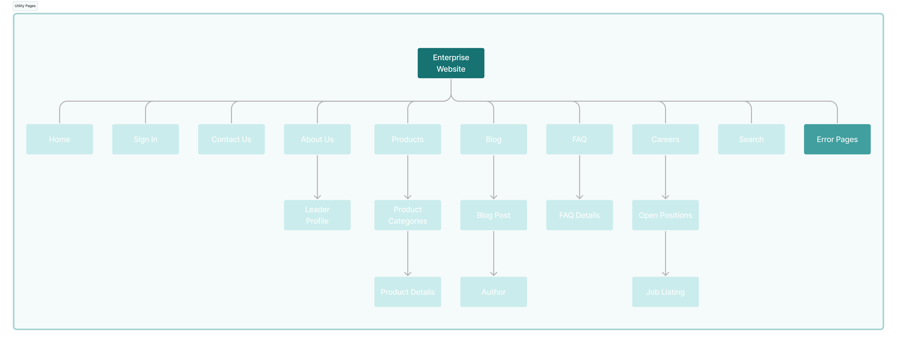
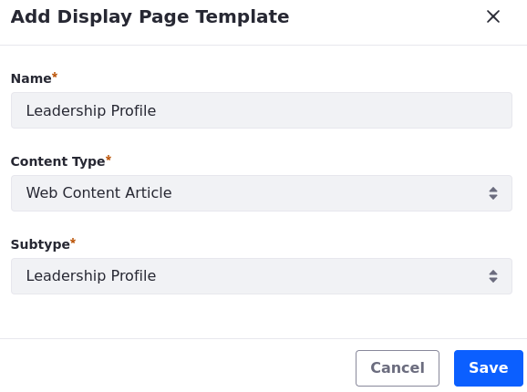

# Adding Pages to Clarity's Site

Pages are the fundamental building blocks of website structures. Each page is a canvas for designing engaging layouts with content (e.g., text, images, videos) and interactive elements (e.g., forms, widgets). Liferay's WYSIWYG editor and drag-and-drop elements provide an intuitive and user-friendly experience, so you can implement your vision without writing code. For advanced use cases, you can also create custom page elements using HTML, CSS, and JavaScript. To help you implement your solution, Liferay provides a variety of page types.

In this lesson, you’ll use different page types to implement Clarity’s site map introduced in the first module:

<!--TASK: Update img -->

This site structure includes content pages, display pages, and utility pages.

## Content Pages

Content pages are used to create content-rich, visually engaging experiences. With an intuitive visual editor and drag-and-drop elements, you can quickly design page layouts, display content, and integrate functionality. Personalize content for specific audiences, manage localized translations, and optimize for all devices with the responsive layout editor. When integrated with Analytics Cloud, you can track content performance metrics and conduct A/B testing, creating page variants and track visitor data (e.g., bounce rate, clicks) to continuously improve engagement. Together, these features make content pages ideal for landing pages, marketing campaigns, and any scenario where presentation and user engagement are crucial.

<!--TASK: Update img -->

!!! tip “Content Pages vs. Widget Pages”
    Liferay also provides widget pages, but this course focuses on building user experiences with content pages. Content pages provide superior flexibility and integration with Liferay’s latest content and personalization features, including fragments, collections, segmentation, and client extensions. Widget pages do not support these features.

<!--TASK:
### Parent and Child Pages

Explain the value of defining these relationships for content pages. Also note that the Open Positions page is a child of the Careers page. 
-->

## Display Pages

Display page templates define structures for displaying content at a dedicated URL. When you create or upload content items, Liferay generates a unique friendly URL for accessing it. However, you can only use this URL to view the content if you create one of these templates for displaying it. Display pages are built using the same UI and features as content pages. With these templates, you can establish a consistent visual style for different types of content.

<!--TASK: Update img -->

<!--TASK:
### Default Templates

Explain how applying a display page works... we will need to mark the category and product display pages and as the default for their content type.
-->

## Utility Pages

Utility pages handle specific functions within a site. Currently, you can use them to create your site’s default 404 and 500 error pages. They are designed using the same tools and features as content pages. With them, you can ensure that even the errors returned to users maintain corporate branding while being easily maintained. Each site includes out-of-the-box error pages, which you can use or modify as needed.

<!--TASK: Update img -->

## Exercise One: Adding Content Pages

While logged in as Walter Douglas,

1. Open the *Site Menu* (), expand *Site Builder*, and click *Pages*.

1. In the Static Pages tab, click *New* and select *Page*.

   

1. Select the *Blank* template.

   !!! note
       This applies a basic header and footer to an empty content page.

   

1. For name, enter `Home` and click *Add*.

   This creates a blank content page and directs you to Liferay’s page editor UI. Here you can access all page building tools and configuration options.

1. Leave the page blank and click *Publish*.

   

1. Repeat this process for these pages:

   * Sign In
   * Contact Us
   * About Us
   * Products
   * Product List
   * Product Detail
   * Blog
   * FAQ
   * Careers
   * Open Positions
   * Search

   

1. Drag and drop *Open Positions* onto *Careers* to make it a child of the Careers page.

   

   <!--TASK: Update Gif -->

1. Repeat this step to create this hierarchy: Products > Product List > Product Detail.

   

With these pages in place, create the remaining parts of Clarity's site structure as display page templates.

## Exercise Two: Adding Display Page Templates

While logged in as Walter Douglas,

1. Open the *Site Menu*, expand *Design*, and click *Page Templates*.

1. Go to the *Display Page Templates* tab.

1. Click *New*.

1. Select *Blank*.

1. For name, enter `Leadership Profile`.

1. For content type, select *Web Content Article*

1. For subtype, select *Basic Web Content*.

   

1. Click *Save*.

   This creates a blank display page template that’s linked to the selected content type. Each template has the same page building tools and configuration options as content pages.

1. Click *Publish*.

1. Repeat this process for these pages:

   <!-- * Product Categories
      * Content Type: Category -->

   <!-- * Product Details
      * Content Type: Product -->

   | Name               | Type                | Subtype           |
   |:-------------------|:--------------------|:------------------|
   | Blog Post          | Web Content Article | Basic Web Content |
   | General Info       | Web Content Article | Basic Web Content |
   | FAQ Detail         | Web Content Article | Basic Web Content |
   | Job Opening Detail | Web Content Article | Basic Web Content |

   

1. Click the *Actions* button () for General Info and select *Mark as Default*.

   

We'll update these templates in Module 7, but for now leave them blank.

Since Liferay sites include 404 and 500 error pages by default, there's no need to create any utility pages, so Clarity's page structure is complete.

## Conclusion

Congratulations! You’ve laid the foundational page structure for Clarity’s site. Next, you’ll take these blank pages and start designing their layout. But before that, let's take a moment to review some core concepts for Liferay page design.

Next Up: [Understanding Page Design](./understanding-page-design.md)
