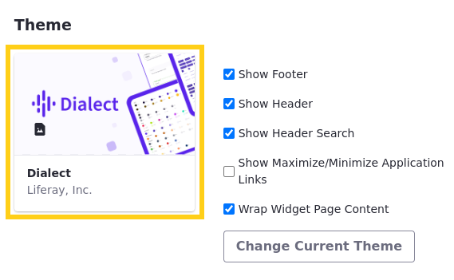
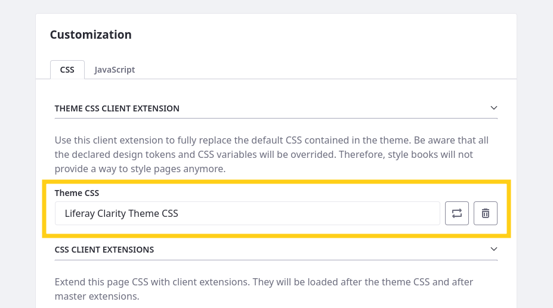

# Applying Clarity's Brand Styling

Liferay empowers users with a set of powerful styling tools for both technical and non-technical users, ensuring a consistent visual identity and user experience across your website. As previously explained, these tools, including themes, style books, frontend client extensions, and page element configurations. Together, they can streamline development and integrate existing styles.

So far, we've used the classic theme's default styling options. In this lesson, you'll use the Theme CSS client extension to overwrite these options. You'll also update the site's favicon and logo to make the platform align more closely with Clarity's branding.

<!--TASK: Expand instruction.

Also, should we use the JavaScript client extension? -->

## Exercise One: Updating Clarity's Default Theme, Favicon, and Logo

1. Open the *Site Menu* (), expand *Site Builder*, and click *Pages*.

1. Click the *Actions* button () in the Application Bar and select *Configuration*.

1. Click *Change Current Theme* and select *Dialect*.

   

1. Click the *Select Favicon* button (), select the `clarity-favicon.svg` file in the Module 6 exercise resources folder and click *Done*.

1. Click the *Change Logo* button () and select the `clarity-logo-c.png` file.

   

1. Click *Save*.

## Exercise Two Deploying the Theme CSS Client Extension

The Clarity workspace includes a theme CSS client extension for updating theme's styles. To deploy this client extension:

1. Open your terminal and go to the `liferay-clarity-theme-css/` folder in the bootcamp folder (`enablement-bootcamp-clarity/client-extensions/`).

1. Run this command to build and deploy the client extension:

   ```bash
   ../../gradlew clean deploy
   ```

1. Verify the command executes successfully.

Now that you've deployed the client extension, you can apply it to your pages.

## Exercise Three: Applying the Client Extension to Pages

1. Return to the Configuration page for Pages.

1. Under Customization, click the *Plus* button () for Theme CSS and select *Liferay Clarity Theme CSS*.

   

1. Click *Save*.

This applies the theme to all of Clarity's pages.

## Conclusion

Congratulations, you've completed Module 6: Site Building. Throughout this module, you learned how to create, configure, and style Liferay websites from the ground up.

Now you can move on to the next module where you'll delve into content authoring and management in Liferay.

Up Next: [Module 7: Content Authoring and Management](../module-7-content-authoring-and-management.md)
